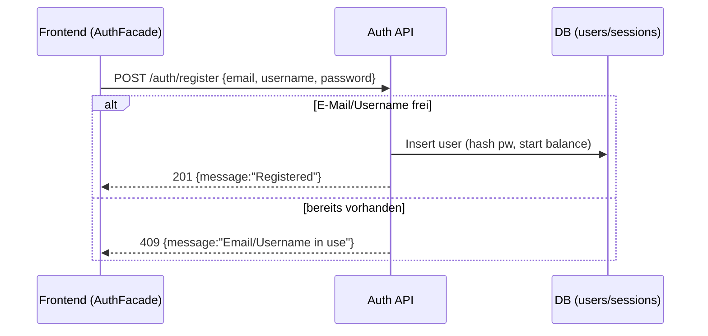
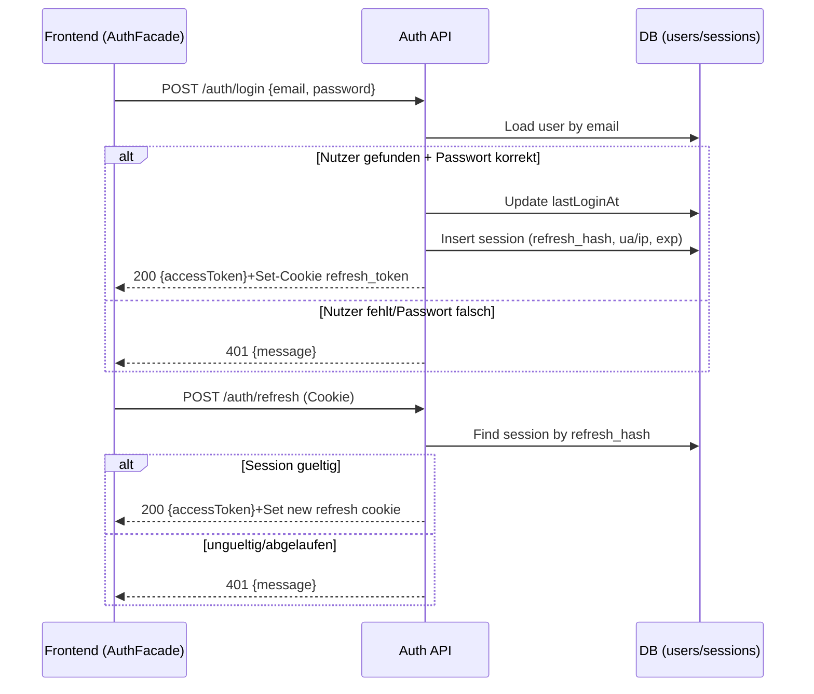
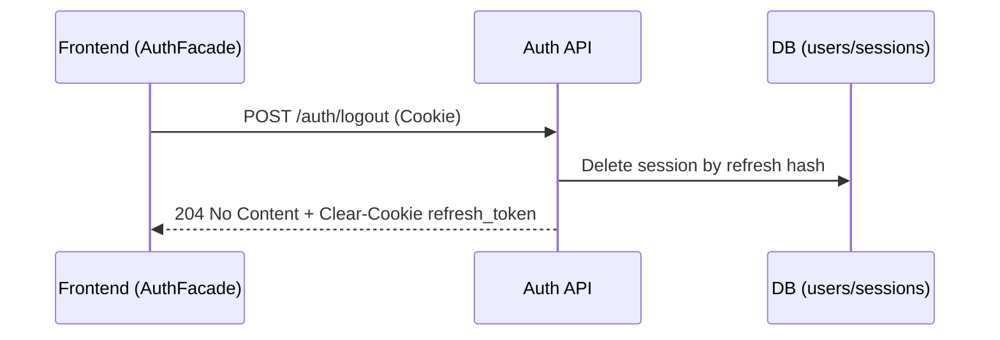

## Revision History
| Datum | Version | Beschreibung | Autor |
| --- | --- | --- | --- |
| 27.10.2025 | 0.0 | UCRS erstellt | Team BetCeption|
| 01.12.2025 | 1.1 | Abgleich mit aktuellem Code (JWT/Refresh, Sessions) | Team BetCeption |

# BetCeption  
## Use-Case-Realization Specification: Authentifizierung & Session Management  
Version 1.1  

---

### Revision History
| Date | Version | Description | Author |
|------|----------|--------------|--------|
| 27/10/2025 | 1.0 | Initiale Erstellung | Team BetCeption |

---

## 1. Introduction
Diese UCRS beschreibt die technische Realisierung der Authentifizierungs- und Session-Verwaltung in **BetCeption**.  
Sie deckt Registrierung, Login, Logout und die Middleware-Pruefung von JWT-Tokens ab.

### 1.1 Purpose
Ziel ist die sichere Identifikation und Verwaltung von Benutzerkonten, Sessions und Zugriffen auf geschuetzte Ressourcen innerhalb der Webapplikation.

### 1.2 Scope
Diese Realisierung betrifft:
- Registrierung, Login, Logout (Use Cases UC1-UC3)
- Session-Handling via JWT + Refresh-Cookies
- Middleware-Authentifizierung fuer API-Zugriffe

### 1.3 Definitions, Acronyms, and Abbreviations
- **JWT** - JSON Web Token  
- **BCrypt** - Hash-Algorithmus zur sicheren Passwortspeicherung  
- **UC** - Use Case  

### 1.4 References
- SRS BetCeption, Kapitel 3.1-3.4  
- Use Case Diagramm "Authentifizierung"  
- Sequenzdiagramme siehe Abschnitt 2  

### 1.5 Overview
Der Fokus liegt auf der technischen Sequenz und den kollaborierenden Komponenten zwischen **Frontend (Angular)**, **Backend (Express)** und **MySQL**.

---

## Implementierungsstand (aktueller Code)
- **Backend:** `/auth/register` prueft doppelte E-Mail/Username und legt Nutzer mit gehashtem Passwort + Startguthaben an. `/auth/login` setzt `lastLoginAt`, liefert `accessToken` im Body, setzt einen HttpOnly-Refresh-Cookie auf `/auth/refresh` und speichert den gehashten Refresh-Token (inkl. UA/IP/Expiry) in `sessions`. `/auth/refresh` rotiert Refresh-Token und Hash. `/auth/logout` loescht den gespeicherten Hash und das Cookie; Access-Token laeuft clientseitig aus. Auth-Middleware erwartet `Authorization: Bearer <access>`; GET `/leaderboard/*` ist fuer Gaeste offen.
- **Frontend:** AuthPanel auf der Startseite nutzt `AuthFacade` (Access-Token in LocalStorage, Refresh per Cookie). Dedizierte Login-/Register-Seiten sind Platzhalter. Daily Reward wird **nicht** automatisch beim Login ausgeloest.
- **Abweichungen:** Kein Account-Lockout/MFA/Device-Bindung; Logout blacklisted keine Access-Tokens, verlaesst sich auf Ablauf/Client-Loeschung.

## 2. Flow of Events - Design

### 2.1 Registrierung
1. Spieler oeffnet Registrierungsseite.  
2. Gibt Benutzername, E-Mail, Passwort ein.  
3. Frontend validiert Eingaben.  
4. Backend prueft, ob E-Mail existiert.  
5. Wenn neu -> Passwort wird gehasht und Benutzer angelegt.  
6. Datenbank speichert Datensatz (Benutzername, E-Mail, Hash, Startguthaben).  
7. Bestaetigung wird ans Frontend gesendet.  
8. Bei Fehlern (z. B. E-Mail bereits vergeben) wird eine Fehlermeldung angezeigt.  

**Sequenzdiagramm: Registrierung**  

---

### 2.2 Login
1. Spieler oeffnet Login-Seite und gibt E-Mail + Passwort ein.  
2. Frontend prueft Eingaben.  
3. Backend sucht Benutzerkonto per E-Mail.  
4. Wenn gefunden -> Passwort wird mit Hash verglichen.  
5. Bei Erfolg wird ein Access-JWT erzeugt und ein Refresh-Token (HttpOnly-Cookie auf `/auth/refresh`) gesetzt; der Refresh wird gehasht in `sessions` gespeichert.  
6. Access-Token wird im Frontend (LocalStorage) gespeichert.  
7. Benutzer wird zur Lobby weitergeleitet.  
8. Daily Reward wird **nicht** automatisch aktiviert (separater Call `/rewards/daily/claim`).  

**Sequenzdiagramm: Login / Refresh**  

---

### 2.3 Authentifizierung (Middleware)
1. Frontend sendet API-Anfrage mit JWT im Header.  
2. Middleware prueft Signatur, Ablaufzeit, Gueltigkeit.  
3. Gueltige Token -> Zugriff erlaubt.  
4. Ungueltige Token -> Antwort 401 Unauthorized (GET `/leaderboard/*` ist als Ausnahme offen).  
5. Abgelaufene Token fuehren zu Fehlermeldung/Logout.  

---

### 2.4 Logout
1. Spieler klickt "Logout".  
2. (Optional) System fragt nach Bestaetigung.  
3. Backend erhaelt Logout-Anfrage, loescht den gespeicherten Refresh-Hash und das HttpOnly-Cookie.  
4. Frontend loescht das Access-Token aus dem Speicher.  
5. Benutzer wird zur Login-Seite weitergeleitet.  

**Sequenzdiagramm: Logout**  

---

## 3. Derived Requirements
- Passwoerter muessen mit **bcrypt** oder **Argon2** gehasht werden.  
- Alle Anfragen ueber **HTTPS**.  
- JWT muss signiert und zeitlich begrenzt sein.  
- Middleware prueft Authentifizierung bei jedem API-Aufruf.  
- Refresh-Tokens werden gehasht gespeichert und nach Logout entfernt.  
- UI-Fehler-Feedback fuer alle Authentifizierungsschritte.  
- Optional: Account-Lockout bei zu vielen Fehlversuchen.  

---

## 2. Overall Description
- **Product Perspective:** Auth-/Session-Komponente des Backends; Grundlage für alle geschützten Routen.  
- **Product Functions:** Registrierung, Login, Refresh, Logout, JWT-Validierung.  
- **User Characteristics:** Spieler mit E-Mail/Username/Passwort; Browser-Client mit Cookies.  
- **Constraints:** HTTPS, HttpOnly Refresh-Cookie, SameSite/Secure, Rate-Limits.  
- **Assumptions/Dependencies:** DB `users`/`sessions`; UC1/UC2/UC5+ benötigen Auth; JWT Secret/Expiry konfiguriert.  
- **Requirements Subset:** Keine MFA/Lockout implementiert.

## 3. Specific Requirements
### 3.1 Functionality
- FR1: Registrierung mit Unique Email/Username, Passwort-Hashing, Startguthaben.  
- FR2: Login verifiziert Credentials, setzt Access-JWT + HttpOnly Refresh-Cookie, speichert Session (Refresh-Hash, UA/IP, Exp).  
- FR3: Refresh rotiert Refresh-Token/Hash und gibt neues Access-JWT.  
- FR4: Logout löscht gespeicherten Refresh-Hash, leert Cookie.  
- FR5: Middleware validiert Access-JWT für geschützte Routen; Leaderboard-GETs sind öffentlich.  
- FR6: Fehlercodes: 401 bei falschen Credentials/ungültigem Token, 409 bei Dup-Registrierung.

### 3.2 Usability
- U1: Fehlermeldungen klar (falsches Passwort, Email schon vergeben).  
- U2: Tokens transparent gehandhabt (Access im Body, Refresh im Cookie).

### 3.3 Reliability
- R1: Refresh-Hash Speicherung verhindert Token-Diebstahl; Rotation bei jedem Refresh.  
- R2: Rate-Limits auf Auth-Routen (Brute-Force-Schutz).

### 3.4 Performance
- P1: Login/Refresh Antwortzeit < 600 ms p95.  
- P2: Hashing-Kosten konfigurierbar (bcrypt/argon2).

### 3.5 Supportability
- S1: Logging von `userId`, `sessionId`, `ip`, `ua`, `requestId`.  
- S2: Konfigurierbare Token-Lifetimes und SameSite/Secure-Flags.

### 3.6 Design Constraints
- DC1: HTTPS Pflicht; HttpOnly/SameSite/Secure Cookies.  
- DC2: JWT-Signatur mit serverseitigem Secret; Passwort-Hashing (bcrypt/argon2).

### 3.7 Online User Documentation and Help System Requirements
- H1: API-Doku für `/auth/register|login|refresh|logout`.

### 3.8 Purchased Components
- PC1: Keine.

### 3.9 Interfaces
- **User Interfaces:** AuthPanel/Forms; nutzt JSON-Body + Cookies.  
- **Hardware Interfaces:** Keine.  
- **Software Interfaces:** REST-APIs; DB-Tabellen `users`, `sessions`.  
- **Communications Interfaces:** HTTPS, JSON, JWT, HttpOnly-Cookies.

### 3.10 Licensing Requirements
- Keine.

### 3.11 Legal, Copyright, and Other Notices
- Datenschutz: Minimale Ausgabe; keine Passwörter/Hashes in Logs/Responses.

### 3.12 Applicable Standards
- HTTPS, JWT Best Practices, OWASP AuthN/Session Hardening.

## 4. Supporting Information
- Sequenzdiagramme Abschnitt 2.  
- Flows in 2.1–2.4.

