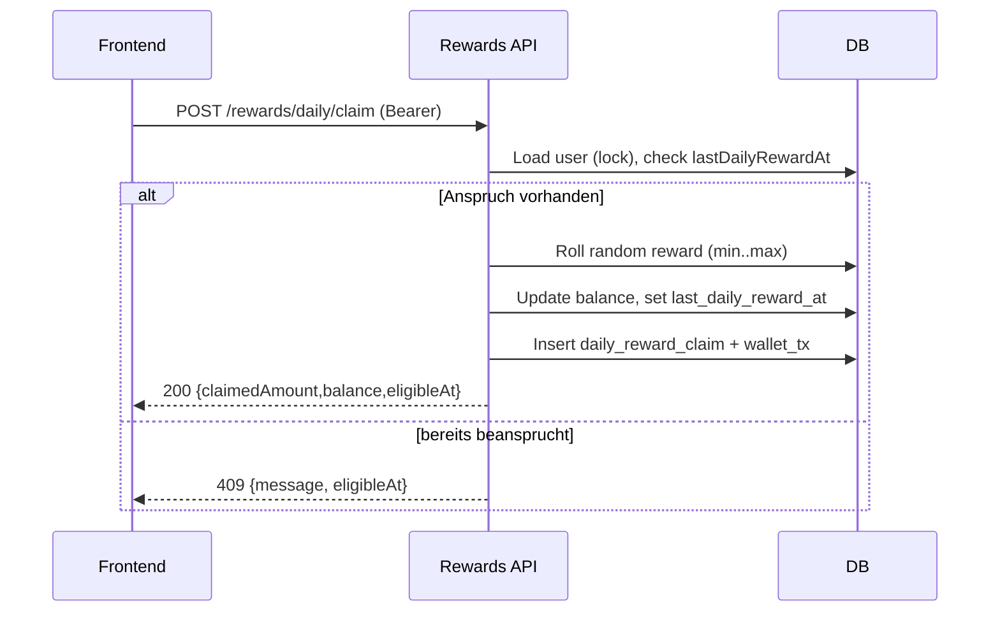

## Revision History
| Datum | Version | Beschreibung | Autor |
| --- | --- | --- | --- |
| 27.10.2025 | 0.0 | UCRS erstellt | Team BetCeption|
| 01.12.2025 | 1.1 | Abgleich mit aktuellem Code (UTC-Tag, Konflikt 409) | Team BetCeption |

# BetCeption  
## Use-Case-Realization Specification: Daily Reward abholen
Version 1.1  

---

### Revision History
Date: 27/10/2025  
Version: 1.0  
Description: Initiale Erstellung  
Author: Team BetCeption  

---

## 1. Introduction
Diese UCRS beschreibt die technische Realisierung des Use-Case "Daily Reward abholen" in BetCeption.  
Ziel ist es, den Ablauf zwischen Frontend, Backend und Datenbank zu dokumentieren, durch den ein Spieler seine taegliche Belohnung abrufen kann.

### 1.1 Purpose
Ein System bereitstellen, das Spielern einmal pro Kalendertag (UTC) eine Belohnung gewaehrt und Mehrfachabholungen sicher verhindert.

### 1.2 Scope
Der Use Case deckt den Ablauf des taeglichen Belohnungsvorgangs ab – vom Klick im Frontend ueber die Backend-Logik bis zur Speicherung in der Datenbank, inklusive Fehlerfaellen bei Nicht-Berechtigung.

### 1.3 Definitions, Acronyms, and Abbreviations
Spieler: Endnutzer, der eine Belohnung beansprucht  
Frontend: Angular-basierte Benutzeroberflaeche  
Reward-Service: Express-Backend-Komponente, zustaendig fuer Belohnungslogik  
DB: MySQL-Datenbank  
eligibleAt: Zeitstempel (UTC), ab wann der Spieler erneut berechtigt ist  

### 1.4 References
Use Case Specification: UC3_DailyReward.md  
UML-Sequenzdiagramm "Daily Reward abholen"  
Projektarchitektur BetCeption-System  

### 1.5 Overview
Kapitel 2 beschreibt den technischen Ablauf basierend auf dem Sequenzdiagramm.  
Kapitel 3 enthaelt die abgeleiteten funktionalen und nicht-funktionalen Anforderungen.

---

## Implementierungsstand (aktueller Code)
- **Backend:** `POST /rewards/daily/claim` vergleicht `users.last_daily_reward_at` mit dem aktuellen UTC-Datum. Bei Berechtigung wird ein Reward per `crypto.randomInt` im Intervall `dailyRewardConfig.minAmount..maxAmount` ermittelt, Guthaben aktualisiert, `DailyRewardClaim` und `WalletTransaction (REWARD)` geschrieben. Antwort: HTTP 200 `{claimedAmount, balance, eligibleAt}`. Zweitversuch am selben UTC-Tag: HTTP 409 `{message, eligibleAt}`.
- **Frontend:** Kein UI-Hook; Service-Methode `Wallet.claimDailyReward()` existiert, wird aber nicht aufgerufen.
- **Abweichungen:** Keine automatische Ausloesung beim Login; Countdown/Timer nur clientseitig ableitbar aus `eligibleAt`.

## 2. Flow of Events - Design

### 2.1 Overview
Der Spieler kann einmal pro UTC-Kalendertag eine Belohnung beanspruchen. Der Reward-Service prueft anhand des gespeicherten Datums, ob der Spieler berechtigt ist, und vergibt bei Erfolg eine Gutschrift.

### 2.2 Participating Objects
Spieler: initiiert den Prozess durch Klick auf "Claim"  
Frontend (Angular): sendet Anfrage mit JWT und zeigt Rueckmeldung an  
Reward-Service (Backend): prueft Anspruch, berechnet Belohnung, aktualisiert Guthaben  
Datenbank (MySQL): speichert `last_daily_reward_at`, Guthaben, Transaktionslog (`wallet_transactions`), `daily_reward_claims`  

### 2.3 Flow Description (aktuell)
1. Spieler klickt im UI auf "Claim".  
2. Frontend sendet eine POST-Anfrage an `/rewards/daily/claim` mit JWT.  
3. Reward-Service liest `last_daily_reward_at` aus der DB (pessimistic lock).  
4. Prueft, ob aktuelles UTC-Datum bereits verbucht ist.  
   - Wenn nicht berechtigt -> Antwort 409 `Invalid or already claimed` mit `eligibleAt` (naechster UTC-Tag).  
5. Wenn berechtigt -> Reward-Menge ermitteln (Zufall oder fix laut Config).  
6. Guthaben aktualisieren, `last_daily_reward_at` setzen, Eintrag in `daily_reward_claims` und `wallet_transactions` anlegen.  
7. Backend sendet 200 OK mit `claimedAmount`, `balance`, `eligibleAt` (naechter UTC-Tag).  
8. Frontend zeigt Erfolgs- oder Konfliktmeldung an (Countdown optional).  

### 2.4 Sequence Diagram

---

## 3. Derived Requirements
- Max. eine Belohnung pro Spieler und UTC-Kalendertag.  
- Operationen laufen atomar in einer DB-Transaktion (Sperre auf User).  
- Belohnungsspanne konfigurierbar (`dailyRewardConfig`).  
- Response muss `eligibleAt` liefern, falls (noch) nicht berechtigt.  
- Auditierbare Protokolle via `daily_reward_claims` und `wallet_transactions`.  
- Antwortzeit < 1 s im Normalfall.  

---

## 2. Overall Description
- **Product Perspective:** Bestandteil der Rewards-Domäne; nutzt Wallet/Users-Tabellen.  
- **Product Functions:** Daily Reward pro UTC-Tag prüfen, Betrag gutschreiben, Claim und WalletTx speichern.  
- **User Characteristics:** Eingeloggt; ruft Claim aktiv auf.  
- **Constraints:** Max. ein Claim pro UTC-Tag; JWT nötig; pessimistic lock auf User.  
- **Assumptions/Dependencies:** UC1 (Auth), UC2 (Wallet), UC10 (Persistenz).  
- **Requirements Subset:** Keine Auto-Claim; keine UI implementiert.

## 3. Specific Requirements
### 3.1 Functionality
- FR1: System muss `POST /rewards/daily/claim` bereitstellen und Auth prüfen.  
- FR2: System muss mit Sperre prüfen, ob `last_daily_reward_at` schon aktueller UTC-Tag ist.  
- FR3: Bei Berechtigung Reward ermitteln (min..max), Balance erhöhen, Claim + WalletTx schreiben.  
- FR4: Bei erneutem Claim am selben Tag 409 mit `eligibleAt`.  
- FR5: Response 200 mit `claimedAmount`, `balance`, `eligibleAt`.

### 3.2 Usability
- U1: Klare Meldungen bei Konflikt (noch nicht berechtigt).  
- U2: Response-JSON direkt für UI (Countdown aus `eligibleAt` ableitbar).

### 3.3 Reliability
- R1: Transaktion mit Sperre verhindert Doppel-Claim.  
- R2: Random Reward per `crypto.randomInt` innerhalb Konfiguration.

### 3.4 Performance
- P1: Antwortzeit < 1 s.  
- P2: Einzelne Row-Lock, kein großer I/O.

### 3.5 Supportability
- S1: Logging von `userId`, `claimedAmount`, `eligibleAt`, `requestId`.  
- S2: Konfigurierbare Reward-Range (`dailyRewardConfig`).

### 3.6 Design Constraints
- DC1: JWT/HTTPS; Decimal für Beträge.  
- DC2: UTC-basierte Prüfung, keine Zeitzonenabweichung.

### 3.7 Online User Documentation and Help System Requirements
- H1: API-Doku `/rewards/daily/claim`.

### 3.8 Purchased Components
- PC1: Keine.

### 3.9 Interfaces
- **User Interfaces:** Keine dedizierte UI; möglicher Button im Wallet/Start.  
- **Hardware Interfaces:** Keine.  
- **Software Interfaces:** REST `/rewards/daily/claim`; DB `users`, `daily_reward_claims`, `wallet_transactions`.  
- **Communications Interfaces:** HTTPS, JSON, JWT.

### 3.10 Licensing Requirements
- Keine.

### 3.11 Legal, Copyright, and Other Notices
- Datenschutz: nur eigene Daten; keine sensiblen Inhalte.

### 3.12 Applicable Standards
- HTTPS, JWT, ACID-Transaktionen.

## 4. Supporting Information
- Sequenzdiagramm Abschnitt 2.4.  
- Flow in 2.3.

