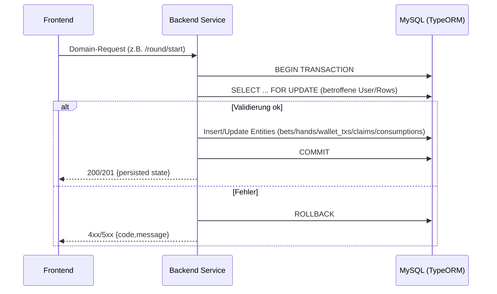

## Revision History
| Datum | Version | Beschreibung | Autor |
| --- | --- | --- | --- |
| 02.12.2025 | 1.0 | UCRS für Daten persistieren erstellt | Team BetCeption |

# BetCeption  
## Use-Case-Realization Specification: Daten persistieren  
Version 1.0  

---

## 1. Introduction
Diese UCRS beschreibt die technische Realisierung des Use Cases **Daten persistieren** (UC10). Sie dokumentiert, wie die Anwendung spiel- und kontorelevante Daten in MySQL mit ACID-Transaktionen speichert.

### 1.1 Purpose
Zuverlässige, transaktionssichere Persistenz für Runden, Wetten, Wallet-Buchungen, Rewards, Power-Ups und Userdaten sicherstellen.

### 1.2 Scope
- Persistenz aller Domänenobjekte (Rounds, Hands, Cards, MainBets, SideBets, WalletTransactions, DailyRewardClaims, Powerups, Sessions, Users).  
- Verwendung von Transaktionen und Sperren bei schreibenden Vorgängen (Round/Bet, Wallet, Reward, Powerup-Consumption).  
- Fehlertolerantes Commit/Rollback-Verhalten.

### 1.3 Definitions, Acronyms, and Abbreviations
- **ACID:** Atomicity, Consistency, Isolation, Durability.  
- **Pessimistic Lock:** Zeilensperre während Transaktion (`FOR UPDATE`).  
- **WalletTx:** Eintrag in `wallet_transactions`.

### 1.4 References
- UC10_Daten_persistieren.md  
- db/schema.sql (alle Tabellen/Views)  
- Backend: Round-, Wallet-, Rewards-, Powerups-, Auth-Routen

### 1.5 Overview
Kapitel 2 beschreibt Implementierungsstand, Kapitel 3 den Ablauf, Kapitel 4 das Sequenzdiagramm, Kapitel 5 die abgeleiteten Anforderungen.

---

## 2. Implementierungsstand (aktueller Code)
- **Backend:**  
  - Round/Bet (`POST /round/start`): Transaktion erstellt Round/Hands/Cards/MainBet/SideBets und bucht Wallet-Txs; sperrt User-Balance und verhindert parallele aktive Runden.  
  - Rewards (`POST /rewards/daily/claim`): Transaktion mit pessimistischer Sperre auf User, schreibt `daily_reward_claims` + `wallet_transactions`.  
  - Powerups (`POST /powerups/purchase|consume`): Kauf/Verbrauch mit Sperre, Wallet-Tx bei Kauf, Consumption-Log beim Einsatz.  
  - Wallet (`POST /wallet/deposit|withdraw`): Sperrt User, passt Balance an, schreibt WalletTx.  
  - Auth (`/auth/login|refresh|logout`): Sessions/Refresh-Hashes werden konsistent gespeichert/gelöscht.  
- **Frontend:** Greift über REST auf diese Endpunkte zu; kein Offline-Cache.  
- **Abweichungen:** XP/Level werden nicht verändert; Idempotency-Keys fehlen; keine Retries bei Deadlocks.

---

## 3. Flow of Events - Design

### 3.1 Schreibender Domain-Request (Beispiel Round-Start)
1. Client sendet schreibende Anfrage (z. B. `/round/start`, `/wallet/withdraw`, `/rewards/daily/claim`).  
2. Backend startet DB-Transaktion.  
3. Betroffene User-/Domain-Records werden mit `FOR UPDATE` gesperrt.  
4. Validierung der Geschäftsregeln (Guthaben, Status, Limits).  
5. Bei Erfolg: Inserts/Updates in Domain-Tabellen + WalletTx/Logs; Fairness-/Seed-Daten setzen (falls Round).  
6. Commit der Transaktion, Antwort 200/201 mit persistiertem Zustand.  
7. Bei Fehler: Rollback, Antwort 4xx/5xx mit Fehlercode.

---

## 4. Sequenzdiagramm

---

## 5. Derived Requirements
- Alle schreibenden Operationen laufen in Transaktionen; Sperren auf betroffene User/Rows, um Race Conditions zu vermeiden.  
- Wallet-Buchungen immer über `wallet_transactions` referenziert (ref_table/ref_id).  
- Fehlgeschlagene Validierungen oder DB-Fehler müssen Rollback auslösen.  
- Antwort enthält den persistierten/aktuellen Zustand; keine schmutzigen Reads.  
- Optionaler Ausbau: Idempotency-Keys für wiederholte Requests, Deadlock-Retries, strukturierte Fehlercodes pro Domain.  
- Backups/Migrations sicherstellen (`typeorm migration:run`), Monitoring von Deadlocks/Locks.

---

## 2. Overall Description
- **Product Perspective:** Querschnittliche Persistenzschicht (MySQL/TypeORM) für alle Domänen.  
- **Product Functions:** Transaktionen starten, Sperren setzen, Entities schreiben/lesen, Commit/Rollback.  
- **User Characteristics:** Intern (Services/Entwickler); keine Endnutzer direkt.  
- **Constraints:** ACID, Foreign Keys, Decimal/Int-Typen; Auth/Domain-Validierung vorgelagert.  
- **Assumptions/Dependencies:** DB verfügbar; TypeORM konfiguriert; Domänenrouten nutzen Transaktionen.  
- **Requirements Subset:** Fokus auf Schreibpfade (Round/Bet, Wallet, Rewards, Powerups, Auth).

## 3. Specific Requirements
### 3.1 Functionality
- FR1: Schreibende Requests müssen Transaktionen mit Sperren nutzen.  
- FR2: Validierungsfehler müssen Rollback auslösen.  
- FR3: Domain-Entities und WalletTxs müssen referenziell konsistent gespeichert werden.  
- FR4: Responses müssen den persistierten Zustand zurückgeben.  
- FR5: Fehlercodes 4xx/5xx bei Validierungs-/DB-Fehlern.

### 3.2 Usability
- U1: Fehlertexte für Entwickler klar (Domain/DB-Fehlercodes).  
- U2: Responses konsistent strukturiert.

### 3.3 Reliability
- R1: ACID-Transaktionen, Foreign Keys, Locks verhindern Inkonsistenzen.  
- R2: Rollback bei Fehlern.

### 3.4 Performance
- P1: Transaktionen kurz halten (<1 s) um Locks zu minimieren.  
- P2: Indizes für häufige Queries.

### 3.5 Supportability
- S1: Logging `requestId`, betroffene Tabellen, Dauer, Fehler.  
- S2: Migrations-/Backup-Prozess dokumentiert.

### 3.6 Design Constraints
- DC1: MySQL 8, TypeORM; UTF-8; Decimal für Geld.  
- DC2: HTTPS/JSON für APIs, aber Kern ist DB.

### 3.7 Online User Documentation and Help System Requirements
- H1: Developer-Doku zu Transaktionsrichtlinien und Retry-Strategien.

### 3.8 Purchased Components
- PC1: Keine.

### 3.9 Interfaces
- **User Interfaces:** Keine (intern).  
- **Hardware Interfaces:** DB-Server.  
- **Software Interfaces:** TypeORM Repositories, MySQL; REST-APIs nutzen diese Schicht.  
- **Communications Interfaces:** DB-Connector (TCP), REST (HTTPS) upstream.

### 3.10 Licensing Requirements
- Keine.

### 3.11 Legal, Copyright, and Other Notices
- Datenschutz: personenbezogene Daten nur wo nötig; Logs minimieren PII.

### 3.12 Applicable Standards
- ACID, SQL-Standards, HTTPS.

## 4. Supporting Information
- Sequenzdiagramm Abschnitt 4.  
- Flows Abschnitt 3.1.

