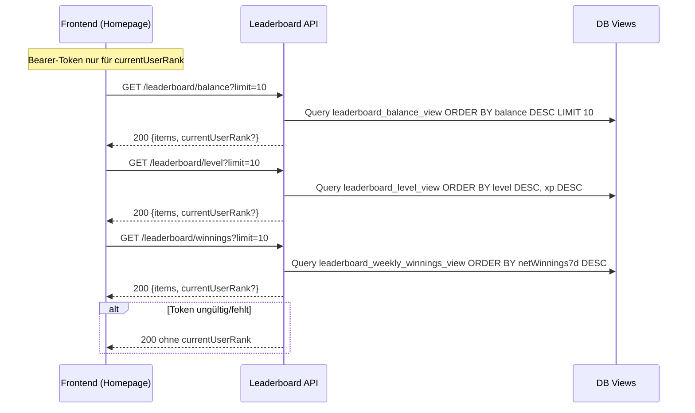

## Revision History
| Datum | Version | Beschreibung | Autor |
| --- | --- | --- | --- |
| 02.12.2025 | 1.0 | UCRS für Leaderboard anzeigen erstellt | Team BetCeption |

# BetCeption  
## Use-Case-Realization Specification: Leaderboard anzeigen  
Version 1.0  

---

## 1. Introduction
Diese UCRS beschreibt die technische Realisierung des Use Cases **Leaderboard anzeigen** (UC4). Sie dokumentiert den Ablauf zwischen Frontend, Backend und Datenbank beim Laden und Anzeigen der Bestenlisten (Balance, Level, Weekly Winnings).

### 1.1 Purpose
Spielern die aktuellen Ranglisten performant bereitstellen, optional mit Hervorhebung des eigenen Rangs.

### 1.2 Scope
- Öffentliche GET-Endpunkte für Balance-, Level- und Weekly-Winnings-Tab.  
- Optionale Authentifizierung nur für die Berechnung des eigenen Rangs.  
- Paginierte Views aus der Datenbank.

### 1.3 Definitions, Acronyms, and Abbreviations
- **currentUserRank:** Rang des eingeloggten Users innerhalb der abgefragten Seite.  
- **Views:** `leaderboard_balance_view`, `leaderboard_level_view`, `leaderboard_weekly_winnings_view`.

### 1.4 References
- UC4_Leaderboard_anzeigen.md  
- db/schema.sql (Leaderboards-Views)  
- Backend-Route `leaderboard`

### 1.5 Overview
Kapitel 2 beschreibt den Implementierungsstand, Kapitel 3 die Flows und Kapitel 4 enthält das Sequenzdiagramm. Kapitel 5 fasst abgeleitete Anforderungen zusammen.

---

## 2. Implementierungsstand (aktueller Code)
- **Backend:** `GET /leaderboard/balance|level|winnings` sind öffentlich; ein optionaler Access-Token wird nur genutzt, um `currentUserRank` zu berechnen. Daten stammen aus den drei DB-Views, sortiert, paginiert per `limit`/`offset` (Default: 10). Kein Cache, kein Perioden-Switch, keine Sortier-Umschaltung.  
- **Frontend:** Homepage lädt alle drei Kategorien (Tabs) mit Limit 10. Keine Pagination, kein Polling oder Caching. Im Winnings-Tab werden Usernames derzeit anonymisiert (`User #<id>`).  
- **Abweichungen zum UC:** Use Case nannte Auth-Pflicht und „Gewinnsumme/DEPTH“; umgesetzt sind Balance/Level/Net Winnings und die Endpunkte sind für Gäste offen.

---

## 3. Flow of Events - Design

### 3.1 Leaderboard laden (Balance/Level/Winnings)
1. Spieler öffnet die Leaderboard-Ansicht (Tab Balance/Level/Winnings).  
2. Frontend sendet `GET /leaderboard/{tab}?limit=10` (optional mit Bearer-Token).  
3. Backend liest die jeweilige View, sortiert und paginiert.  
4. Wenn Token vorhanden und gültig, wird `currentUserRank` berechnet.  
5. Response enthält Items (Rang, User, Wert) und optional `currentUserRank`.  
6. Frontend rendert die Tabelle und hebt den eigenen Rang hervor, falls vorhanden.  
7. Fehlerfälle: ungültiges Token wird ignoriert (kein 401); DB-Fehler -> 500; leere Liste -> 200 mit `items: []`.

---

## 4. Sequenzdiagramm

---

## 5. Derived Requirements
- Leaderboard-Reads sind öffentlich; Auth wird nur für `currentUserRank` genutzt, kein 401 bei fehlendem Token.  
- Pagination per `limit`/`offset`, Standardlimit 10; Sortierung fix je View (Balance DESC, Level DESC/Xp DESC, NetWinnings7d DESC).  
- Antwortzeit < 1 s im Normalfall; Views sollen mit passenden Indizes versehen sein.  
- Frontend muss leere Antworten (`items: []`) und fehlenden `currentUserRank` robust handhaben.  
- Optional: Anzeige des Usernamens im Winnings-Tab, falls im Backend verfügbar.

---

## 2. Overall Description
- **Product Perspective:** Read-Only-Feature auf DB-Views; Teil der Public-API.  
- **Product Functions:** Leaderboards für Balance, Level, Weekly Winnings abrufen; optional eigenen Rang berechnen.  
- **User Characteristics:** Gäste oder eingeloggte Spieler; Grundkenntnis Tabelle/Ranking.  
- **Constraints:** Öffentliche GETs; `currentUserRank` nur mit Token; fixe Sortierung je View.  
- **Assumptions/Dependencies:** Views `leaderboard_balance|level|weekly_winnings`; UC1 (Auth optional für Rank).  
- **Requirements Subset:** Keine Schreiboperationen, kein Caching implementiert.

## 3. Specific Requirements
### 3.1 Functionality
- FR1: API muss Balance-, Level- und Winnings-View paginiert liefern.  
- FR2: Bei Token optional `currentUserRank` berechnen, sonst auslassen.  
- FR3: Response muss Items (Rang, User, Wert) und optional Rank enthalten.  
- FR4: Fehler 500 bei DB-Fehler; kein 401 für fehlendes Token (nur Rank entfällt).

### 3.2 Usability
- U1: Leere Listen korrekt darstellen (`items: []`).  
- U2: Felder eindeutig benannt (rank/user/value).

### 3.3 Reliability
- R1: Views mit passenden Indizes; deterministische Sortierung.  
- R2: Keine Abhängigkeit von Cache; frische DB-Daten.

### 3.4 Performance
- P1: Antwortzeit < 1 s für limit=10.  
- P2: DB-Views optimiert für ORDER BY.

### 3.5 Supportability
- S1: Logging von Tab, limit/offset, requestId.  
- S2: Konfigurierbare Default-Limits.

### 3.6 Design Constraints
- DC1: Öffentliche GET, Auth nur optional; HTTPS/JSON.  
- DC2: Sortierung fix je View.

### 3.7 Online User Documentation and Help System Requirements
- H1: API-Doku `/leaderboard/balance|level|winnings`.

### 3.8 Purchased Components
- PC1: Keine.

### 3.9 Interfaces
- **User Interfaces:** Tabs/Tabellen im Frontend.  
- **Hardware Interfaces:** Keine.  
- **Software Interfaces:** REST-Endpunkte, DB-Views `leaderboard_*`.  
- **Communications Interfaces:** HTTPS, JSON; optional JWT.

### 3.10 Licensing Requirements
- Keine.

### 3.11 Legal, Copyright, and Other Notices
- Datenschutz: Usernames ggf. anonymisieren; keine sensiblen Daten ausgeben.

### 3.12 Applicable Standards
- HTTPS, JWT (optional), SQL-Standards für Views.

## 4. Supporting Information
- Sequenzdiagramm Abschnitt 4.  
- Flows in 3.1.

