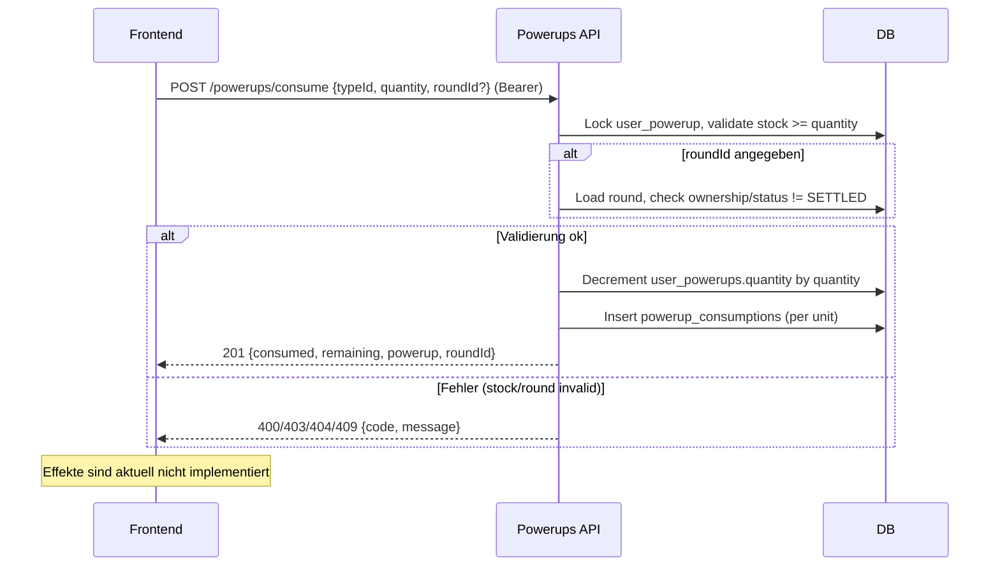

## Revision History
| Datum | Version | Beschreibung | Autor |
| --- | --- | --- | --- |
| 02.12.2025 | 1.0 | UCRS für Power-Up einsetzen erstellt | Team BetCeption |

# BetCeption  
## Use-Case-Realization Specification: Power-Up einsetzen  
Version 1.0  

---

## 1. Introduction
Diese UCRS beschreibt die technische Realisierung des Use Cases **Power-Up einsetzen** (UC8). Sie dokumentiert, wie ein Spieler ein vorhandenes Power-Up verbraucht und wie Bestand, Runde und Effekte serverseitig gehandhabt werden.

### 1.1 Purpose
Power-Ups sicher verbrauchen, Bestand konsistent reduzieren und (zukünftig) Effekte regelkonform anwenden.

### 1.2 Scope
- Endpoint `POST /powerups/consume` mit `{typeId, quantity, roundId?}`.  
- Besitz-/Bestandsprüfung, optionale Rundenprüfung (Ownership/Status), Consumption-Logging.  
- Aktuell keine spielentscheidenden Effekte umgesetzt.

### 1.3 Definitions, Acronyms, and Abbreviations
- **PowerupType:** Katalogeintrag mit Preis/Level/Effektdefinition.  
- **UserPowerup:** Bestand des Users (Menge).  
- **Consumption:** Pro Verbrauchseinheit ein Eintrag in `powerup_consumptions`.

### 1.4 References
- UC8_PowerUp_Einsetzen.md  
- db/schema.sql (powerup_types, user_powerups, powerup_consumptions)  
- Backend-Route `powerups/consume`

### 1.5 Overview
Kapitel 2 fasst Implementierungsstand, Kapitel 3 den Ablauf, Kapitel 4 das Sequenzdiagramm, Kapitel 5 die abgeleiteten Anforderungen.

---

## 2. Implementierungsstand (aktueller Code)
- **Backend:** `POST /powerups/consume` (auth) prüft Besitz und Menge in `user_powerups`, optional `roundId` (Runde gehört User, nicht settled), dekrementiert Bestand, schreibt je Einheit einen `powerup_consumptions`-Eintrag, antwortet mit `consumed`, `remaining`, `powerup`, `roundId`. Effekte werden aktuell nicht ins Spiel eingewoben.  
- **Frontend:** Keine UI; Service-Aufruf existiert, wird aber nicht genutzt.  
- **Abweichungen:** Keine Effekte, keine Synchronisation mit laufender Runde außer Besitzprüfung.

---

## 3. Flow of Events - Design

### 3.1 Power-Up verbrauchen
1. Spieler ist eingeloggt; optional ist eine Runde aktiv (`roundId`).  
2. Spieler wählt `typeId` und `quantity`.  
3. Backend sperrt/prüft `user_powerups`, validiert Bestand und optional Runde (Ownership/Status erlaubt).  
4. Bei Erfolg: Bestand verringern, `powerup_consumptions`-Einträge schreiben, Response mit `consumed`, `remaining`, Powerup-Details und optional `roundId`.  
5. Fehlerfälle: nicht ausreichend Bestand -> 400/404; Runde invalid/settled -> 409/404; fehlendes JWT -> 401.

---

## 4. Sequenzdiagramm

---

## 5. Derived Requirements
- Besitz- und Bestandsprüfung mit Sperre (pessimistic lock) pro Verbrauch.  
- Optionaler Runden-Context muss Eigentum und Status prüfen (nicht `SETTLED`).  
- Atomicität: Bestand verringern und Consumption-Log in einer Transaktion.  
- Fehlercodes klar unterscheiden (nicht gefunden, zu wenig Bestand, falsche Runde/Status).  
- Vorbereitung für Effekte: Schnittstelle für Effekt-Engine, Auditierung der verbrauchten Items.  
- Antwortzeit < 1 s im Normalfall.

---

## 2. Overall Description
- **Product Perspective:** Bestandteil der Backend-Domäne `powerups`; nutzt vorhandene Auth- und Round-Module sowie MySQL/TypeORM.  
- **Product Functions:** Power-Ups konsumieren, Bestand reduzieren, Consumption loggen, optional Runde validieren.  
- **User Characteristics:** Eingeloggte Spieler mit vorhandenem Power-Up-Bestand; keine Admin-Funktion.  
- **Constraints:** JWT-Auth erforderlich; Runde darf nicht `SETTLED` sein; DB-Verfügbarkeit nötig.  
- **Assumptions/Dependencies:** UC2 (Shop/Inventar) liefert Bestände; UC5/UC7 stellen Rundenkontext; PowerupTypes sind konfiguriert.  
- **Requirements Subset:** Beschränkt auf UC8 (Konsum), keine Effekt-Engine implementiert.

## 3. Specific Requirements
### 3.1 Functionality
- FR1: System muss Besitz/Bestand prüfen und bei Erfolg `quantity` reduzieren.  
- FR2: System muss bei `roundId` die Runde auf Eigentum/Status prüfen.  
- FR3: System muss je verbrauchter Einheit einen `powerup_consumptions`-Eintrag schreiben.  
- FR4: System muss Fehlercodes für fehlenden Bestand, ungültige Runde oder fehlende Auth liefern.  
- FR5: Response muss `consumed`, `remaining`, `powerup`, optional `roundId` enthalten.

### 3.2 Usability
- U1: Fehlertexte verständlich (Bestand fehlt, Runde ungültig).  
- U2: Response-JSON klar strukturiert, für UI direkt nutzbar.

### 3.3 Reliability
- R1: Transaktion mit Sperre verhindert Doppelverbrauch.  
- R2: Keine Bestandsreduzierung bei Fehler (Rollback).

### 3.4 Performance
- P1: Antwortzeit < 1 s bei normaler Last.  
- P2: Konsum-Requests seriell pro User (Sperre).

### 3.5 Supportability
- S1: Logging von `userId`, `typeId`, `quantity`, `roundId`, `requestId`.  
- S2: Konfiguration von Effekten/Typen zentral (`powerup_types`).

### 3.6 Design Constraints
- DC1: JWT-Auth, HTTPS.  
- DC2: MySQL/TypeORM; Decimal für Preise, Int für Mengen.

### 3.7 Online User Documentation and Help System Requirements
- H1: API-Dokumentation der Route `/powerups/consume` (Swagger o.ä.).

### 3.8 Purchased Components
- PC1: Keine.

### 3.9 Interfaces
- **User Interfaces:** Kein dediziertes UI; erwartetes JSON siehe Implementierungsstand.  
- **Hardware Interfaces:** Keine.  
- **Software Interfaces:** REST-API `/powerups/consume`; DB-Tabellen `user_powerups`, `powerup_consumptions`.  
- **Communications Interfaces:** HTTPS, JSON, JWT im Authorization-Header.

### 3.10 Licensing Requirements
- Keine speziellen Anforderungen (internes Produkt).

### 3.11 Legal, Copyright, and Other Notices
- Datenschutz: minimal notwendige Userdaten in Logs; keine sensiblen Daten in Fehlermeldungen.

### 3.12 Applicable Standards
- HTTPS, JWT Best Practices, ACID-Transaktionen.

## 4. Supporting Information
- Sequenzdiagramm in Abschnitt 4.  
- Flows und Constraints in Abschnitt 3.1/5 zusammengefasst.

