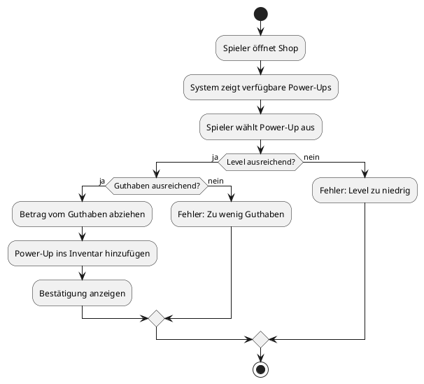

# Use Case 9 – Power-Ups / Pillen kaufen

## 1. Brief Description
Dieser Use Case ermöglicht es dem Spieler, spezielle Power-Ups („Pillen“) im Shop zu kaufen.  
Diese Power-Ups können dem Spieler im Spiel Vorteile verschaffen, z. B. zusätzliche Karten, verdoppelte Gewinne oder Schutz vor Verlusten.  
Jedes Power-Up ist ab einem bestimmten Level verfügbar und kann nur gekauft werden, wenn der Spieler genügend Guthaben besitzt.

---

## 2. Mockup

---

## 3. Screenshots

---

## 4. Flow of Events

### 4.1 Basic Flow
1. Spieler navigiert zum Shop.
2. Das System zeigt verfügbare Power-Ups mit Preis und Level-Anforderung an.
3. Spieler wählt ein Power-Up aus.
4. Das System prüft:
   - Hat der Spieler das erforderliche Level?
   - Hat der Spieler genügend Guthaben?
5. Wenn beide Bedingungen erfüllt sind:
   - Der Betrag wird vom Guthaben abgezogen.
   - Das Power-Up wird dem Inventar hinzugefügt.
6. System zeigt eine Bestätigungsmeldung an.

**Activity Diagram**

---

## 4.2 Alternative Flows
- **Nicht genügend Guthaben:**  
  Das System zeigt eine Fehlermeldung an und fordert den Spieler auf, mehr Coins zu erwerben.
- **Level zu niedrig:**  
  Das Power-Up bleibt gesperrt, und das System zeigt an, welches Level erforderlich ist.

---

## 5. Special Requirements
- Alle Power-Ups müssen in der Datenbank hinterlegt sein.
- Preise und Levelanforderungen müssen serverseitig validiert werden.
- Der Kaufvorgang muss atomar erfolgen (Transaktionssicherheit).

---

## 6. Preconditions
- Spieler ist eingeloggt.
- Spieler hat ein gültiges Guthaben und Level.

---

## 7. Postconditions
- Power-Up ist im Inventar des Spielers gespeichert.
- Guthaben wurde reduziert.
- Kauf wird in der Datenbank protokolliert.

---

## 8. Save changes / Sync with server
Alle Käufe werden serverseitig validiert und mit der Datenbank synchronisiert.  
Inventar und Guthaben werden nach erfolgreichem Kauf aktualisiert.

---

## 9. Function Points
- Shop öffnen
- Power-Up auswählen
- Level- und Guthabenprüfung
- Power-Up dem Inventar hinzufügen
- Guthaben anpassen
