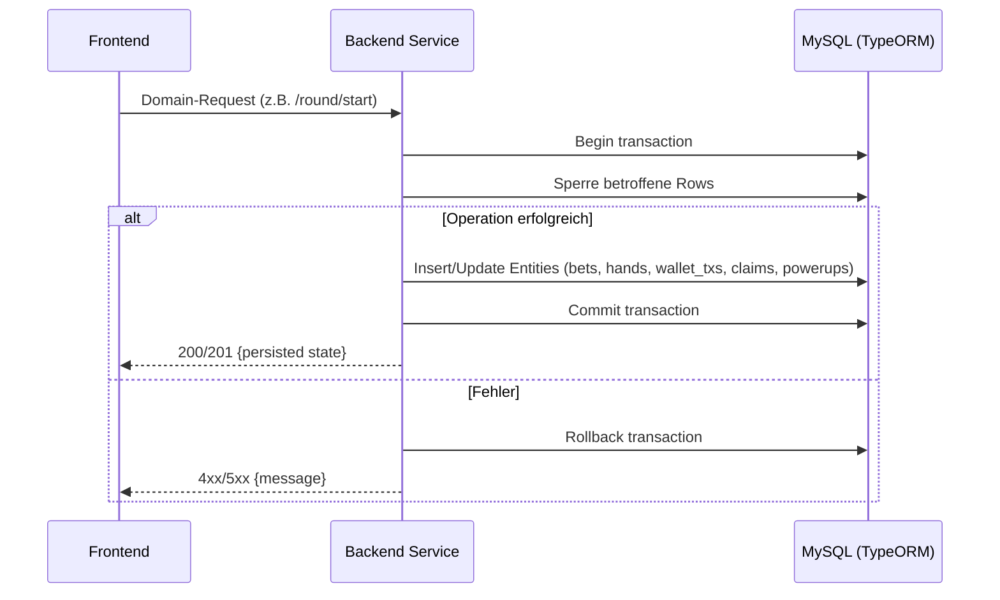
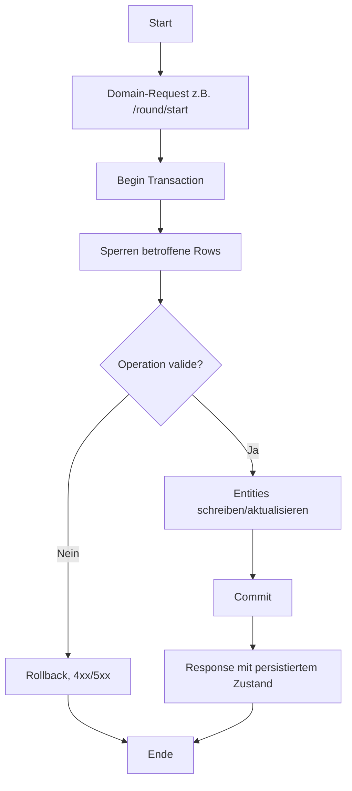

## Revision History
| Datum | Version | Beschreibung | Autor |
| --- | --- | --- | --- |
| 2025-10-27 | 0.1 | Initiale UC-Dokumentation (Neue Ordnerstruktur) | Team BetCeption|
| 2025-12-01 | 1.1 | Abgleich Implementierung (Transaktionen/Locks, fehlende XP-Updates) | Team BetCeption |

# Use Case – Daten persistieren

## 1. Brief Description
Dieser Use Case beschreibt die dauerhafte Speicherung aller wichtigen Spiel- und Benutzerdaten in einer MySQL-Datenbank.  
Das System stellt sicher, dass Spielerprofile, Wetten, Spielstände, Inventar, Power-Ups, XP und Transaktionen zuverlässig gespeichert und bei Bedarf wiederhergestellt werden können.

---

## 2. Akteure:
- **Entwickler:** Führt Tests zur Datenkonsistenz, API-Kommunikation und Datenbankintegrität durch.  
- **System:** Simuliert Testfälle und liefert Ergebnisse zur Überprüfung der Datenflüsse.

---

## 3. Flow of Events

### 3.1 Basic Flow
1. Eine Aktion des Spielers (z. B. Spielstart, Kauf, Level-Up) löst eine Datenänderung aus.
2. Das System erstellt oder aktualisiert die entsprechenden Einträge im Speicher (temporär).
3. Die Persistenz-Schicht prüft Datenintegrität und Verknüpfungen (z. B. Fremdschlüssel).
4. Die Änderungen werden in die MySQL-Datenbank geschrieben.
5. Das System bestätigt den Erfolg an die Business-Logik.

---
## 4. Sequenzdiagramm

---

## 5. AktivitAtsdiagramm (aktuell)

---

## 5. Special Requirements
- ACID-konforme Transaktionen in MySQL.
- Fehlerbehandlung und automatisches Retry-System bei Verbindungsverlust.
- Verwendung von ORM oder Data Mapper für strukturierte Persistenz.

---

## 6. Preconditions
- MySQL-Datenbank ist aktiv und erreichbar.
- Anwendung ist mit Datenbank verbunden.

---

## 7. Postconditions
- Datenänderungen wurden dauerhaft gespeichert.
- Inkonsistenzen wurden vermieden.

---

## 8. Function Points

| Kategorie  | Beschreibung                                | Function Points |
|-------------|----------------------------------------------|-----------------|
| Eingaben    | Testkonfiguration und Datenbankanfragen      | 2 FP            |
| Ausgaben    | Testberichte und Fehlerprotokolle            | 2 FP            |
| Abfragen    | Datenabgleich zwischen API und Datenbank     | 2 FP            |
| **Gesamt**  |                                              | **6 FP**        |

---

