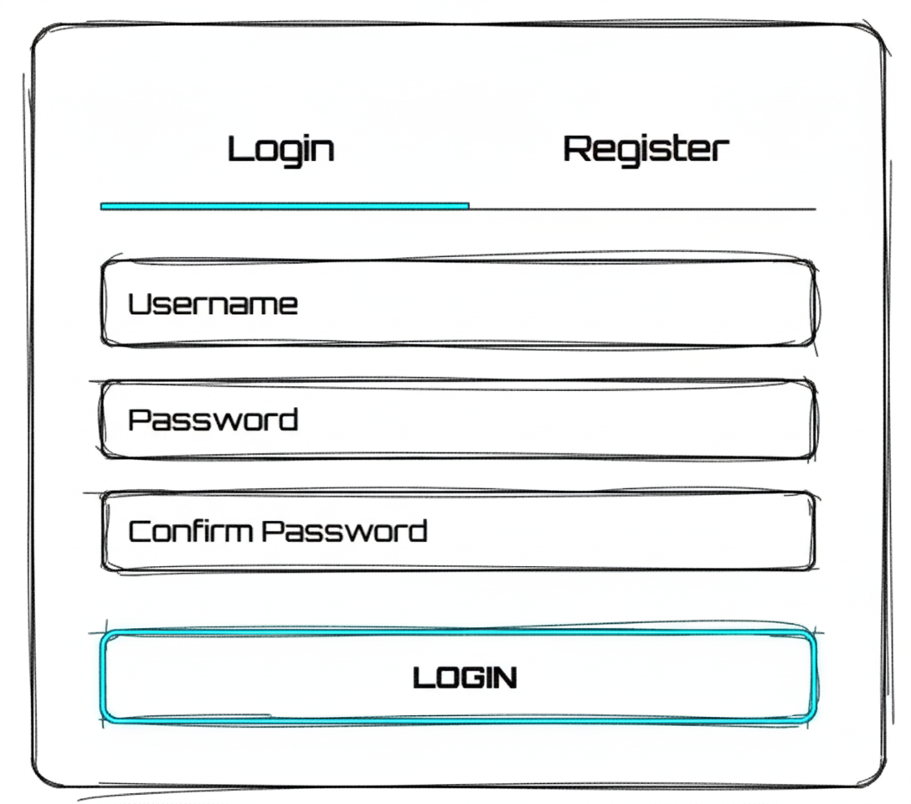
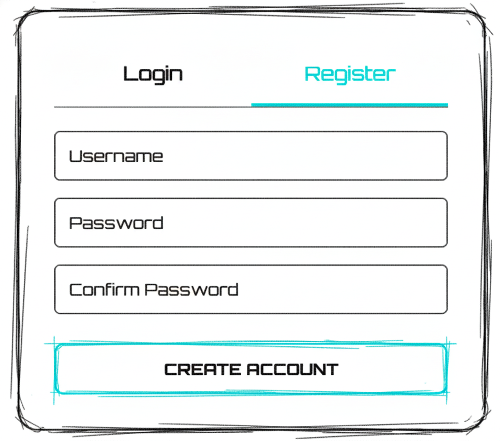
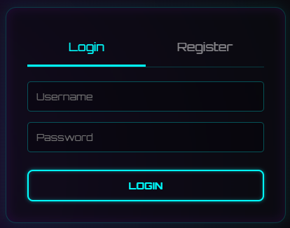
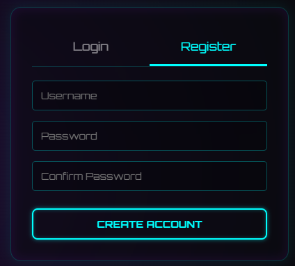
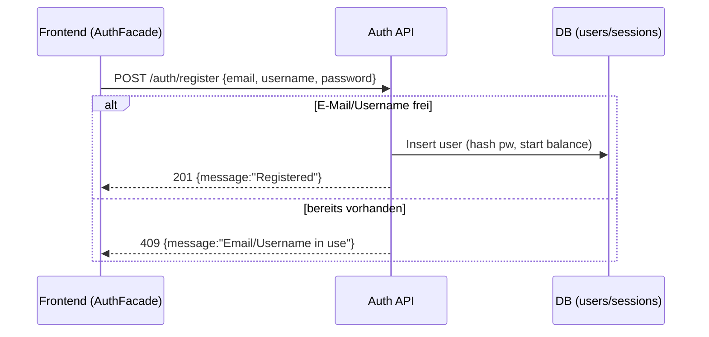
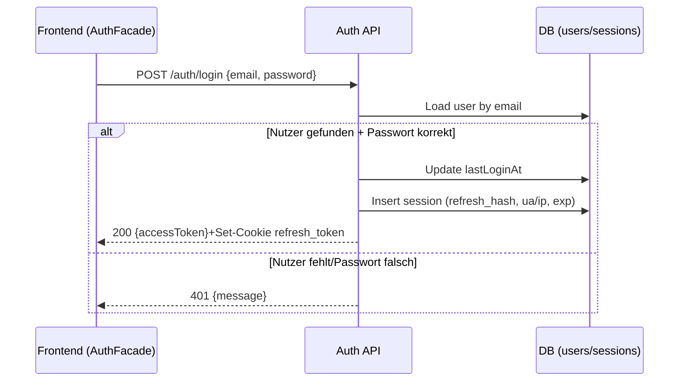
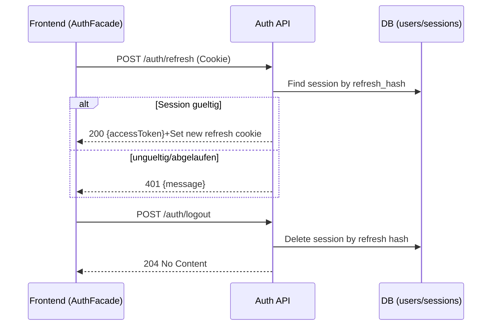
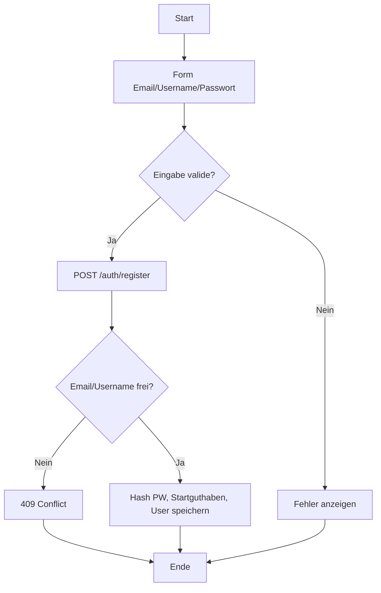
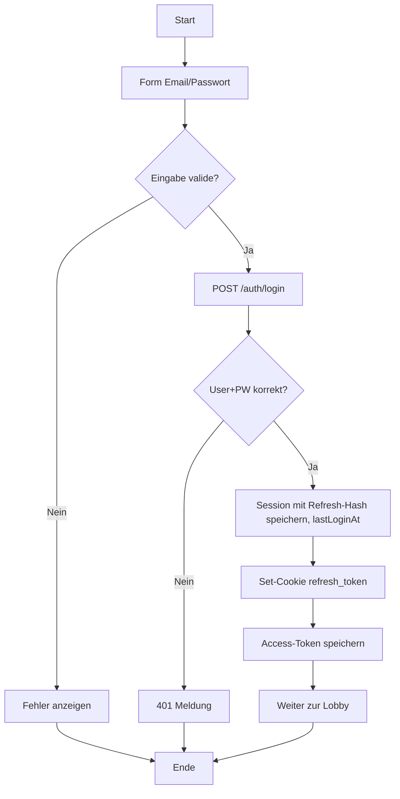
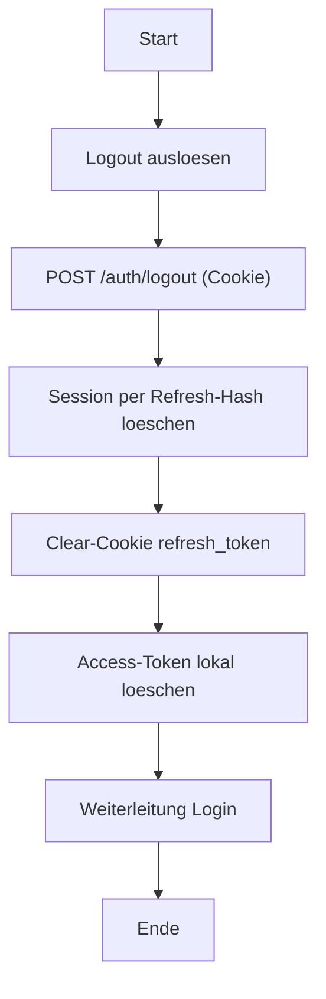

## Revision History
| Datum | Version | Beschreibung | Autor |
| --- | --- | --- | --- |
| 2025-10-27 | 0.1 | Initiale UC-Dokumentation (Neue Ordnerstruktur) | Team BetCeption|
| 2025-12-01 | 1.1 | Abgleich Implementierung (Access/Refresh, Sessions, Daily Reward Hinweis) | Team BetCeption |

# Use Case – Authentifizierung & Session Management

## 1. Brief Description
Dieser Use Case beschreibt die gesamte Benutzerverwaltung in **BetCeption** – von der **Registrierung** neuer Spieler, über den **Login** bestehender Konten bis hin zum **Logout** (Sitzungsende) **und die laufende Prüfung der Authentifizierung** bei allen weiteren Aktionen.  

Das Ziel ist die sichere Authentifizierung, Verwaltung von Sitzungen (Session/JWT-Token) und die Kontrolle des Zugriffs auf geschützte Bereiche der Anwendung.  
Die **Middleware** stellt sicher, dass nur authentifizierte Benutzer auf spielbezogene Ressourcen zugreifen können.  

Nach erfolgreicher Anmeldung wird der Benutzer zur **Lobby** weitergeleitet. Beim ersten Login des Tages wird automatisch der **Daily Reward** aktiviert.

---
## Abgleich Implementierung (Stand aktueller Code)
- **Backend:** `/auth/register` legt Nutzer mit gehashtem Passwort und Startbalance an. `/auth/login` prA�ft Hash, setzt `lastLoginAt`, erstellt Access-Token (Response Body) plus Refresh-Token als HttpOnly-Cookie (`/auth/refresh`), speichert gehashten Refresh-Token in `sessions`. `/auth/refresh` erneuert Access-Token und Refresh-Token (gleiche Cookie-Strategie) nach Validierung des gespeicherten Hashes. `/auth/logout` lA�scht den gespeicherten Refresh-Token und das Cookie. Auth-Middleware erwartet `Authorization: Bearer <access>`, GET `/leaderboard/*` darf ohne Token passieren.
- **Frontend:** Startseite besitzt ein Auth-Panel fA�r Login/Registrierung und nutzt `AuthFacade` mit LocalStorage fA�r Access-Token und Cookies fA�r Refresh. Dedizierte Login-/Register-Seiten sind Platzhalter. Token-Refresh wird clientseitig auf Bedarf aufgerufen, automatische Daily-Reward-Aktivierung existiert nicht.
- **Abweichungen:** Daily Reward wird **nicht** automatisch beim Login ausgelA�st (muss per `/rewards/daily/claim` erfolgen). Kein Account-Lockout, MFA oder Device-Bindung implementiert. Logout invalidiert nur Refresh-Cookie/Session, Access-Token lA�uft aus oder wird clientseitig gelA�scht.

## Aktueller Ablauf (Backend)
1. Register: Client sendet `{email, username, password}` an `/auth/register`; Backend verweigert bei doppelter Mail/Username und vergibt Startguthaben (`env.users.initialBalance`).
2. Login: Client sendet `{email, password}` an `/auth/login`; bei Erfolg `accessToken` im Body, Refresh-Cookie mit `httpOnly`, `secure`, `sameSite` auf `/auth/refresh`; `lastLoginAt` wird gesetzt.
3. GeschA�tzte Routen: Access-Token im `Authorization`-Header; Refresh bei Ablauf via `/auth/refresh` (benutzt gespeicherten Refresh-Hash).
4. Logout: Client POST `/auth/logout`; Refresh-Session wird gelA�scht, Cookie entfernt, Access-Token bleibt clientseitig zu lA�schen/ablaufen.

ja
## 1.2 Wireframe Mockups

## 1.3 Mockups

---

## 2. Akteure
- **Primärer Akteur:** Spieler (Benutzer)  
- **Sekundäre Akteure:**  
  - Authentifizierungs-Service (Node.js / Express)  
  - Datenbank (MySQL)  
  - Frontend (Angular)  
  - Authentifizierungs-Middleware (JWT-Validator)

---

## 3. Flow of Events

### 3.1 Registrierung
1. Der Benutzer öffnet die **Registrierungsseite**.  
2. Er gibt **Benutzername**, **E-Mail** und **Passwort** ein.  
3. Das System prüft die Eingaben auf Vollständigkeit und Format.  
4. Wenn Felder leer sind oder E-Mail ungültig ist, wird eine Fehlermeldung angezeigt:  
   *„Bitte füllen Sie alle Felder korrekt aus.“*  
5. Das System prüft, ob die E-Mail bereits registriert ist.  
6. Wenn nicht vorhanden, wird das Konto angelegt, das Passwort **gehasht** gespeichert und ein Startguthaben vergeben (z. B. 1000 Coins).  
7. Das System zeigt eine Bestätigungsmeldung:  
   *„Registrierung erfolgreich.“*  
8. Bei bereits registrierter E-Mail erscheint:  
   *„Ein Konto mit dieser E-Mail existiert bereits.“*  
9. Nach erfolgreicher Registrierung kann der Benutzer sich einloggen.

---

### 3.2 Login
1. Der Benutzer gibt auf der **Login-Seite** seine **E-Mail** und sein **Passwort** ein.  
2. Das System validiert die Eingaben.  
3. Es sucht in der Datenbank nach einem Benutzer mit der angegebenen E-Mail.  
4. Wird ein Konto gefunden, wird das Passwort mit dem gespeicherten Hash verglichen.  
5. Bei Erfolg wird eine **Session** oder ein **JWT-Token** erstellt.  
6. Der Benutzer wird zur **Startseite/Lobby** weitergeleitet.  
7. Wenn es der **erste Login des Tages** ist, wird der **Daily Reward** aktiviert.  
8. Bei falschen Anmeldedaten wird eine Fehlermeldung ausgegeben.

---

### 3.3 Authentifizierung prüfen (Middleware)
1. Spieler sendet eine Anfrage an das System (z. B. Spiel starten, Wette platzieren).  
2. Middleware fängt die Anfrage ab und extrahiert das **JWT-Token**.  
3. Das System prüft Signatur, Gültigkeit und Ablaufzeit.  
4. Wenn das Token gültig ist, wird die Anfrage weitergeleitet.  
5. Wenn das Token ungültig oder abgelaufen ist, wird der Zugriff verweigert (**401 Unauthorized**).  
6. Der Benutzer wird zur **Login-Seite** weitergeleitet oder erhält eine API-Fehlermeldung.  

**Alternative Flows:**  
- **Token abgelaufen:** Benutzer wird automatisch ausgeloggt.  
- **Token manipuliert:** Anfrage wird blockiert, IP ggf. gesperrt.  
- **Kein Token vorhanden:** Client erhält *401 Unauthorized*.

---

### 3.4 Logout
1. Der Benutzer klickt auf **„Logout“**.  
2. (Optional) Das System fragt nach einer Bestätigung.  
3. Nach Bestätigung wird das **Session-/JWT-Token ungültig gemacht**.  
4. Der Benutzer wird zur **Login-Seite** weitergeleitet.  
5. Das System zeigt eine Meldung:  
   *„Erfolgreich abgemeldet.“*  

**Alternative Flows:**  
- **Abbruch:** Benutzer bleibt eingeloggt.  
- **Token bereits abgelaufen:** Hinweis *„Sitzung abgelaufen“* und automatische Weiterleitung zum Login.

---

## 4. Sequenzdiagramme
### 4.1 Registrieren

### 4.2 Login

### 4.3 Refresh/Logout

---

## 5. AktivitAtsdiagramm
### 5.1 Registrierung

### 5.2 Login

### 5.3 Logout

## 6. Special Requirements
- Kommunikation ausschließlich über **HTTPS**  
- **Passwörter gehasht** (z. B. bcrypt oder Argon2)  
- **JWT-Token**: signiert, sicher, enthält `user_id`, Ablaufzeit (`exp`)  
- **Middleware** validiert alle Anfragen auf Authentifizierung  
- **Client- und serverseitige Validierung** aller Eingaben  
- Nach Logout dürfen **keine gecachten Inhalte** mehr abrufbar sein  
- Optional: **Rate-Limiting / Account-Lockout** bei zu vielen Fehlversuchen  

---

## 7. Preconditions
- Benutzer besitzt ein **gültiges Token** oder befindet sich auf der **Login-/Registrierungsseite**.  
- Bei Login: Benutzerkonto existiert.  
- Bei Logout oder Middlewareprüfung: Benutzer ist (oder war) eingeloggt.

---

## 8. Postconditions
- **Nach Registrierung:** Konto angelegt.  
- **Nach Login:** Benutzer authentifiziert, gültige Session/JWT aktiv.  
- **Während Middleware-Prüfung:** Nur gültige Tokens dürfen zugreifen.  
- **Nach Logout:** Token ungültig, kein Zugriff auf geschützte Bereiche.

---

## 9. Daten, die gespeichert oder synchronisiert werden
- Benutzername  
- E-Mail-Adresse  
- Passwort (gehasht)  
- Startguthaben  
- Letztes Login-Datum  
- Session/JWT-Token  
- Token-Ablaufzeit (`exp`)  
- Optional: IP-Adresse, Audit-Logs  

---

## 10. Function Points
| Komponente               | Beschreibung                              | Punkte |
|--------------------------|--------------------------------------------|--------|
| Formularfelder           | Benutzername, E-Mail, Passwort             | 2      |
| Validierungslogik        | Eingabeprüfung                             | 1      |
| Authentifizierung        | Passwortprüfung + Token-Erstellung         | 3      |
| Middlewareprüfung         | Token validieren, Zugriffskontrolle        | 3      |
| Datenbank-Operationen    | Benutzer anlegen, Login prüfen, Session speichern | 2 |
| Weiterleitung & Meldungen | Erfolgsmeldungen / Fehlermeldungen         | 1      |
| **Gesamt**               |                                            | **12 FP** |

---

## 11. Abhängigkeiten
- **Daily Reward** (wird beim ersten Login des Tages aktiviert)  
- **Middleware** (JWT-Validierung) wird bei allen spielbezogenen API-Endpunkten verwendet  
- **UI-Komponenten** für Login, Logout, Fehlermeldungen  
- **REST-API-Endpunkte:** `/register`, `/login`, `/logout`, `/middleware/auth-check`  
- **MySQL** für Benutzerdaten und Sessions  

---

