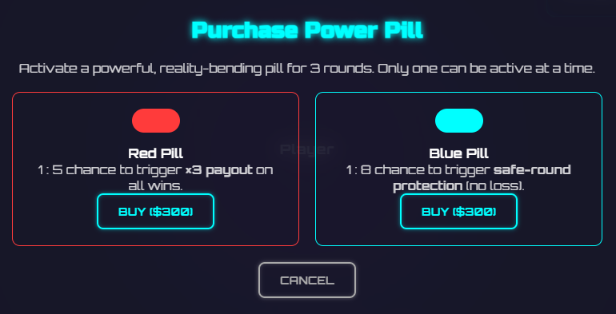

## Revision History
| Datum | Version | Beschreibung | Autor |
| --- | --- | --- | --- |
| 2025-10-27 | 0.1 | Initiale UC-Dokumentation (Neue Ordnerstruktur) | Team BetCeption|
| 2025-12-01 | 1.1 | Abgleich Implementierung (Shop/Inventar/Wallet Backend, fehlendes Frontend) | Team BetCeption |

# Use Case – Shop, Inventar & Guthabenverwaltung

## 1. Brief Description
Dieser Use Case beschreibt alle Funktionen rund um das **In-Game-Ökosystem von BetCeption**, bestehend aus:
- dem **Shop** (Kauf von Power-Ups / Pillen),
- dem **Inventar** (Anzeige aller erworbenen, aber noch nicht verwendeten Items),
- sowie der **Guthabenverwaltung** (Einsicht, Historie und automatische Synchronisierung).

Ziel ist es, dem Spieler eine durchgängige Benutzererfahrung für den Erwerb, die Verwaltung und die Nutzung seiner Spielressourcen zu bieten.

---
## Abgleich Implementierung (Stand aktueller Code)
- **Backend:** `GET /shop/powerups` ist A�ffentlich; `POST /shop/powerups/purchase` prA�ft Level, Guthaben und fA�hrt Kauf + Wallet-Transaktion in einer DB-Transaktion aus. `GET /inventory/powerups` liefert Bestand des eingeloggten Users. `GET /wallet`, `GET /wallet/transactions`, `POST /wallet/deposit|withdraw` liefern Kontostand, Historie bzw. buchen Ein-/Auszahlungen (Validierung auf zwei Nachkommastellen, pessimistic locks auf User-Balance). Daten werden als Decimal gespeichert, in Cent berechnet.
- **Frontend:** Kein dediziertes Shop-/Inventar-/Wallet-UI. Einzig der Blackjack-Screen lädt per `Wallet.getSummary()` den Kontostand. Keine Transaktionshistorie, kein Kauf- oder Inventar-Flow implementiert.
- **Abweichungen:** Kein Realtime-Sync oder Filter/Sortierung im Frontend. Keine Anzeige/Bedienung fA�r Kauf oder Transaktionen. Level-Sperren/Guthaben werden backendseitig erzwungen; Client validiert nicht vorab.

## Aktueller Ablauf (Backend)
1. Shop anzeigen: Client ruft `GET /shop/powerups`; Backend liefert Power-Ups inkl. Preis, Level-Anforderung und Effekt.
2. Kauf: Authentifizierter Client sendet `POST /shop/powerups/purchase {typeId, quantity}`; Backend sperrt User, prA�ft Level & Balance, zieht Betrag ab, erhA�ht Inventar (`user_powerups`), schreibt Wallet-Tx (`kind=ADJUSTMENT`).
3. Inventar: Authentifizierter Client ruft `GET /inventory/powerups`; Backend liefert Liste mit Typ-Details und Restbestand.
4. Wallet: Authentifizierter Client ruft `GET /wallet` (Saldo, XP/Level, `lastDailyRewardAt`) und `GET /wallet/transactions` (paginiert); `POST /wallet/deposit|withdraw` passen das Guthaben an und loggen Transaktionen.


## 1.2 Wireframe Mockups


## 1.3 Mockups


---
## 2. Akteure
- **Primärer Akteur:** Spieler (eingeloggt)
- **Sekundäre Akteure:**  
  - Shop-Service (Node/Express)  
  - Inventar-Service  
  - Datenbank (MySQL)  
  - Frontend (Angular)

---

## 3. Flow of Events

### 3.1 Power-Ups / Pillen kaufen (Shop)
1. Spieler navigiert zum **Shop**.  
2. Das System zeigt verfügbare **Power-Ups** mit Preis und Level-Anforderung an.  
3. Spieler wählt ein Power-Up aus.  
4. Das System prüft:  
   - Hat der Spieler das erforderliche Level?  
   - Hat der Spieler genügend Guthaben?  
5. Wenn beide Bedingungen erfüllt sind:  
   - Der Betrag wird **vom Guthaben abgezogen**.  
   - Das Power-Up wird dem **Inventar** hinzugefügt.  
6. System zeigt eine Bestätigungsmeldung an.  

**Alternative Flows:**  
- **Nicht genügend Guthaben:** Fehlermeldung *„Nicht genügend Coins“*.  
- **Level zu niedrig:** Power-Up bleibt gesperrt mit Hinweis auf benötigtes Level.  
- **Serverfehler:** Kauf wird abgebrochen, keine Transaktion.  

---

### 3.2 Inventar anzeigen
1. Spieler öffnet das **Inventar-Menü**.  
2. Das System überprüft den **Login-Status**.  
3. Das System ruft alle Power-Ups aus der Datenbank ab, die dem Spieler gehören und noch nicht verbraucht sind.  
4. Das Inventar zeigt:  
   - **Icons, Namen, Effekte, Verfügbarkeit** der Power-Ups.  
   - Sortieroptionen nach **Kategorie oder Level**.  
5. Spieler kann Details zu einzelnen Power-Ups einsehen.  

**Alternative Flows:**  
- Kein Power-Up vorhanden → leere Anzeige mit *„Keine Power-Ups vorhanden“*.  
- Verbindungsfehler → Fehlermeldung, Inventar bleibt leer.  

---

### 3.3 Guthaben anzeigen / verwalten
1. Spieler öffnet die **Guthaben-Seite**.  
2. System überprüft Login.  
3. System ruft den **aktuellen Kontostand** aus der Datenbank ab.  
4. System zeigt:  
   - **Gesamtguthaben**,  
   - **Transaktionshistorie** (Wetten, Gewinne, Käufe, Belohnungen).  
5. Spieler kann Filter und Details anzeigen (z. B. Zeitraum oder Transaktionstyp).  

**Alternative Flows:**  
- **Verbindungsfehler / Serverfehler:** Fehlermeldung, Daten nicht aktualisiert.  
- **Keine Transaktionen vorhanden:** Hinweis *„Keine Transaktionen verfügbar“*.  

---

## 4. Sequenzdiagramme
### 4.1 Power-Up kaufen

### 4.2 Inventar anzeigen

### 4.3 Guthaben anzeigen


## 5. AktivitAtsdiagramm (aktuell)
```mermaid
flowchart TD
  A[Start] --> B[Shop: GET /shop/powerups]
  B --> C[Liste anzeigen]
  C --> D[User waehlt Power-Up + Menge]
  D --> E{Eingabe valide?}
  E -->|Nein| F[Fehler anzeigen]
  E -->|Ja| G[POST /shop/powerups/purchase]
  G --> H{Level/Budget ok?}
  H -->|Nein| I[400/403 Meldung]
  H -->|Ja| J[Inventar aktualisieren, Wallet-Tx - Betrag]
  J --> K[201 {balance, quantity}]
  K --> L[Inventar laden GET /inventory/powerups]
  L --> M[Wallet laden GET /wallet + /wallet/transactions]
  M --> N[UI aktualisieren]
  I --> O[Ende]
  N --> O
  F --> O
```

## 6. Special Requirements
- **Echtzeit-Synchronisation** zwischen Client und Server.  
- **Transaktionssicherheit:** Alle Käufe atomar (ACID).  
- **Sortierung und Filterung** im Inventar und der Transaktionsliste.  
- **Level-Validierung** bei Power-Up-Käufen.  
- **Serverseitige Berechnung** des Guthabens (kein Vertrauen in Client-Daten).  
- **Audit-Logs** für Käufe und Transaktionen.

---

## 7. Preconditions
- Spieler ist **eingeloggt**.  
- Für Käufe: ausreichendes Guthaben und erforderliches Level.  

---

## 8. Postconditions
- **Nach Kauf:** Power-Up im Inventar, Guthaben reduziert.  
- **Nach Inventarabruf:** Liste der Items angezeigt.  
- **Nach Guthabenabruf:** Kontostand & Transaktionshistorie aktualisiert.  

---

## 9. Function Points
| Komponente | Beschreibung | Punkte |
|-------------|--------------|--------|
| Power-Up-Kauf | Level- & Guthabenprüfung, Kauf-Transaktion | 3 |
| Inventar-Anzeige | Datenabfrage, Sortierung, UI | 2 |
| Guthabenverwaltung | Kontostand, Historie, Filter | 3 |
| Fehler- & Synchronisationslogik | Fehlermeldungen, Realtime-Update | 1 |
| **Gesamt** |  | **9 FP** |

---

## 10. Abhängigkeiten
- **Authentifizierung & Session Management** (Tokenprüfung)  
- **Spiel- & Levelsystem** (Levelanforderungen)  
- **MySQL-Datenbank** (Inventar, Transaktionen, Guthaben)  
- **Frontend-Komponenten** (Shop-, Inventar- und Wallet-Views)

---


