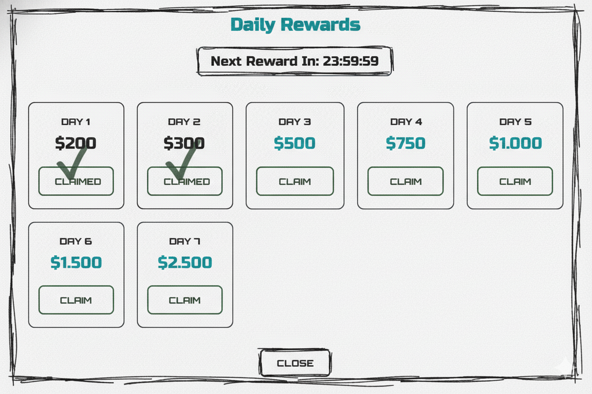
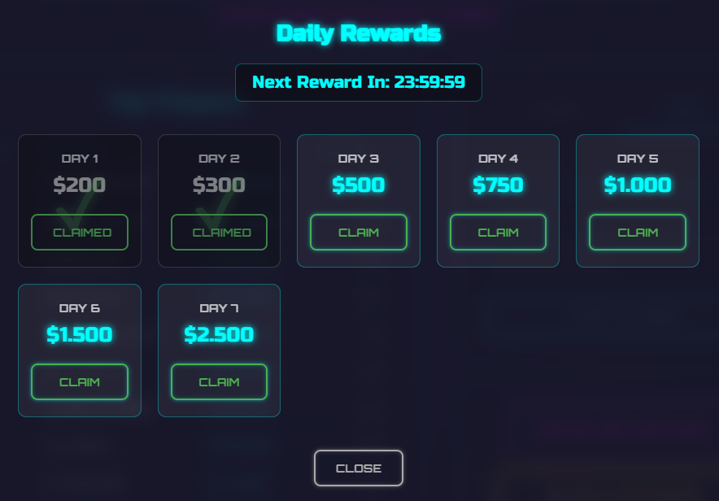
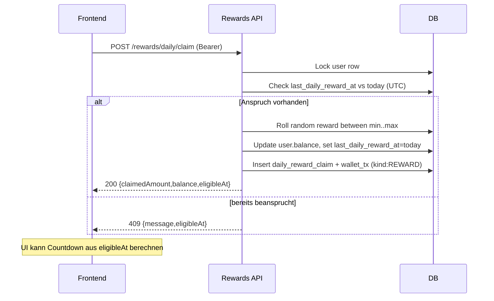
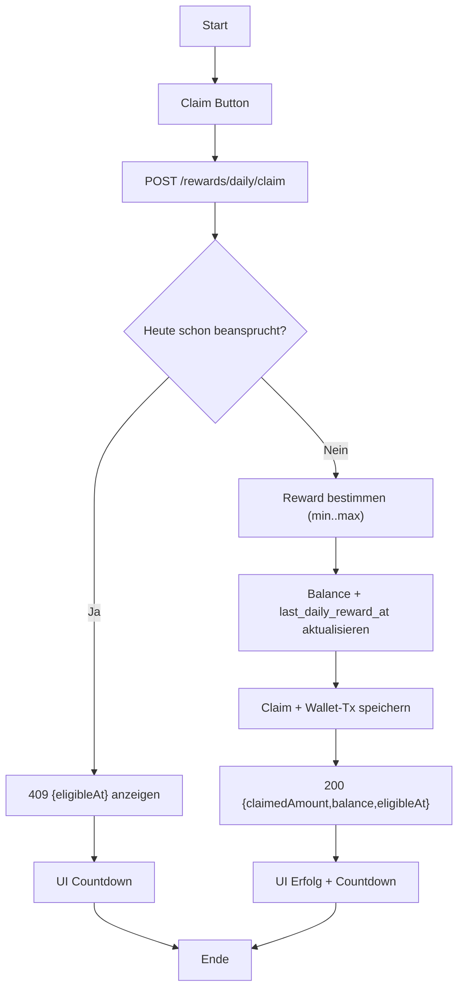

## Revision History
| Datum | Version | Beschreibung | Autor |
| --- | --- | --- | --- |
| 2025-10-27 | 0.1 | Initiale UC-Dokumentation (Neue Ordnerstruktur) | Team BetCeption|
| 2025-12-01 | 1.1 | Abgleich Implementierung (UTC-Tag, Claim-Endpoint, kein Auto-Login-Claim) | Team BetCeption |

# Use Case 2: Daily Reward abholen

## 1.1 Brief Description
Dieser Use Case ermöglicht es einem **eingeloggten Spieler**, einmal pro Tag eine **tägliche Belohnung (Coins)** zu erhalten.  
Beim Login oder beim Aufruf der Reward-Funktion prüft das System das **letzte Belohnungsdatum**.  
Wenn mehr als 24 Stunden vergangen sind oder ein neuer Kalendertag begonnen hat, wird dem Spieler die Belohnung gutgeschrieben.

---
## Abgleich Implementierung (Stand aktueller Code)
- **Backend:** `POST /rewards/daily/claim` prA�ft `users.lastDailyRewardAt` gegen das aktuelle UTC-Datum (Kalendertag, nicht 24h Intervall). Bei erster Abholung pro Tag wird ein Reward per `crypto.randomInt` zwischen `dailyRewardConfig.minAmount` und `maxAmount` gezogen, Guthaben aktualisiert, `DailyRewardClaim` sowie `WalletTransaction (REWARD)` geschrieben. Response: `{claimedAmount, balance, eligibleAt}`. Zweitversuch am selben Tag liefert 409 + `eligibleAt`.
- **Frontend:** Kein UI-Hook vorhanden. `Wallet`-Service stellt `claimDailyReward()` bereit, wird aber nirgends verwendet.
- **Abweichungen:** Daily Reward wird **nicht** automatisch beim Login ausgelA�st. Countdown/Timer nur clientseitig nach Response mA�glich. Keine Retry- oder Reminder-Logik.

## 1.2 Wireframe Mockups

## 1.3 Mockup

---

**2. Akteure:**  
- **Spieler:** Löst die tägliche Belohnung durch Einloggen aus.  
- **System:** Überprüft das Datum und gewährt die Belohnung einmal pro Tag.
---

## 3. Flow of Events

### 3.1 Basic Flow
1. Der Spieler klickt „Claim“.
2. Das System liest `last_daily_reward_at` aus der Datenbank.  
3. Das System prüft, ob der Spieler anspruchsberechtigt ist:  
   - mehr als 24 Stunden seit letzter Belohnung **oder**  
   - neuer Kalendertag (UTC).  
4. Wenn ja:  
   - Coins werden dem Konto gutgeschrieben.  
   - Transaktion wird geloggt.  
   - `last_daily_reward_at` wird aktualisiert.  
   - Erfolgsmeldung wird angezeigt.  
5. Wenn nein:  
   - System zeigt Countdown, wann die nächste Belohnung verfügbar ist.

---

### 4. Sequenzdiagramm

## 5. AktivitAtsdiagramm (aktuell)

## 6. Special Requirements
- Belohnung kann **fix** (z. B. 250 Coins) oder **zufällig** (z. B. 100–500 Coins) sein.  
- Zeitprüfung basiert auf **Serverzeit (UTC)**.  
- Operation ist **atomar und idempotent** (keine Doppelbelohnungen).  
- Audit-Log wird erstellt mit:
  - user_id  
  - amount  
  - reason = "daily_reward"  
  - timestamp  
- Response enthält:  
  `{ claimed_amount, new_balance, eligible_at }`

---

## 7. Preconditions
- Spieler ist **eingeloggt** (UC2).  

---

## 8. Postconditions
- Bei Erfolg:  
  - Coins wurden gutgeschrieben.  
  - `last_daily_reward_at` wurde aktualisiert.  
  - Transaktion ist in der Datenbank gespeichert.  
- Bei Nicht-Berechtigung:  
  - Keine Änderung an Guthaben oder Zeitstempel.  
  - Countdown wird angezeigt.

---

## 9. Function Points
| Komponente | Beschreibung | Punkte |
|-------------|---------------|--------|
| Eligibility-Check | Zeitprüfung 24h / Kalendertag | 2 |
| Reward-Ermittlung | Fix oder zufällig | 2 |
| Transaktion & Audit | Datenbank-Update + Logging | 2 |
| UI-Feedback | Erfolgsmeldung & Countdown | 1 |
| **Gesamt** |  | **7 FP** |

---

