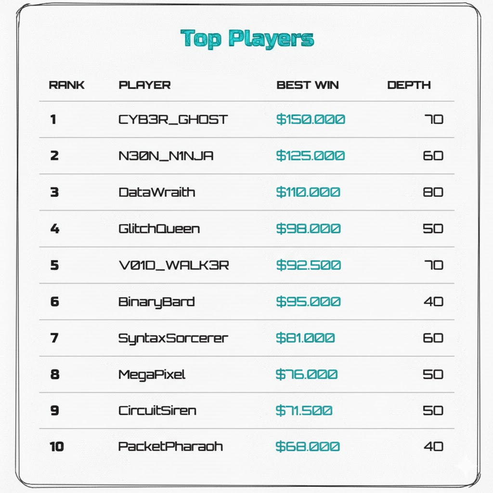
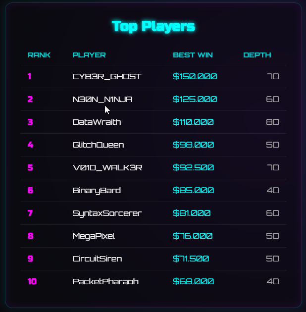
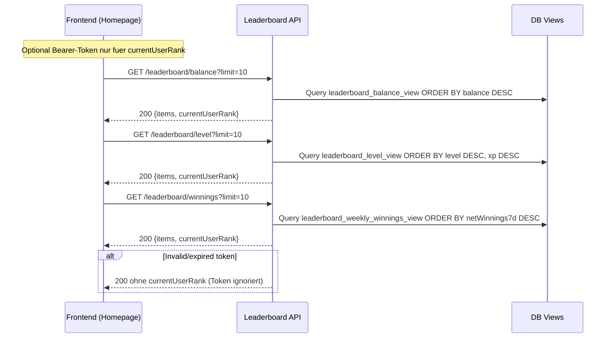
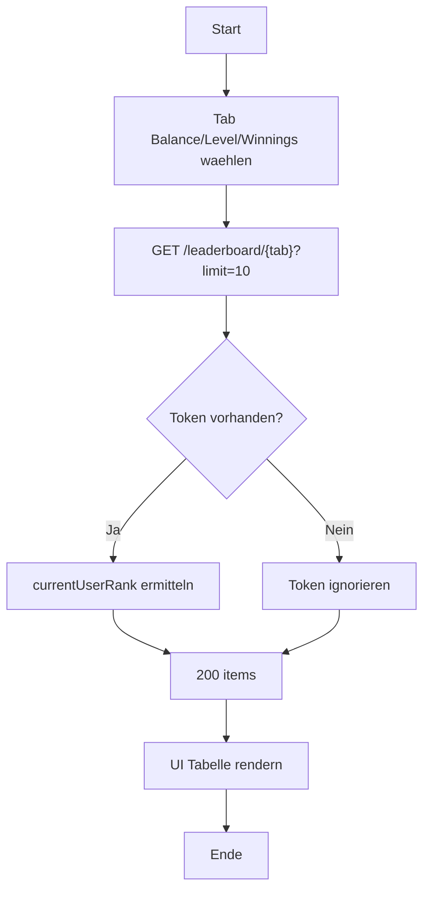

## Revision History
| Datum | Version | Beschreibung | Autor |
| --- | --- | --- | --- |
| 2025-10-27 | 0.1 | Initiale UC-Dokumentation (Neue Ordnerstruktur) | Team BetCeption|
| 2025-12-01 | 1.1 | Abgleich Implementierung (Balance/Level/Winnings-Views, public GET) | Team BetCeption |

# Use Case 4: Leaderboard anzeigen

## 1.1 Brief Description
Dieser Use Case ermöglicht es dem **eingeloggten Spieler**, die **Bestenliste (Leaderboard)** in **BetCeption** einzusehen.  
Das Leaderboard zeigt die **Top-Spieler** basierend auf Kriterien wie **Gewinnsumme** und **DEPTH** an.  
Die Daten werden vom Server geladen und regelmäßig aktualisiert.

---
## Abgleich Implementierung (Stand aktueller Code)
- **Backend:** Endpunkte `GET /leaderboard/balance`, `/leaderboard/level`, `/leaderboard/winnings` sind A�ffentlich; ein optionaler Access-Token wird nur genutzt, um den Rang des eingeloggten Users innerhalb der geladenen Seite zu berechnen. Daten stammen aus drei DB-Views (`balance`, `level`, `net winnings 7d`), paginiert A�ber `limit`/`offset`, Standardlimit 10. Kein Cache/Timer, kein Sort-Umschalter.
- **Frontend:** Homepage-Komponente lA�dt automatisch alle drei Kategorien (Tabs). Limit fest auf 10, keine Pagination oder Sortierung. Beim Winnings-Tab werden Usernames nicht angezeigt (Backend liefert nur `userId`, Frontend rendert `User #<id>`). Unangemeldete Nutzer kA�nnen die Liste sehen.
- **Abweichungen:** Use Case nennt Gewinnsumme/DEPTH + Auth-Pflicht; aktuell gibt es Balance, Level, Net Winnings (7d) und Endpunkte sind fA�r GA�ste offen. Keine periodische Aktualisierung oder Caching.

## 1.2 Wireframe Mockups

## 1.3 Mockup

---
**2. Akteure:**  
- **Spieler:** Möchte das aktuelle Leaderboard einsehen.  
- **System:** Ruft die aktuellen Punktestände aller Spieler aus der Datenbank ab und zeigt sie an.
---

## 3. Flow of Events

### 3.1 Basic Flow
1. Der Spieler öffnet die **Leaderboard-Seite**.
2. Der Client sendet GET /api/leaderboard?sort=win_sum&page=1 inklusive JWT.
3. Das System validiert das JWT.  
4. Das System lädt die Liste entweder aus dem Cache (Treffer) oder aus der Datenbank (Miss) und aktualisiert danach den Cache.
5. Optional ermittelt das System den eigenen Rang des Spielers.
6. Server sendet die Daten an den Client zurück.  
7. Client zeigt die Daten in einer strukturierten Tabelle an.  
8. Der eigene Rang des Spielers wird hervorgehoben.

   **Fehlerfälle**
   - Bei ungültigem oder fehlendem Token sendet das System 401 Unauthorized. Der Client leitet zur Anmeldung weiter.
   - Bei einem Serverfehler sendet das System 500 Server Error. Der Client zeigt eine Fehlermeldung mit „Erneut versuchen“.
   - Wenn keine Einträge vorhanden sind, sendet das System 200 OK { items: [] }. Der Client zeigt „Noch keine Einträge“.

---

### 5. Sequenzdiagramm

## 6. AktivitAtsdiagramm (aktuell)

## 7. Special Requirements
- Leaderboard-Daten werden **serverseitig aggregiert**.  
- Abfrage ist **paginiert** (z. B. 50 Spieler pro Seite).  
- Spielername wird **zensiert oder anonymisiert**, wenn Datenschutz aktiviert ist.  
- Server aktualisiert Daten **periodisch (z. B. alle 5 Minuten)**.  
- Client sollte **Caching** und **Loading-Indikatoren** unterstützen.  
- Sortierung nach:
  - Gewinnsumme (default)
  - DEPTH
- **Highlighting**: eigener Spieler wird visuell hervorgehoben.

---

## 8. Preconditions
- Spieler ist **eingeloggt** (UC2).

---

## 9. Postconditions
- Leaderboard ist erfolgreich geladen und angezeigt.  
- Keine Datenänderungen am Server nötig.

---

## 10. Function Points
| Komponente | Beschreibung | Punkte |
|-------------|---------------|--------|
| Datenabruf | Server-API / DB-Abfrage | 2 |
| Darstellung | Tabelle / Karten mit Rang und Filter | 2 |
| Sortier- und Filterlogik | Benutzerinteraktion | 2 |
| Fehlerbehandlung / Caching | Netzwerk & Timeout | 1 |
| **Gesamt** |  | **7 FP** |

---

**Client-Logik:**
- Speichert letzte Serverantwort im Cache.  
- Aktualisiert Daten automatisch alle 5 Minuten.

---
-->

