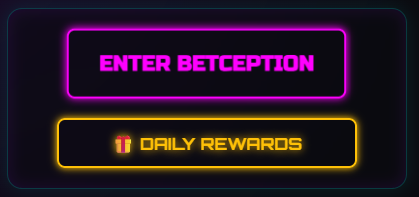

# Use Case – Spiel starten (Blackjack)

## 1.1 Brief Description
Dieser Use Case ermöglicht es einem **eingeloggten Spieler**, ein neues **Blackjack-Spiel** in **BetCeption** zu starten.  
Der Spieler wählt seinen Einsatz und das System initialisiert das Spiel mit Dealer, Karten und Spielstatus.  
Das Spiel kann anschließend über weitere Use Cases (z. B. UC6 - Wette platzieren, UC8 - Spielzug ausführen) fortgesetzt werden.

---
## 1.2 Wireframe Mockups

## 1.3 Mockup


---
<!--
## 1.3 Screenshots
- Startseite des Spiels mit Einsatzfeld  
- Nach Start: Tisch mit Karten  
- Anzeige von Einsatz und Guthaben  

*(Screenshots folgen später.)*

---
-->
**2. Akteure:**  
- **Spieler:** Startet ein neues Blackjack-Spiel.  
- **System:** Initialisiert das Spiel, verteilt Karten und verwaltet die Wettsituation.
---

## 3. Flow of Events

### 3.1 Basic Flow
1. Spieler ist **eingeloggt** (UC2).  
2. Spieler navigiert zur **Blackjack-Spielseite**.  
3. Das System zeigt das aktuelle Guthaben an.  
4. Spieler gibt seinen **Einsatzbetrag** ein.  
5. System prüft, ob genügend Guthaben vorhanden ist.  
6. Wenn ja:
   - Betrag wird reserviert bzw. abgezogen.
   - Neues Spielobjekt wird erstellt (Status: *running*).
   - Spieler- und Dealer-Karten werden initial verteilt.
   - Spielstatus wird gespeichert.
7. Spieloberfläche zeigt den aktuellen Zustand (Karten, Einsatz, Optionen).

---

### 4. Sequenz Diagram

---

### 5. Aktivitätsdiagramm

---


## 6. Special Requirements
- Spiel darf nur gestartet werden, wenn **kein anderes aktives Spiel** besteht.  
- Einsatzbetrag wird **atomar reserviert** (DB-Transaktion).  
- Initiale Kartenverteilung erfolgt **zufällig** über RNG.
  <!--- RNG muss **kryptographisch sicher** sein.--> 
- Server synchronisiert Spielstatus mit Client nach jeder Aktion.
  <!--- Spielstatus wird persistiert in `games`-Tabelle.  -->
<!--- Das Spielobjekt enthält:
  - game_id  
  - player_id  
  - dealer_cards  
  - player_cards  
  - bet_amount  
  - status ("running", "finished")  
  - created_at -->
---

## 7. Preconditions
- Spieler ist **eingeloggt** (UC2).  
- Kein anderes aktives Spiel läuft.  
- Spieler hat ausreichend Guthaben.

---

## 8. Postconditions
- Neues Spielobjekt ist erstellt und gespeichert.  
- Einsatzbetrag ist vom Guthaben abgezogen.  
- Spielstatus = *running*.  
- Karten wurden verteilt.

---
<!--
### 5.1 Save changes / Sync with server
**Persistente Datenbanktabellen (Beispiel):**
```sql
INSERT INTO games (player_id, bet_amount, dealer_cards, player_cards, status, created_at)
VALUES (:player_id, :bet, :dealer_cards, :player_cards, 'running', NOW());
UPDATE users SET balance = balance - :bet WHERE id = :player_id;
```

Server antwortet mit:
```json
{
  "game_id": 123,
  "player_cards": ["10♠", "A♥"],
  "dealer_cards": ["7♣"],
  "balance": 950,
  "status": "running"
}
```
-->
---

## 9. Function Points
| Komponente | Beschreibung | Punkte |
|-------------|---------------|--------|
| Einsatzprüfung | Guthabenvalidierung | 2 |
| Spielinitialisierung | Karten & Status erstellen | 2 |
| Datenpersistenz | Spiel- und User-Update | 2 |
| UI-Feedback | Darstellung Spielstart & Fehler | 1 |
| **Gesamt** |  | **7 FP** |

---
<!--
## 7. Technische Hinweise
**API-Endpoint:**
```
POST /api/game/start
Authorization: Bearer <JWT>
Body: { "bet_amount": 50 }
```

**Antworten:**
```
200 OK { game_id, player_cards, dealer_cards, balance, status }
400 Bad Request { error: "insufficient_balance" }
409 Conflict { error: "active_game_exists" }
500 Internal Server Error { error: "server_error" }
```

**Serverlogik (Pseudocode):**
```pseudo
if user.balance < bet:
    return 400, { error: "insufficient_balance" }
if existsActiveGame(user.id):
    return 409, { error: "active_game_exists" }

cards = shuffleDeck()
player_cards = draw(cards, 2)
dealer_cards = draw(cards, 1)

transaction:
  insertGame(user.id, bet, player_cards, dealer_cards, "running")
  updateBalance(user.id, -bet)
commit

return 200, { game_id, player_cards, dealer_cards, balance: user.balance - bet, status: "running" }
```

---
-->
