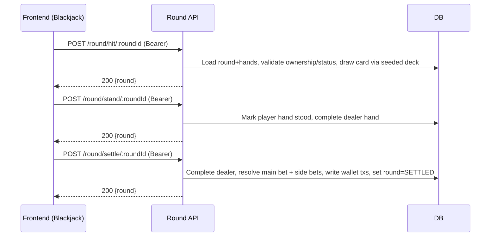

## Revision History
| Datum | Version | Beschreibung | Autor |
| --- | --- | --- | --- |
| 2025-10-27 | 0.1 | Initiale UC-Dokumentation (Neue Ordnerstruktur) | Team BetCeption|
| 2025-12-01 | 1.1 | Abgleich Implementierung (Hit/Stand/Settle, kein Double/Split) | Team BetCeption |

# Use Case – Spielzug ausführen (Hit, Stand, Double, Split)

## 1.1 Brief Description
Dieser Use Case beschreibt, wie ein **eingeloggter Spieler** während eines laufenden Blackjack-Spiels (UC5) einen **Spielzug** ausführt – z. B. **Hit (Karte ziehen)**, **Stand (bleiben)**, **Double (Einsatz verdoppeln + 1 Karte)** oder **Split (Hand teilen)**.  
Das System prüft den **aktuellen Spielstatus**, **Regeln** und **Guthaben**, führt den Spielzug aus, aktualisiert Karten, Status und ggf. XP/Gewinne.

---
## Abgleich Implementierung (Stand aktueller Code)
- **Backend:** Unterstützt `POST /round/hit/:roundId`, `POST /round/stand/:roundId`, `POST /round/settle/:roundId`, `GET /round/:roundId` (alle auth). Aktionen prüfen, ob Runde dem User gehört, Status `IN_PROGRESS`, Kartenwerte usw. Dealer wird beim Stand/Settle nachgezogen, danach Auflösung von Main- und Side-Bets; Wallet-Gutschrift bei Gewinn/Refund, Runde auf `SETTLED`. Double/Split sind nicht implementiert.
- **Frontend:** Blackjack-UI bietet Buttons für Deal (UC5), Hit, Stand, Settle. Double/Split gibt es nicht. Fehler werden als Text angezeigt; Rundendaten werden nach jeder Aktion geladen. Balance wird nur nach Deal/Settle neu geholt.
- **Abweichungen:** Kein Log oder XP-Update nach Zugalternative. Nur eine Spielerhand, kein Multi-Hand/Split. Aktionen sind nicht zeitlich begrenzt.

## 1.2 Wireframe Mockups

## 1.3 Mockup


---
## 2. Use Case – Spielzug ausführen
**Akteure:**  
- **Spieler:** Führt Aktionen wie „Hit“, „Stand“ oder „Double Down“ aus.  
- **System:** Reagiert auf Spieleraktionen, zieht Karten und aktualisiert den Spielstatus.

---

## 3. Flow of Events

### 3.1 Basic Flow
1. Spieler ist **eingeloggt** (UC2) und hat ein **aktives Spiel (UC5)**.  
2. Spieler wählt eine **Aktion** (Hit, Stand, Double, Split).  
3. Client sendet den Spielzug an den Server.  
4. Server validiert:
   - Gültiger Spielzustand (running)
   - Aktion erlaubt (z. B. Split nur bei Paar)
   - Ausreichend Guthaben (für Double/Split)
5. Server wendet die Aktion an:
   - **Hit**: neue Karte an Spieler.
   - **Stand**: Dealer zieht Karten, bis ≥ 17.
   - **Double**: Einsatz verdoppelt, Karte ziehen, Stand erzwingen.
   - **Split**: Hand aufteilen, zweite Wette erzeugen.
6. Server aktualisiert Spielstatus (`running`, `finished`).
7. System berechnet Sieg/Niederlage, XP und Gewinne.  
8. Ergebnisse werden dem Client gesendet, UI zeigt aktuelle Karten und Balance.

---

## 4. Sequenzdiagramm


---

## 5. AktivitAtsdiagramm (aktuell)
```mermaid
flowchart TD
  A[Start] --> B[Hit/Stand/Settle Aktion]
  B --> C{Runde gehoert User & aktiv?}
  C -->|Nein| D[Fehler 400/404/409]
  C -->|Ja| E{Aktion}
  E -->|Hit| F[Naechste Karte ziehen (Seeded Deck)]
  F --> G[Hand neu berechnen (Bust/Blackjack?)]
  E -->|Stand| H[Player steht, Dealer zieht bis >=17]
  E -->|Settle| I[Dealer ggf. vervollstaendigen]
  I --> J[MainBet & Sidebets aufloesen]
  J --> K[Wallet-Tx fuer Win/Refund, Balance anpassen]
  G --> L[Round evtl. weiter aktiv]
  H --> L
  K --> M[Round SETTLED, Antwort 200]
  D --> N[Ende]
  L --> N
  M --> N
```

---

## 6. Special Requirements
- **Kartenverteilung:** RNG (kryptografisch sicher, deterministisch pro Session).  
- **Game Engine** führt Blackjack-Regeln korrekt aus (Soft 17, Ace as 1/11).  
- **Atomicität:** Jeder Spielzug als Transaktion.
- **XP-/Level-System:** Nach Abschluss XP hinzufügen (UC11).  
- **Protokollierung:** Jeder Zug wird geloggt (`action`, `card`, `timestamp`).  
- **Synchronisation:** Spielstatus konsistent zwischen Client und Server.

---

## 7. Preconditions
- Spieler ist **eingeloggt** (UC2).  
- **Aktives Spiel** (UC5) mit Status `running`.  
- Aktion ist laut Spielregeln erlaubt.

---

## 8. Postconditions
- Spielstatus wurde aktualisiert.  
- Karten, Einsatz und Balance ggf. angepasst.  
- Bei Ende: Gewinn/Niederlage & XP berechnet.  
- Änderungen sind persistiert.

---

## 9. Function Points
| Komponente | Beschreibung | Punkte |
|-------------|---------------|--------|
| Validierung | Status, Regeln, Guthaben | 2 |
| Spielengine | Kartenlogik & RNG | 2 |
| Ergebnisberechnung | Gewinn/Niederlage/XP | 2 |
| Persistenz & Sync | DB-Update & Client-Feedback | 1 |
| **Gesamt** |  | **7 FP** |

---

