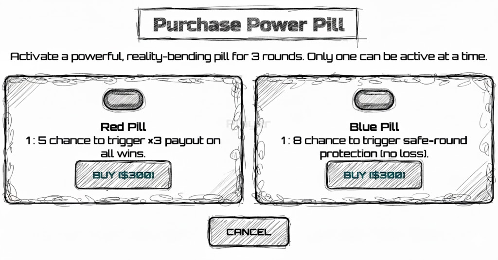
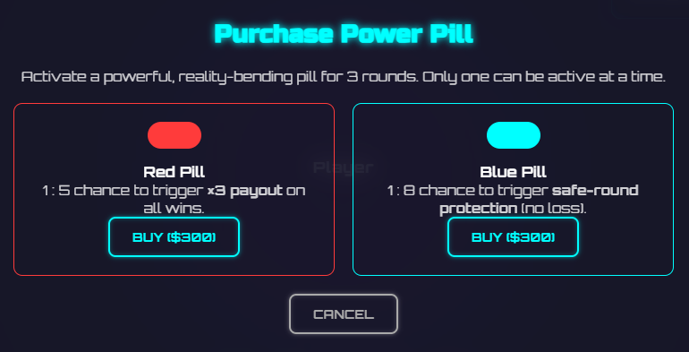
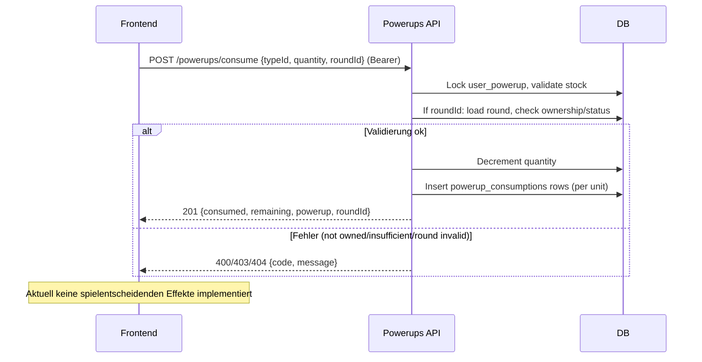

## Revision History
| Datum | Version | Beschreibung | Autor |
| --- | --- | --- | --- |
| 2025-10-27 | 0.1 | Initiale UC-Dokumentation (Neue Ordnerstruktur) | Team BetCeption|
| 2025-12-01 | 1.1 | Abgleich Implementierung (Consume-Endpoint ohne Effekte, fehlendes UI) | Team BetCeption |

# Use Case – Power-Up einsetzen

## 1. Brief Description
Dieser Use Case beschreibt, wie ein Spieler ein zuvor gekauftes Power-Up im laufenden Spiel einsetzt.  
Ein Power-Up kann dem Spieler strategische Vorteile bringen, wie z. B. eine zusätzliche Karte, verdoppelte Gewinne oder Schutz vor Verlusten.  
Nach der Nutzung wird das Power-Up aus dem Inventar entfernt.

---
## Abgleich Implementierung (Stand aktueller Code)
- **Backend:** `POST /powerups/consume` (auth) erwartet `{typeId, quantity, roundId?}`. Backend prüft Besitz und Menge (`user_powerups`), optional Runde (gehört zum User, nicht settled), reduziert Bestand, legt für jede Einheit einen `powerup_consumptions`-Eintrag an. Keine Effekte werden aktuell auf das Spiel angewandt; die Response meldet nur Verbrauch und Restbestand.
- **Frontend:** Keine UI für Power-Ups. Service-Aufruf `Rng.consumePowerup()` existiert, wird aber nicht genutzt.
- **Abweichungen:** Beschriebene Effekte (z. B. Karte, Schutz, Multiplikator) sind noch nicht implementiert. Keine Synchronisation mit laufender Runde außer Besitzprüfung.

---
## 1.2 Wireframe Mockups

## 1.3 Mockup


---

## 2. Akteure:
- **Spieler:** Wählt ein verfügbares Power-Up aus und aktiviert es im laufenden Spiel.  
- **System:** Überprüft die Verfügbarkeit und wendet den Effekt des Power-Ups an.

---
## 3. Flow of Events

### 3.1 Basic Flow
1. Spieler befindet sich in einem laufenden Spiel.
2. Spieler öffnet sein Inventar und wählt ein verfügbares Power-Up aus.
3. Das System prüft:
   - Ist das Power-Up im Inventar vorhanden?
   - Ist die Anwendung im aktuellen Spiel erlaubt?
4. Wenn ja:
   - Effekt des Power-Ups wird angewendet.
   - Power-Up wird aus dem Inventar entfernt.
   - Spielstatus wird aktualisiert (z. B. Karte hinzugefügt, Gewinn verdoppelt etc.).
5. System zeigt eine Bestätigung über die erfolgreiche Nutzung an.

---
## 4. Sequenzdiagramm


---
## 5. AktivitAtsdiagramm (aktuell)
```mermaid
flowchart TD
  A[Start] --> B[User waehlt Power-Up + Menge]
  B --> C{Eingabe valide?}
  C -->|Nein| D[Fehler anzeigen]
  C -->|Ja| E[POST /powerups/consume]
  E --> F[Lock user_powerup]
  F --> G{Bestand ausreichend?}
  G -->|Nein| H[400/404 Meldung]
  G -->|Ja| I{roundId angegeben?}
  I -->|Ja| J[Round laden + Ownership/Status pruefen]
  J -->|Fehler| H
  J -->|OK| K[Bestand verringern]
  I -->|Nein| K
  K --> L[Consumption-Eintraege schreiben]
  L --> M[201 {consumed, remaining, powerup, roundId}]
  H --> N[Ende]
  M --> N
```

---

## 6. Special Requirements
- Der Effekt jedes Power-Ups muss klar definiert sein.
- System muss prüfen, dass Effekte nicht gestapelt oder manipuliert werden können.
- Die Anwendung muss serverseitig validiert und synchronisiert werden.

---

## 7. Preconditions
- Spieler ist eingeloggt.
- Spieler befindet sich in einem aktiven Spiel.
- Das Power-Up ist im Inventar vorhanden.

---

## 8. Postconditions
- Effekt des Power-Ups wurde angewendet.
- Power-Up wurde aus dem Inventar entfernt.
- Spielstatus wurde aktualisiert.
- Änderungen wurden in der Datenbank gespeichert.

---

## 9. Function Points

| Kategorie  | Beschreibung                            | Function Points |
|-------------|------------------------------------------|-----------------|
| Eingaben    | Auswahl des Power-Ups, Aktivierungsbefehl | 2 FP            |
| Ausgaben    | Anzeige des aktiven Effekts, Aktualisierung der Spielansicht | 2 FP |
| Abfragen    | Überprüfung der Power-Up-Verfügbarkeit    | 1 FP            |
| **Gesamt**  |                                          | **5 FP**        |

---

