```mermaid
classDiagram
  direction LR

  class User {
    +string id
    +string username
    +string email
    +string passwordHash
    +string balance
    +int xp
    +int level
    +Date lastLoginAt?
    +string lastDailyRewardAt?
    +Date createdAt
  }

  class Session {
    +string id
    +User user
    +string refreshToken  // hashed
    +string userAgent?
    +string ip?
    +Date expiresAt
    +Date createdAt
  }
  User "1" o-- "*" Session

  class Round {
    +string id
    +RoundStatus status
    +string serverSeed
    +string serverSeedHash
    +Date startedAt
    +Date endedAt?
    +Date createdAt
  }

  class Hand {
    +string id
    +Round round
    +HandOwnerType ownerType
    +HandStatus status
    +int handValue?
  }
  Round "1" o-- "*" Hand
  User "1" o-- "*" Hand

  class Card {
    +string id
    +Hand hand
    +CardRank rank
    +CardSuit suit
    +int drawOrder
    +Date createdAt
  }
  Hand "1" o-- "*" Card

  class MainBet {
    +string id
    +Round round
    +Hand hand
    +User user
    +string amount  // decimal
    +MainBetStatus status
    +string payoutMultiplier?
    +string settledAmount?
    +Date settledAt?
    +Date createdAt
  }
  Round "1" o-- "1" MainBet
  User "1" o-- "*" MainBet

  class SidebetType {
    +int id
    +string code
    +string title
    +string description?
    +string baseOdds
  }

  class SideBet {
    +string id
    +Round round
    +User user
    +SidebetType type
    +string amount
    +SideBetStatus status
    +string odds?
    +SideBetColor predictedColor?
    +CardSuit predictedSuit?
    +CardRank predictedRank?
    +SideBetTargetContext targetContext
    +string settledAmount?
    +Date settledAt?
    +Date createdAt
  }
  Round "1" o-- "*" SideBet
  User "1" o-- "*" SideBet
  SidebetType "1" o-- "*" SideBet

  class WalletTransaction {
    +string id
    +User user
    +WalletTransactionKind kind
    +string amount
    +string refTable
    +string refId?
    +Date createdAt
  }
  User "1" o-- "*" WalletTransaction

  class DailyRewardClaim {
    +string id
    +User user
    +string claimDate
    +string amount
    +Date createdAt
  }
  User "1" o-- "*" DailyRewardClaim

  class PowerupType {
    +int id
    +string code
    +string title
    +string description?
    +int minLevel
    +string price
    +json effectJson
  }

  class UserPowerup {
    +string id
    +User user
    +PowerupType type
    +int quantity
    +Date acquiredAt
  }
  User "1" o-- "*" UserPowerup
  PowerupType "1" o-- "*" UserPowerup

  class PowerupConsumption {
    +string id
    +User user
    +PowerupType type
    +Round round?
    +Date createdAt
  }
  User "1" o-- "*" PowerupConsumption
  PowerupType "1" o-- "*" PowerupConsumption
  Round "1" o-- "*" PowerupConsumption

  class LeaderboardBalanceView {
    +string userId
    +string username
    +string balance
  }
  class LeaderboardLevelView {
    +string userId
    +int level
    +int xp
  }
  class LeaderboardWeeklyWinningsView {
    +string userId
    +string netWinnings7d
  }
```

# BetCeption  
# Software Architecture Document  
# Version 1.0

## Revision History
| Datum | Version | Beschreibung | Autor |
| --- | --- | --- | --- |
| 08.12.2025 | 1.0 | Finale RUP-SAD, Abgleich mit SRS/Code | Team BetCeption |
| 02.12.2025 | 0.2 | Klassendiagramm (Backend) eingebettet | Team BetCeption |
| 01.12.2025 | 0.1 | Abgleich Implementierungsstand (Backend/Frontend) | Team BetCeption |
| 01.12.2025 | 0.0 | Neu erstellt | Team BetCeption |

---

## 1 Introduction
### 1.1 Purpose
Dieses Dokument gibt einen vollstaendigen Ueberblick ueber die Software-Architektur von BetCeption anhand des 4+1-Sichtenmodells. Es fasst architekturrelevante Entscheidungen, Ziele und Views zusammen und verweist auf Detaildokumente (ASR, Utility Tree, ADRs, Use Cases).

### 1.2 Scope
Gilt fuer die initiale Auslieferung: Blackjack mit Sidebets/Power-Ups, virtuelles Wallet, Leaderboards, Daily Reward. Betrifft Backend (Node/Express/TypeORM), Frontend (Angular) und Datenbank (MySQL/Docker). Optionale Oberflaechen (Docs/Metrics) sind per Feature-Flag zuschaltbar; Erweiterungen ausserhalb des MVP liegen ausserhalb des Scopes.

### 1.3 Definitions, Acronyms, Abbreviations
- ASR: Architecture Significant Requirement  
- ADR: Architecture Decision Record  
- JWT: JSON Web Token  
- RNG: Random Number Generator  
- SPA: Single Page Application  
- UC: Use Case  
- DB: Datenbank (MySQL 8)

### 1.4 References
- [`docs/architecture/asr-3-step.md`](./asr-3-step.md) (ASR, Szenarien, Taktiken)  
- [`docs/architecture/utility-tree.md`](./utility-tree.md) (Utility Tree, priorisierte Szenarien)  
- [`docs/architecture/architecture-decisions.md`](./architecture-decisions.md) (AD-1..9)  
- [`docs/architecture/weekly-blog.md`](./weekly-blog.md) (Woche 6-8)  
- [`docs/use-cases/*.md`](../use-cases/) (UC1-UC10)  
- [`docs/use-case-realisation/*.md`](../use-case-realisation/) (Sequenz-/Aktivitaetsdiagramme)  
- [`db/schema.sql`](../db/schema.sql) (Relationenschema)  
- Source-Code-Struktur unter [`Betception-Backend/src`](../../Betception-Backend/src), [`Betception-Frontend/src`](../../Betception-Frontend/src)

### 1.5 Overview
Die folgenden Abschnitte folgen dem RUP-Template: Architekturdarstellung, Ziele/Randbedingungen, Use-Case-Sicht, logische Sicht, Prozess-Sicht, Einsatzsicht, Implementierungssicht, Datensicht, Groesse/Performance, Qualitaet, Risiken/Schulden.

### 1.6 Implementation Status (Sync)
- Backend: Auth/Session, Round/Fairness, Wallet/Ledger, Leaderboard-Views und Daily-Reward-Transaktion sind implementiert. XP/Level-Progression ueber Basis-Level, Power-Up-Effekte und Double/Split fehlen noch.
- Frontend: Auth-Panel + Blackjack-View (Deal/Hit/Stand/Settle) und Leaderboard-Tabs sind vorhanden. Shop/Inventar/Wallet/Rewards haben kein UI; Login-/Register-Seiten sind Platzhalter.

## 2 Architectural Overview
Wir nutzen das 4+1-Sichtenmodell:
- Use-Case-Sicht: zentrale UC1-UC10, Sequenzen/Verhaltensmodellierung (siehe Use-Case-Dokumente, Blog).  
- Logische Sicht: Domaenenmodelle, Entities, Feature-Folder-Struktur (Backend/Frontend).  
- Prozess-Sicht: Laufzeitfluesse (Auth, Round/Bet, Power-Up, Leaderboard, Observability).  
- Einsatzsicht: Container-Topologie (Browser -> Proxy -> Node/Express -> MySQL).  
- Implementierungssicht: Layering, Module, Middlewares, CI/CD.  
Quellen: Code-Struktur, ASR, Utility Tree, ADRs und Blog-Updates.

## 3 Architectural Goals and Constraints
- Ziele (ASR-basiert):  
  - ASR-1/4: Deterministische Spielengine, Fairness-API (Server-Seed + SHA-256-Hash + Draw-Order).  
  - ASR-2: Atomare Wallet-Buchungen mit ACID-Transaktionen und Sperren.  
  - ASR-3: Gehaerteter Auth-Flow (JWT + Refresh-Cookie HttpOnly/SameSite/Secure, Rate-Limits, Token-Rotation).  
  - ASR-5: Performante Round-Starts (p95 < 300 ms trotz Sidebets/Power-Ups).  
  - ASR-6: Beobachtbarkeit (Request-IDs, strukturierte Logs, `/metrics` per Toggle/API-Key).  
  - ASR-7: Modulare Erweiterbarkeit (Feature-Folder; Backend spiegelt Angular).  
- Randbedingungen: Docker Compose als Laufzeit, MySQL 8, Node/Express/TypeORM, Angular SPA; CI/CD via GitHub Actions; Secrets per Environment; Feature-Toggles fuer Docs/Metrics; stabile Use-Case-Schnittstellen.

## 4 Use Case View
Zentrale Use Cases (siehe `docs/use-cases`, Realisierung unter `docs/use-case-realisation`):
- UC1 Authentifizierung & Session-Management  
- UC2 Shop, Inventar & Wallet  
- UC3 Daily Reward  
- UC4 Leaderboard anzeigen  
- UC5 Spiel starten (Blackjack)  
- UC6 Wetten platzieren (Haupt- & Nebenwetten)  
- UC7 Spielzug ausfuehren (Hit/Stand/Double/Split)  
- UC8 Power-Up einsetzen  
- UC9 XP-/Level-System verwalten  
- UC10 Daten persistieren  

**Implementierungsabdeckung (Kurz):** Backend deckt UC1/3/4/5/6/8/10 ab; UC7 (Double/Split) und UC9 (Level-Aufstieg) fehlen. Frontend deckt Auth, Leaderboard und Blackjack (ohne Double/Split, ohne Sidebet-UI) ab; Shop/Inventar/Wallet/Reward fehlen.

## 5 Logical View
### 5.1 Overview
Layered Feature-Folder-Architektur: Router/Controller/Schema/Service je Domaene, Entities im separaten Ordner, Cross-Cutting in Middlewares/Observability/Utils. Frontend spiegelt Domaenenstruktur (Angular-Module fuer Auth, Blackjack Table/Hand/Controls, Leaderboard).

### 5.2 Architecture-Relevant Design Packages
- Backend-Domaenenmodule: `auth`, `round`, `wallet`, `powerups`, `fairness`, `leaderboard`, `rewards`, `inventory`, `shop`, `user`, `observability`, `middlewares`, `utils`.  
- Kern-Entities (vgl. `db/schema.sql`, `src/entity/*`): User, Session, Round, Hand, Card, MainBet, SideBet + SidebetType, WalletTransaction, DailyRewardClaim, PowerupType, UserPowerup, PowerupConsumption. RNG-Daten (server_seed, server_seed_hash) haengen an Round; Ledger-Eintraege referenzieren Bets/Rounds/Rewards.

### 5.3 Use Case Realizations
- UC1: AuthRouter/Controller mit Session-Repo, JWT/Refresh, Rate-Limits, Token-Rotation.  
- UC5/UC6: RoundRouter -> Controller/Service -> ACID-Transaktion (Round, Hands, MainBet, WalletTransaction) + RNG/Seed+Hash-Persistenz.  
- UC4: LeaderboardRouter -> DB-Views (`leaderboard_balance|level|winnings`), anonym lesbar, optional persoenlicher Rang mit Auth.  
- UC8: PowerupsRouter -> Inventory/Consumption + optional Round-Verknuepfung; Wallet-Belastung transaktional.  
- UC3: RewardsRouter -> `claimDailyReward` transaktional mit pessimistischer Sperre, Ledger-Eintrag und Idempotenz pro UTC-Tag.  
Weitere Realisierungen siehe Use-Case-Dokumente.

### 5.4 Class Diagram (Backend)
Das aktuelle Domaenenmodell (Entities, Beziehungen und Views) wird im folgenden Mermaid-Klassendiagramm dargestellt. Basis sind `db/schema.sql` und die Implementierung unter `Betception-Backend/src/entity`.

## 6 Process View
- Auth-Flow: Middleware-Kette (CORS -> RequestContext -> RateLimit) -> AuthRouter -> Controller -> Session-Repo (Hashing, Rotation) -> JWT-Ausgabe; Logout/Refresh verwalten Sessions/Cookies.  
- Round/Bet: Router -> Controller/Service -> DB-Transaktion (Round+Hands+MainBet+WalletTransaction) -> RNG (Seed+Hash) -> Response; Idempotenzschluessel verhindern Doppelbuchungen.  
- Sidebet/Power-Up: Router -> Controller -> Transaktion ueber Sidebet/Wallet oder Inventory/Consumption; Effekte werden im Round-Service beruecksichtigt.  
- Leaderboards: Router -> Views -> Response; Auth optional fuer persoenlichen Rang (anonyme GETs erlaubt).  
- Daily Reward: Router -> `claimDailyReward` -> Transaktion mit pessimistischer Sperre auf User, Aktualisierung `last_daily_reward_at`, Claim- und Wallet-Eintrag; erneute Claims am gleichen UTC-Tag liefern 409.  
- Observability: RequestContext vergibt IDs, Logger schreibt JSON, `/metrics` liefert Snapshots; Feature-Toggle/API-Key schuetzt Docs/Metrics.

## 7 Deployment View
- Topologie: Browser (SPA) -> optional Nginx/API-Gateway -> Node/Express-Container -> MySQL-Container.  
- Laufzeit: `docker-compose` fuer Dev/CI/Prod-Paritaet; DB im internen Netzwerk isoliert; REST ueber HTTPS; Secrets via Environment; Migrationslauf beim Start.

## 8 Implementation View
### 8.1 Overview
Implementierung folgt Layering: Middleware/Router/Controller/Service/Entity, plus Utilities und Observability. CI/CD automatisiert Build, Tests und Migrationen.

### 8.2 Layers
- Transport/HTTP: Express, Router + Middlewares (CORS, Rate-Limit, RequestContext).  
- API/Controller: orchestriert Use-Case-Flows, validiert mit Zod-Schemata.  
- Service/Domain: Geschaeftslogik, Transaktionen, RNG, Power-Up-Effekte, Daily-Reward-Logik.  
- Persistence: TypeORM-Entities/Repos, ACID-Transaktionen, pessimistic locking.  
- Frontend: Angular-Module (Auth, Table/Hand/Controls, Leaderboard), HttpClient-Wrapper (`withCredentials`), Interceptor/Guard.  
- CI/CD & Ops: GitHub Actions, Dockerfiles/Compose, optionale API-Key-Guards fuer Swagger/Metrics.

## 9 Data View
- Relationenschema: `db/schema.sql` mit Tabellen fuer Users, Sessions, Rounds, Hands, Cards, MainBets, SideBets, SidebetTypes, WalletTransactions, DailyRewardClaims, PowerupTypes, UserPowerups, PowerupConsumptions; Views fuer Leaderboards (Balance, Weekly Winnings, Level).  
- Eigenschaften: deterministische RNG-Attribute pro Round, Ledger-Referenzen (`ref_table`/`ref_id`), Indizes auf Round/User/Wallet; ACID-Transaktionen sichern Konsistenz.

## 10 Size and Performance
- Zielwerte: Round-Start p95 < 300 ms; Auth p95 < 600 ms; `/fairness` und Leaderboard-Reads < 300 ms.  
- Dimensionierung: ca. 100 gleichzeitige Sessions im Testbetrieb; zwei schreibende Transaktionen pro Spielaktion; Startbundle Frontend < 300 kB gzip (Ziel).  
- Massnahmen: Async I/O, Connection-Pooling, Pagination, Indizes, reduzierte DTOs, Caching ueber DB-Views fuer Leaderboard.

## 11 Quality
- Zuverlaessigkeit: ACID-Transaktionen, pessimistic locking, Idempotenz-Schluessel.  
- Sicherheit: bcrypt/SHA-256, Token-Hardening, Rate-Limits, HttpOnly/SameSite-Cookies, API-Key-Guards, Feature-Toggles fuer sensible Routen.  
- Wartbarkeit/Erweiterbarkeit: Feature-Folder, klare Modulgrenzen, Zod-Validierung, parallele Angular-Struktur, ADRs/ASR als Leitplanken.  
- Beobachtbarkeit: Request-IDs, strukturierte Logs, `/metrics` Snapshots, optionale API-Key-Absicherung.  
- Deployment/Portabilitaet: Docker Compose, automatisierte Migrationen, CI/CD; reproduzierbare Umgebungen.  
- Fairness/Pruefbarkeit: RNG-Commitment (Seed+Hash) und `/fairness`-API ermoeglichen Offline-Verifikation jeder Runde.

## 12 Risks and Technical Debt
- Fehlende Features: Double/Split und Power-Up-Effekte im Backend, XP/Level-Aufstieg ueber Basis-Level sowie zugehoerige UI-Fluesse im Frontend.  
- Observability: `/metrics` und Swagger sind Feature-Flag-geschuetzt; produktive Monitoring-Strategie (Dashboard/Alerting) muss noch konkretisiert werden.  
- Load-Boundaries: Performance-Ziele sind getestet fuer ca. 100 gleichzeitige Sessions; Skalierung darueber hinaus erfordert Profiling und Moeglichkeit zu horizontaler Skalierung der API.  
- Security-Hardening: Rate-Limits und Token-Rotation vorhanden; regelmaessige Pen-Tests und Abhaengigkeits-Scans sind noch aufzusetzen.
