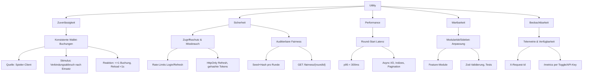

## Revision History
| Datum | Version | Beschreibung | Autor |
| --- | --- | --- | --- |
| 2025-11-25 | 0.4 | small changes | Team Betception |
| 2025-11-25 | 0.3 | Utility Diagramm update | Team Betception |
| 2025-11-25 | 0.2 | Docs update | Team Betception |
| 2025-11-24 | 0.1 | small changes | Team Betception |
| 2025-11-24 | 0.0 | Update asr-3-step.md | JustinKaram14 |
| 01.12.2025 | 1.1 | Abgleich mit aktuellem Code (Status/Gaps) | Team BetCeption |

# Architecture Significant Requirements (ASR)

Eine architektonisch bedeutsame Anforderung (ASR) verändert die Systemarchitektur so stark, dass das Design ohne sie fundamental anders wäre. Dieses Dokument folgt dem in der Vorlesung beschriebenen 3-Schritt-Ansatz: Qualitätsmerkmale klären, passende Taktiken auswählen und daraus konkrete Architekturentscheidungen ableiten.

### Implementierungsstand (Abgleich)
- Engine, Wallet, Auth, Leaderboard-Views, Daily-Reward-Transaktion und Observability-/Rate-Limit-Middlewares sind produktionsnah umgesetzt.
- Noch offen: XP-/Level-Erhöhung (UC9), Power-Up-Effekte in der Runde, Double/Split im Spiel-Flow, UI für Wallet/Shop/Inventar/Daily-Reward. Idempotency-Key-Unterstützung für Bets/Rounds fehlt (Absicherung erfolgt über Locks/Status).

## Schritt 1 - Klärung der Qualitätsmerkmale

Aufbauend auf Geschäfts- und Stakeholderzielen werden Qualitätsattribute samt Szenarien nach der 6-Part Form beschrieben. Der Utility Tree dient als Leitfaden.

### 1.1 Geschäfts- und Stakeholderziele

| Treiber | Beschreibung | Architektur-Auswirkung |
| --- | --- | --- |
| Spieler:innen wollen faire Blackjack-Runden mit nachvollziehbaren Ergebnissen. | Rundenlogik, Kartengenerierung und Auszahlungen müssen serverseitig deterministisch und einsehbar sein. | Backend kontrolliert RNG, Fairness-API für Auditierung, persistenter Spielstatus. |
| Betreiber:in braucht betrugssicheres Wallet (Coins). | Einsätze, Sidebets, Power-Ups und Rewards berühren das Wallet und dürfen nie doppelt oder verloren werden. | Transaktionen und Sperren in der DB, Validierung vor jedem State-Change, Ledger. |
| Entwicklerteam muss Features schnell liefern/testen/deployen. | Wartbarkeit, Modularität, Tests, Docker-Umgebung sind Pflicht. | Layered Express/TypeORM, Feature-Module, CI/CD, Infrastructure-as-Code. |
| Compliance/Security erwartet Schutz personenbezogener Daten und Resilienz gegen Missbrauch. | Auth, Sessions, Rate-Limiting nach Standards; Secrets nicht im Repo. | JWT + Refresh-Cookies, Hashes, Rate-Limiter, Secrets via `.env`. |
| Produktmanagement erwartet SPA <2 s TTI, 95 % API <300 ms. | Performance beeinflusst Stack, Datenmodell, API-Design. | Angular SPA, schlanke JSON-APIs, Indizes, asynchrone I/O. |

### 1.2 Utility Tree & Qualitätsattribut-Szenarien

| Qualitätsattribut | Quelle | Stimulus | Artefakt | Umgebung | Reaktion | Messung | BP | Risiko |
| --- | --- | --- | --- | --- | --- | --- | --- | --- |
| Zuverlässigkeit (Datenkonsistenz) | Spieler-Client | Browser verliert direkt nach Einsatzreservierung die Verbindung | Round-/Wallet-Service | Runde "IN_PROGRESS" | Backend stellt beim Reload denselben Status her, Einsätze höchstens einmal gebucht | <= 1 Wallet-Buchung pro Round-ID, Round-Status abrufbar <1 s | Hoch | Mittel |
| Sicherheit (Integrität & Auditierbarkeit) | Spieler:in | `GET /fairness/{roundId}` nach Abschluss | Fairness-API & Round-Datensatz | Runde "SETTLED" | Server liefert `serverSeed`, Hash und Zeitstempel zur Offline-Verifikation | 100 % settled Runden liefern Matching Hash & Seed | Hoch | Mittel |
| Performance | 100 parallele Sessions | `POST /round/start` | Round-Start-Endpunkt | Normalbetrieb mit produktionsnaher DB | Antworten bleiben schnell und vollständig | p95 < 300 ms, keine Timeouts | Hoch | Mittel |
| Sicherheit (Zugriffsschutz) | Angreifer:in | 200 Login-Versuche/min mit falschen Credentials | Auth-API (`/auth/login`,`/auth/refresh`) | Normalbetrieb | Rate-Limiter sperrt Identität/IP nach 10 Fehlversuchen, Fehlermeldungen bleiben generisch | Max. 10 Fehlversuche/5 min pro IP oder E-Mail | Hoch | Hoch |
| Wartbarkeit / Modifizierbarkeit | Entwickler:in | Neue Sidebet-Regel wird implementiert | Round-Modul (Engine + Tests) | Design-/Implementierungsphase | Änderungen bleiben auf Domäne beschränkt und sind testbar | < 2 Dateien außerhalb `modules/round` betroffen, Tests bestehen | Mittel | Mittel |
| Verfügbarkeit & Beobachtbarkeit | On-Call | Supportticket verlangt Ursachenanalyse | `/metrics` + strukturierte Logs | Produktion, Monitoring aktiviert | Telemetrie & Logs liefern Request-IDs, Fehler- & Latenzwerte | 100 % Requests mit `X-Request-Id`, `/metrics` antwortet <1 s | Mittel | Niedrig |

## Schritt 2 - Taktiken je Qualitätsattribut

| Qualitätsattribut / Refinement | Ausgewählte Taktiken | Umsetzung im System |
| --- | --- | --- |
| Zuverlässigkeit - Konsistente Wallet-Buchungen | Atomare Transaktionen, State-Recovery, Idempotente Commands (Status-/Lock-basierend) | `AppDataSource.transaction` bündelt Round- & Wallet-Updates, pessimistic locking im Wallet/Reward/Shop/Powerup-Modul, pro User nur eine aktive Runde. |
| Sicherheit - Auditierbarer Fairness-Nachweis | Deterministisches RNG, Record/Replay, sicherer Hash | Round-Controller erzeugt Seeds serverseitig, `fairness.utils.ts` persistiert `serverSeed` + `serverSeedHash` (SHA-256), `fairness.controller.ts` liefert beide zur Offline-Verifikation. |
| Sicherheit - Zugriffsschutz & Missbrauchsprävention | Rate Limiting, Authentifizierung, Fail-Secure Defaults | Auth-/Global-Limiter, JWT + Refresh-Cookies (HttpOnly/SameSite/Secure), Refresh-Hashes, generische Fehlermeldungen. |
| Performance - Round-Start-Latenz | Ressourcen-Pooling, asynchrone I/O, Pagination/Indizes | Connection-Pool von TypeORM, Indizes auf Round/User/Wallet, DTOs liefern nur benötigte Felder; Pagination bei Leaderboard/Fairness. |
| Wartbarkeit - Lokale Sidebet-Anpassungen | Separation of Concerns, Information Hiding, Testautomatisierung | Feature-Module (`src/modules/round/*`) kapseln Engine, DTOs & Tests; `zod`-Schemas sichern Eingaben; Jest-Tests für Round/Sidebet. |
| Verfügbarkeit & Beobachtbarkeit - Telemetrie | Monitoring, Request Tracing, Fehlererkennung | `requestContext` vergibt `X-Request-Id`, `observability/metrics.ts` liefert Snapshots (Feature-Toggle/API-Key), strukturierte JSON-Logs. |

## Schritt 3 - Abgeleitete Architecture Significant Requirements

| ASR | Beschreibung | Begründung (Schritt 1+2) | Technische Umsetzung |
| --- | --- | --- | --- |
| ASR-1 Deterministische Spielengine | Kartenmischung & Spielstatus laufen ausschließlich im Backend. Jede Runde persistiert `serverSeed`, `serverSeedHash`, Aktionen und Resultate. | Fairness-Szenario und Spieler:innen-Treiber. | Seeds + Hash im Round-Record, Fisher-Yates basierend auf SHA-256 (`round.controller.ts`, `fairness.utils.ts`). |
| ASR-2 Atomare Wallet-Buchungen | Einsätze, Gewinne und Power-Up-Käufe sind atomar. | Konsistenz-Szenario und Betreiberziel. | TypeORM-Transaktionen, pessimistic locking auf User/Powerups, Ledger `wallet_transactions` mit Referenzen. |
| ASR-3 Gesicherter Auth-Flow | JWT für APIs; Refresh-Tokens in HttpOnly+Secure Cookies und serverseitig gehasht. Rate-Limiter schützen Auth-Routen. | Zugriffsschutz-Szenario + Compliance. | `auth.controller.ts`, `hashToken`, `globalRateLimiter`, `loginRateLimiter`, `apiKeyGuard` optional. |
| ASR-4 Auditierbare Fairness-Schnittstelle | Settled Runden müssen reproduzierbar sein (Seed + Hash + Draw Order). | Fairness-Szenario. | `fairness.controller.ts`, `fairness.utils.ts`, persistente Seeds pro Round, GET `/fairness/{roundId}`. |
| ASR-5 Performante API & SPA | Round-Start-Flow bleibt performant trotz Sidebets/Power-Ups. | Performance-Szenario + Produktziel. | Schlanke DTOs, Pagination, Indizes, Async I/O, Angular Lazy Loading. |
| ASR-6 Diagnostizierbarkeit & Betrieb | Jede Anfrage erhält `X-Request-Id`, Logs sind strukturiert, `/metrics` per Toggle/API-Key. | Beobachtbarkeits-Szenario. | `requestContext`, JSON-Logger, `/metrics` Feature-Flag. |
| ASR-7 Modular ausbaubare Domänen | Neue Features (Leaderboard, Rewards, XP) berühren bestehende Module minimal. | Wartbarkeitsszenario + Teamziel. | Ordner pro Modul, Zod-Schemata, Entities pro Aggregat, parallele Angular-Struktur. |

Vor größeren Änderungen prüfen wir, welche Utility-Tree-Szenarien bzw. ASR betroffen sind und ob zusätzliche Taktiken angewendet werden müssen.
