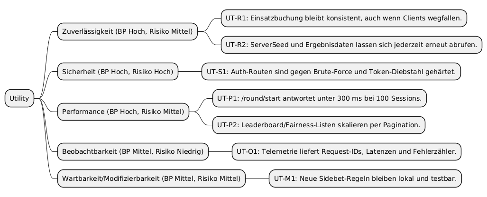

# Utility Tree

Dieser Utility Tree fasst die wichtigsten Qualitätsattribute für BetCeption zusammen. Er basiert auf den Anforderungen aus dem SRS (Kapitel 3) und den ASR aus `asr-3-step.md`. Jede Verzweigung enthält priorisierte Szenarien mit Einschätzung des Risikos.

## Szenario-Details
| ID | Attribut | Stimulus & Umgebung | Erwartete Antwort | Response-Metrik | BP | Risiko | Eingesetzte Taktiken |
| --- | --- | --- | --- | --- | --- | --- | --- |
| UT-R1 | Zuverlässigkeit | Client verliert Verbindung direkt nach Einsatzbuchung. | Runde bleibt in konsistentem Status, Wallet zeigt nach Reload exakt einen Abzug. | Max. eine Buchung pro Round-ID (idempotent). | Hoch | Mittel | ACID-Transaktionen (`round.controller.ts`), Retry-safe APIs, Persistenz jedes Steps. |
| UT-R2 | Zuverlässigkeit/Fairness | Spieler ruft `/fairness/{roundId}` für eine alte Runde auf. | Server liefert Hash+Seed und Zeitstempel, auch wenn Runde abgeschlossen ist. | 100 % der settled Runden verfügbar. | Hoch | Niedrig | Persistente Seeds (`Round`-Entity), `fairness.controller.ts`, deterministische RNG-Utility. |
| UT-S1 | Sicherheit | Ein Angreifer feuert 200 Login-Requests/Min mit erratenen Passwörtern. | Rate-Limiter sperrt IP/Email nach 10 Fehlversuchen, Tokens bleiben geheim. | Max. 10 fehlgeschlagene Logins/5min pro Identität. | Hoch | Hoch | Globale + Auth-spezifische Rate-Limiter, Hashing für Passwörter (`bcrypt`) und Refresh-Tokens (`hashToken`). |
| UT-P1 | Performance | 100 gleichzeitige Sessions starten neue Runden. | 95-%-Perzentil <300 ms, kein Request-Timeout. | P95 <300 ms für `/round/start`. | Hoch | Mittel | Asynchrones Node.js I/O, vorvalidierte DTOs, minimierte DB-Abfragen, Indizes auf Round/User. |
| UT-P2 | Performance/Skalierung | Leaderboard wird bei 10k Einträgen abgefragt. | Backend liefert Seite `n` in <200 ms mit `pageSize` max. 50. | Pagination <200 ms p95. | Mittel | Mittel | TypeORM Pagination (`findAndCount`), Index auf Score/Balance, limitierte Projektion. |
| UT-O1 | Beobachtbarkeit | Betriebsteam untersucht Supportticket. | `/metrics` zeigt aktuelle Request-Zähler, Durchschnittslatenzen und Fehlerquote, Logs tragen `X-Request-Id`. | Telemetrie abrufbar ohne Neustart, 100 % Requests mit ID. | Mittel | Niedrig | `observability/metrics.ts`, `requestContext` Middleware, strukturierte Logger. |
| UT-M1 | Wartbarkeit | PO fordert neue Sidebet-Formel. | Änderung betrifft nur Round-Domäne (Engine + Tests), andere Module bleiben unverändert. | Code-Anpassung <2 Dateien außerhalb Round. | Mittel | Mittel | Feature-Folder-Struktur (`modules/round`), zentrale Services, Jest-Test-Suiten für Engine. |
