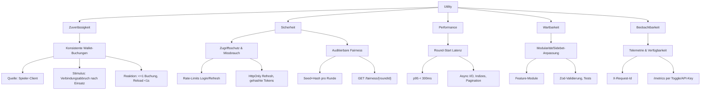

## Utility Tree

Der Utility Tree folgt der Struktur aus den Vorlesungsfolien (Quality Attribute → Refinement → Quality Attribute Scenario → Business Value → Technical Risk). Alle Szenarien sind in der 6-Part-Form beschrieben und referenzieren das Diagramm.

| Quality attribute | Refinement | Quality attribute scenario (6-Part Form) | Business value | Technical risk |
| --- | --- | --- | --- | --- |
| Zuverlässigkeit | Konsistente Wallet-Buchungen | **Quelle:** Spieler-Client. **Stimulus:** Browser verliert direkt nach Einsatzreservierung die Verbindung. **Artefakt:** Round-/Wallet-Service. **Umgebung:** Runde `IN_PROGRESS`. **Reaktion:** Backend rekonstruiert den Status, Einsätze werden höchstens einmal gebucht. **Messung:** <= 1 Wallet-Buchung pro Round-ID, Reload liefert Status <1 s. | Hoch | Mittel |
| Sicherheit | Auditierbarer Fairness-Nachweis | **Quelle:** Spieler:in. **Stimulus:** `GET /fairness/{roundId}` nach Abschluss. **Artefakt:** Fairness-API & Round-Datensatz. **Umgebung:** Runde `SETTLED`. **Reaktion:** Server liefert `serverSeed`, Hash und Zeitstempel zur Offline-Verifikation. **Messung:** 100 % settled Runden liefern Matching Hash & Seed. | Hoch | Mittel |
| Sicherheit | Zugriffsschutz & Missbrauchsprävention | **Quelle:** Angreifer:in. **Stimulus:** 200 Login-Versuche/min mit falschen Credentials. **Artefakt:** Auth-API (`/auth/login`, `/auth/refresh`). **Umgebung:** Normalbetrieb. **Reaktion:** Rate-Limiter blockt IP/E-Mail nach 10 Fehlversuchen, Fehlermeldungen bleiben generisch. **Messung:** Max. 10 Fehlversuche/5 min pro Identität. | Hoch | Hoch |
| Performance | Round-Start-Latenz | **Quelle:** 100 parallele Sessions. **Stimulus:** `POST /round/start`. **Artefakt:** Round-Start-Endpunkt + DB. **Umgebung:** Normalbetrieb, produktionsnahe Datenbank. **Reaktion:** Antworten bleiben schnell und vollständig. **Messung:** p95 < 300 ms, keine Timeouts. | Hoch | Mittel |
| Wartbarkeit | Lokale Anpassung der Sidebet-Engine | **Quelle:** Entwickler:in. **Stimulus:** Neue Sidebet-Regel wird implementiert. **Artefakt:** Round-Modul (Engine + Tests). **Umgebung:** Design-/Implementierungsphase. **Reaktion:** Änderung bleibt auf Domäne beschränkt und ist testbar. **Messung:** < 2 Dateien außerhalb `modules/round` betroffen, Tests grün. | Mittel | Mittel |
| Verfügbarkeit & Beobachtbarkeit | Telemetrie für Incident Response | **Quelle:** On-Call. **Stimulus:** Supportticket verlangt Ursachenanalyse. **Artefakt:** `/metrics` + strukturierte Logs. **Umgebung:** Produktion mit Monitoring. **Reaktion:** Telemetrie & Logs liefern Request-IDs, Fehler- & Latenzwerte. **Messung:** 100 % Requests mit `X-Request-Id`, `/metrics` antwortet <1 s. | Mittel | Niedrig |

- Umgesetzt: ACID-Transaktionen mit Locks für Round/Wallet/Shop/Powerup/Daily-Reward; deterministische RNG + Fairness-API; Auth mit Rate-Limits + Refresh-Cookies; Metrics/Docs per Feature-Flag/API-Key.
