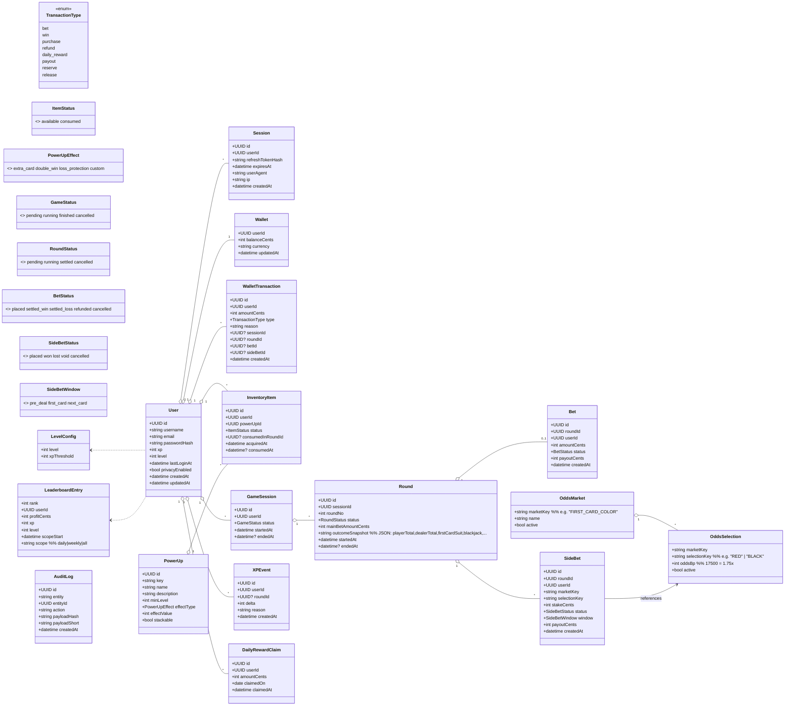

```mermaid
%% BetCeption Backend Domain Model (reworked: wallet, odds, round)
classDiagram
direction LR

class User {
  +UUID id
  +string username
  +string email
  +string passwordHash
  +int xp
  +int level
  +datetime lastLoginAt
  +bool privacyEnabled
  +datetime createdAt
  +datetime updatedAt
}

class Session {
  +UUID id
  +UUID userId
  +string refreshTokenHash
  +datetime expiresAt
  +string userAgent
  +string ip
  +datetime createdAt
}
User "1" o-- "*" Session

class Wallet {
  +UUID userId
  +int balanceCents
  +string currency
  +datetime updatedAt
}
User "1" o-- "1" Wallet

class WalletTransaction {
  +UUID id
  +UUID userId
  +int amountCents
  +TransactionType type
  +string reason
  +UUID? sessionId
  +UUID? roundId
  +UUID? betId
  +UUID? sideBetId
  +datetime createdAt
}
User "1" o-- "*" WalletTransaction

class TransactionType {
  <<enum>>
  bet
  win
  purchase
  refund
  daily_reward
  payout
  reserve
  release
}

class PowerUp {
  +UUID id
  +string key
  +string name
  +string description
  +int minLevel
  +PowerUpEffect effectType
  +int effectValue
  +bool stackable
}
class InventoryItem {
  +UUID id
  +UUID userId
  +UUID powerUpId
  +ItemStatus status
  +UUID? consumedInRoundId
  +datetime acquiredAt
  +datetime? consumedAt
}
User "1" o-- "*" InventoryItem
PowerUp "1" o-- "*" InventoryItem

class ItemStatus { <<enum>> available consumed }
class PowerUpEffect { <<enum>> extra_card double_win loss_protection custom }

class GameSession {
  +UUID id
  +UUID userId
  +GameStatus status
  +datetime startedAt
  +datetime? endedAt
}
User "1" o-- "*" GameSession

class Round {
  +UUID id
  +UUID sessionId
  +int roundNo
  +RoundStatus status
  +int mainBetAmountCents
  +string outcomeSnapshot  %% JSON: playerTotal,dealerTotal,firstCardSuit,blackjack,...
  +datetime startedAt
  +datetime? endedAt
}
GameSession "1" o-- "*" Round

class Bet {
  +UUID id
  +UUID roundId
  +UUID userId
  +int amountCents
  +BetStatus status
  +int payoutCents
  +datetime createdAt
}
Round "1" o-- "0..1" Bet

class OddsMarket {
  +string marketKey   %% e.g. "FIRST_CARD_COLOR"
  +string name
  +bool active
}
class OddsSelection {
  +string marketKey
  +string selectionKey  %% e.g. "RED" | "BLACK"
  +int oddsBp           %% 17500 = 1.75x
  +bool active
}
OddsMarket "1" o-- "*" OddsSelection

class SideBet {
  +UUID id
  +UUID roundId
  +UUID userId
  +string marketKey
  +string selectionKey
  +int stakeCents
  +SideBetStatus status
  +SideBetWindow window
  +int payoutCents
  +datetime createdAt
}
Round "1" o-- "*" SideBet
SideBet --> OddsSelection : references

class GameStatus { <<enum>> pending running finished cancelled }
class RoundStatus { <<enum>> pending running settled cancelled }
class BetStatus { <<enum>> placed settled_win settled_loss refunded cancelled }
class SideBetStatus { <<enum>> placed won lost void cancelled }
class SideBetWindow { <<enum>> pre_deal first_card next_card }

class XPEvent {
  +UUID id
  +UUID userId
  +UUID? roundId
  +int delta
  +string reason
  +datetime createdAt
}
User "1" o-- "*" XPEvent

class LevelConfig {
  +int level
  +int xpThreshold
}
LevelConfig <.. User

class DailyRewardClaim {
  +UUID id
  +UUID userId
  +int amountCents
  +date claimedOn
  +datetime claimedAt
}
User "1" o-- "*" DailyRewardClaim

class LeaderboardEntry {
  +int rank
  +UUID userId
  +int profitCents
  +int xp
  +int level
  +datetime scopeStart
  +string scope   %% daily|weekly|all
}
LeaderboardEntry <.. User

class AuditLog {
  +UUID id
  +string entity
  +UUID entityId
  +string action
  +string payloadHash
  +string payloadShort
  +datetime createdAt
}
```