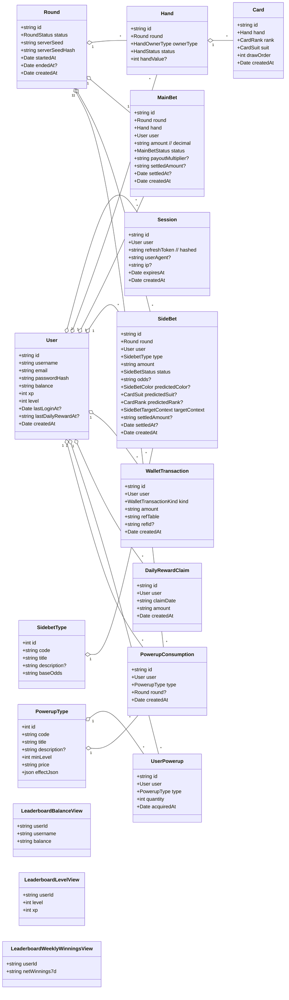

```mermaid
classDiagram
  direction LR

  class User {
    +string id
    +string username
    +string email
    +string passwordHash
    +string balance
    +int xp
    +int level
    +Date lastLoginAt?
    +string lastDailyRewardAt?
    +Date createdAt
  }

  class Session {
    +string id
    +User user
    +string refreshToken  // hashed
    +string userAgent?
    +string ip?
    +Date expiresAt
    +Date createdAt
  }
  User "1" o-- "*" Session

  class Round {
    +string id
    +RoundStatus status
    +string serverSeed
    +string serverSeedHash
    +Date startedAt
    +Date endedAt?
    +Date createdAt
  }

  class Hand {
    +string id
    +Round round
    +HandOwnerType ownerType
    +HandStatus status
    +int handValue?
  }
  Round "1" o-- "*" Hand
  User "1" o-- "*" Hand

  class Card {
    +string id
    +Hand hand
    +CardRank rank
    +CardSuit suit
    +int drawOrder
    +Date createdAt
  }
  Hand "1" o-- "*" Card

  class MainBet {
    +string id
    +Round round
    +Hand hand
    +User user
    +string amount  // decimal
    +MainBetStatus status
    +string payoutMultiplier?
    +string settledAmount?
    +Date settledAt?
    +Date createdAt
  }
  Round "1" o-- "1" MainBet
  User "1" o-- "*" MainBet

  class SidebetType {
    +int id
    +string code
    +string title
    +string description?
    +string baseOdds
  }

  class SideBet {
    +string id
    +Round round
    +User user
    +SidebetType type
    +string amount
    +SideBetStatus status
    +string odds?
    +SideBetColor predictedColor?
    +CardSuit predictedSuit?
    +CardRank predictedRank?
    +SideBetTargetContext targetContext
    +string settledAmount?
    +Date settledAt?
    +Date createdAt
  }
  Round "1" o-- "*" SideBet
  User "1" o-- "*" SideBet
  SidebetType "1" o-- "*" SideBet

  class WalletTransaction {
    +string id
    +User user
    +WalletTransactionKind kind
    +string amount
    +string refTable
    +string refId?
    +Date createdAt
  }
  User "1" o-- "*" WalletTransaction

  class DailyRewardClaim {
    +string id
    +User user
    +string claimDate
    +string amount
    +Date createdAt
  }
  User "1" o-- "*" DailyRewardClaim

  class PowerupType {
    +int id
    +string code
    +string title
    +string description?
    +int minLevel
    +string price
    +json effectJson
  }

  class UserPowerup {
    +string id
    +User user
    +PowerupType type
    +int quantity
    +Date acquiredAt
  }
  User "1" o-- "*" UserPowerup
  PowerupType "1" o-- "*" UserPowerup

  class PowerupConsumption {
    +string id
    +User user
    +PowerupType type
    +Round round?
    +Date createdAt
  }
  User "1" o-- "*" PowerupConsumption
  PowerupType "1" o-- "*" PowerupConsumption
  Round "1" o-- "*" PowerupConsumption

  class LeaderboardBalanceView {
    +string userId
    +string username
    +string balance
  }
  class LeaderboardLevelView {
    +string userId
    +int level
    +int xp
  }
  class LeaderboardWeeklyWinningsView {
    +string userId
    +string netWinnings7d
  }
```

