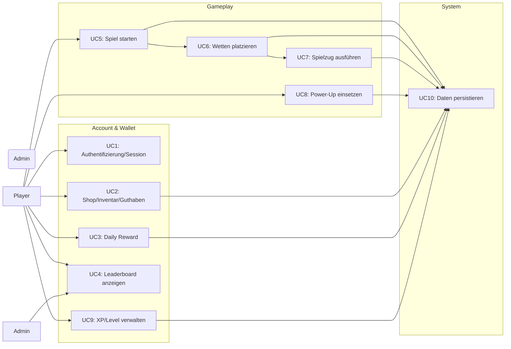

# BetCeption – Semester-Handout

## 1. Projektüberblick
- Blackjack-Spiel im Browser (SPA)
- Sidebets & Power-Ups
- Virtuelles Wallet (Spielgeld, kein Glücksspielrecht)
- Fairness-Commitment mit Seed + Hash (prüfbare Runden)

## 2. Architektur & Hauptentscheidungen
- Architekturstil: Backend & Frontend als Feature-Folder
- Fairness / Engine:
  - Serverseitige, deterministische Blackjack-Engine
  - Pro Runde: starker Seed → Hash → an Client; später Seed zur Prüfung
- Konsistenz / Transaktionen:
  - Wallet & Bets in ACID-Transaktionen
  - Sperren / Idempotenz-Keys gegen Doppelbuchungen
  - Ledger-Ansatz für Buchungsverlauf
- Security-by-default:
  - Auth mit JWT (+ Refresh-Cookie: HttpOnly, SameSite, Secure)
  - Passwörter via bcrypt
  - Rate-Limits auf kritischen Endpoints
- Observability:
  - Request-IDs, strukturierte Logs (UserId, RoundId)
- Deployment:
  - Docker Compose für Datenbank und Backend

## 3. Technologien & Tools
- Backend: Node.js, Express, TypeORM, MySQL 8, bcrypt, zod, Jest, Supertest, Docker Compose
- Frontend: Angular, RxJS, HttpClient/Interceptor/Guards, CSS
- CI/PM: GitHub, GitHub Actions, YouTrack/Board

## 4. Overall Use Case

## 5. Aufwandsstatistik
- Gesamt erfasster Aufwand (Team): ca. 108 h (≈ 6.500 Minuten)
- Verteilung nach Personen (gerundet):
  - Justin: ~ 50 h
  - Philipp: ~ 39 h
  - j.haeuser4: ~ 20 h
- Verteilung nach Workflows:
  - Allgemein: ~ 3 h
  - Backend: ~ 32 h
  - Database: ~ 7 h
  - Frontend: ~ 45 h
  - Projektmanagement: ~ 22 h

## 6. Rollen & Hauptbeiträge im Team
- Justin
  - Architektur & technische Leitplanken
  - Hauptverantwortlich Backend
  - Docker-Setup und Infrastruktur
- Philipp
  - Hauptverantwortlich Frontend
  - Auth-Integration, Routing, Guards & Interceptor
- J. Häuser
  - Anforderungsanalyse & Dokumentation
  - Unterstützung beim Testing
  - Unterstützung bei Frontend & Backend
