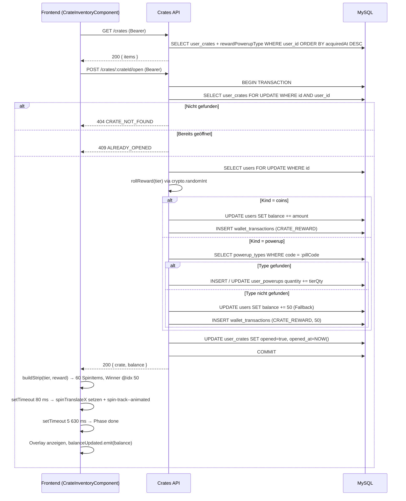

## Revision History
| Datum | Version | Beschreibung | Autor |
| --- | --- | --- | --- |
| 06.05.2026 | 1.0 | UCRS für Crate-System erstellt | Team BetCeption |

# BetCeption
## Use-Case-Realization Specification: Kisten-System (Crate-System)
Version 1.0

---

## 1. Introduction

### 1.1 Purpose
Diese UCRS beschreibt die technische Realisierung des Use Cases **Kisten-System** (UC11). Sie dokumentiert, wie Kisten beim Level-Up vergeben, im Backend geöffnet und die Belohnungen atomar in das Spielerprofil geschrieben werden.

### 1.2 Scope
- Automatische Kistenvergabe beim Level-Up (Tier aus Level berechnet).
- Endpunkte `GET /crates` und `POST /crates/:crateId/open`.
- Tier-basierte Belohnungsauswürfelung (Coins oder Power-Up) mit kryptografischem Zufallsgenerator.
- Pessimistic-Write-Lock verhindert Doppelöffnung.
- CS:GO-Style Roulette-Animation im Frontend (60-Item-Strip, 5 200 ms).

### 1.3 Definitions, Acronyms, and Abbreviations
- **UserCrate:** DB-Entity in `user_crates`; ein Eintrag pro erhaltene Kiste.
- **Tier:** Qualitätsstufe 1 (Common), 2 (Rare), 3 (Epic) — bestimmt Coin-Spanne und Power-Up-Wahrscheinlichkeit.
- **CRATE_REWARD:** `WalletTransactionKind`-Enum-Wert für Kisten-Coin-Belohnungen.
- **SPIN_COUNT / WINNER_IDX:** Frontend-Konstanten; 60 Slots insgesamt, Winner an Position 50.

### 1.4 References
- `../use-cases/uc11-crate-system.md`
- `Betception-Backend/src/modules/crates/crates.controller.ts`
- `Betception-Backend/src/entity/UserCrate.ts`
- `Betception-Frontend/src/app/features/casino/homepage/components/crate-inventory/crate-inventory.ts`
- `db/schema.sql` (user_crates, wallet_transactions, user_powerups)

### 1.5 Overview
Kapitel 2 beschreibt den Implementierungsstand. Kapitel 3 den detaillierten technischen Ablauf. Kapitel 4 das Sequenzdiagramm. Kapitel 5 die abgeleiteten Anforderungen.

---

## 2. Implementierungsstand (aktueller Code)

### 2.1 Backend
- **Entity `UserCrate`:** Felder `tier` (tinyint 1–3), `acquiredLevel` (int), `acquiredAt` (timestamp, default NOW), `opened` (boolean), `openedAt` (timestamp nullable), `rewardKind` (enum coins|powerup nullable), `rewardCoins` (decimal nullable), `rewardPowerupType` (ManyToOne → PowerupType nullable).
- **Tier-Berechnung (`getTierForLevel`):** Level ≤ 5 → Tier 1; Level ≤ 10 → Tier 2; Level > 10 → Tier 3.
- **`GET /crates`** (authGuard): Liest alle `user_crates` des JWT-Users (inkl. Relation `rewardPowerupType`), sortiert nach `acquiredAt DESC`. Serialisierung via `serializeCrate()` normalisiert den Tier-Wert und blendet `reward` nur aus, wenn `opened = true`.
- **`POST /crates/:crateId/open`** (authGuard): Öffnet eine Kiste in einer einzigen DB-Transaktion:
  1. `SELECT ... FOR UPDATE` auf Kiste + User.
  2. Validierung: Kiste vorhanden (404) und noch nicht geöffnet (409).
  3. `rollReward(tier)`: `crypto.randomInt(10000) / 10000` gegen `pillChance`-Schwelle:
     - < Schwelle → `{ kind: 'powerup' }` → `pickRandomPowerPillCode()` → PowerupType suchen → `user_powerups` create/increment.
     - ≥ Schwelle → `{ kind: 'coins', amount }` → `crypto.randomInt(span)` im Tier-Bereich → Balance erhöhen + `WalletTransaction` (CRATE_REWARD) anlegen.
  4. Fallback: Kein passender PowerupType → 50 Coins gutschreiben.
  5. `crate.opened = true`, `openedAt = new Date()`.
  6. Response: `{ crate: serializeCrate(crate), balance: user.balance }`.

### 2.2 Frontend
- **`CrateInventoryComponent`**: Standalone Angular-Komponente; bezieht Kisten via `BetceptionApi.listCrates()` in `ngOnInit`.
- **Öffnen (`onOpen`):** Setzt Phase `loading`, ruft `api.openCrate(crateId)` auf; bei Erfolg → `startSpin(reward)`.
- **Roulette-Strip (`buildStrip`):** Erstellt 60 `SpinItem`-Objekte. Index 50 = tatsächlicher Winner (echte Belohnung). Restliche Slots: 7 % Chance auf Fake-Power-Up, sonst Fake-Coins im Tier-Bereich (±1 Tier zufällig).
- **Animation:** `spinTranslateX` wird nach 80 ms auf den berechneten Zielwert gesetzt; CSS-Klasse `spin-track--animated` aktiviert `transition: transform 5 200 ms cubic-bezier(0.05, 0.8, 0.35, 1.0)`. Nach `SPIN_MS + 80 + 350` ms → Phase `done`.
- **Phasen:** `idle` → `loading` → `spinning` → `done`; `onDismissReveal()` setzt zurück auf `idle`.
- **`balanceUpdated`-Output:** Emittiert nach erfolgreicher API-Response die neue Balance an den Parent (Homepage).

---

## 3. Flow of Events – Design

### 3.1 Kiste beim Level-Up vergeben
1. Round-Settlement erkennt Level-Up.
2. `UserCrate` wird mit `tier = getTierForLevel(newLevel)` und `acquiredLevel = newLevel` angelegt.
3. Frontend lädt Kisten-Liste neu; neue Kiste erscheint im Inventar.

### 3.2 Kiste öffnen (Happy Path)
1. Spieler klickt „Öffnen" auf einer ungeöffneten Kiste.
2. Frontend: Phase `loading`, `POST /crates/:crateId/open` wird gesendet.
3. Backend: DB-Transaktion mit FOR-UPDATE-Lock.
4. Belohnung auswürfeln → Guthaben/Inventar aktualisieren → Kiste schließen.
5. Backend antwortet mit vollständiger Kisten-Serialisierung und aktueller Balance.
6. Frontend: Strip aufbauen, Winner einfügen, Animation starten.
7. Nach 5 630 ms: Phase `done`, Ergebnis-Overlay sichtbar.
8. Spieler schließt Overlay → Phase `idle`, Balance in Navigation aktualisiert.

### 3.3 Fehlerfälle
| Code             | HTTP | Ursache                                |
|------------------|------|----------------------------------------|
| `CRATE_NOT_FOUND` | 404 | Kiste nicht vorhanden oder fremder User |
| `ALREADY_OPENED` | 409  | `opened = true` in der DB              |
| `UNAUTHENTICATED`| 401  | Kein gültiges JWT                      |

---

## 4. Sequenzdiagramm

---

## 5. Derived Requirements

- **DR1:** Belohnungsauswürfelung muss serverseitig und nicht deterministisch vorhersehbar sein (`crypto.randomInt`).
- **DR2:** Pessimistic Write Lock verhindert Race Conditions beim gleichzeitigen Öffnen derselben Kiste.
- **DR3:** Coins-Gutschrift und `WalletTransaction`-Eintrag müssen atomar in einer DB-Transaktion erfolgen.
- **DR4:** Power-Up-Bestand muss via `INSERT … ON CONFLICT` oder explizitem `findOne/save` idempotent erhöht werden.
- **DR5:** Fallback auf 50 Coins sichert eine valide Belohnung, auch wenn der Power-Up-Katalog unvollständig ist.
- **DR6:** Frontend darf die Animation erst starten, wenn die Backend-Response vollständig eingegangen ist (Ergebnis ist deterministisch, Animation nur visuell).
- **DR7:** `balanceUpdated`-Event muss nach jedem erfolgreichen Öffnen an den Parent emittiert werden.
- **DR8:** Fehlercodes (`CRATE_NOT_FOUND`, `ALREADY_OPENED`, `UNAUTHENTICATED`) müssen im Frontend lokalisiert angezeigt werden.

---

## 2. Overall Description
- **Product Perspective:** Erweiterung der Progression-Domäne; abhängig von UC9 (XP/Level-System) für die Kistenvergabe und UC2 (Shop/Inventar) für Power-Up-Bestände.
- **Product Functions:** Kistenvergabe bei Level-Up, Inventar-Anzeige, atomares Öffnen mit Belohnungsauswürfelung, Roulette-Animation.
- **User Characteristics:** Eingeloggte Spieler, die Levels erreichen; keine Admin-Funktion.
- **Constraints:** JWT-Auth erforderlich; DB muss FOR-UPDATE-Locks unterstützen (InnoDB); Krypto-Zufallsgenerator muss auf Node.js-Seite verfügbar sein.
- **Assumptions/Dependencies:** Level-Up-Logik aus UC9 ist aktiv; `powerup_types` enthält mindestens RED_PILL und BLUE_PILL; WalletTransactionKind.CRATE_REWARD ist im Enum definiert.

## 3. Specific Requirements

### 3.1 Functionality
- FR1: System muss bei Level-Up automatisch einen `UserCrate`-Eintrag mit dem korrekten Tier anlegen.
- FR2: `GET /crates` muss alle Kisten des authentifizierten Users zurückliefern.
- FR3: `POST /crates/:crateId/open` darf eine Kiste nur einmal öffnen; zweiter Aufruf liefert 409.
- FR4: Belohnungsauswürfelung erfolgt serverseitig; Coins-Spanne und Pill-Chance sind Tier-abhängig.
- FR5: Coins-Belohnung muss das User-Guthaben erhöhen und eine `WalletTransaction` (CRATE_REWARD) anlegen.
- FR6: Power-Up-Belohnung muss den Bestand in `user_powerups` um die Tier-abhängige Menge erhöhen.
- FR7: Fallback auf 50 Coins bei unbekanntem Power-Up-Code.

### 3.2 Usability
- U1: Roulette-Animation gibt dem Spieler visuelles Feedback über die Spannung der Belohnung.
- U2: Fehlermeldungen sind lokalisiert und verständlich (I18n-Keys).
- U3: Inventar trennt ungeöffnete und geöffnete Kisten klar.

### 3.3 Reliability
- R1: Transaktion mit FOR-UPDATE-Lock verhindert Doppelöffnung.
- R2: Rollback bei jedem Fehler innerhalb der Transaktion (keine Teilgutschriften).
- R3: Fallback-Logik stellt sicher, dass ein Öffnen nie ohne Belohnung abgeschlossen wird.

### 3.4 Performance
- P1: Crate-Open-Endpunkt < 500 ms bei normaler Last (Lock-Dauer minimieren).
- P2: Frontend-Animation läuft vollständig clientseitig; keine weiteren API-Calls während der Animation.

### 3.5 Supportability
- S1: `refTable = 'user_crates'` und `refId = crate.id` in WalletTransaction ermöglichen Audit-Trail.
- S2: Tier-Konfiguration (Coin-Spannen, Pill-Chance) zentral im Controller definiert – einfach anpassbar.

### 3.6 Design Constraints
- DC1: JWT-Auth via `authGuard` Middleware auf allen `/crates`-Routen.
- DC2: MySQL/TypeORM mit InnoDB (FOR-UPDATE-Lock-Unterstützung erforderlich).
- DC3: `crypto.randomInt` statt `Math.random()` für die serverseitige Belohnungsauswürfelung.

### 3.7 Interfaces
- **User Interfaces:** `CrateInventoryComponent` (Angular Standalone) – Inventar-Ansicht + Roulette-Animation + Ergebnis-Overlay.
- **Software Interfaces:** REST-API `GET /crates`, `POST /crates/:crateId/open`; DB-Tabellen `user_crates`, `wallet_transactions`, `user_powerups`, `powerup_types`.
- **Communications Interfaces:** HTTPS, JSON, JWT im Authorization-Header.

### 3.8 Applicable Standards
- HTTPS, JWT Best Practices, ACID-Transaktionen, kryptografisch sichere Zufallsgenerierung.

## 4. Supporting Information
- Sequenzdiagramm in Abschnitt 4.
- Tier-Konfiguration und Belohnungslogik in `crates.controller.ts` (`TIER_CONFIG`, `rollReward`, `getTierForLevel`).
- Frontend-Animationslogik in `crate-inventory.ts` (`buildStrip`, `startSpin`, `SPIN_COUNT`, `WINNER_IDX`, `SPIN_MS`).
