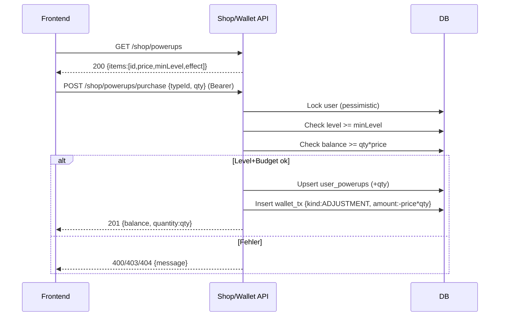
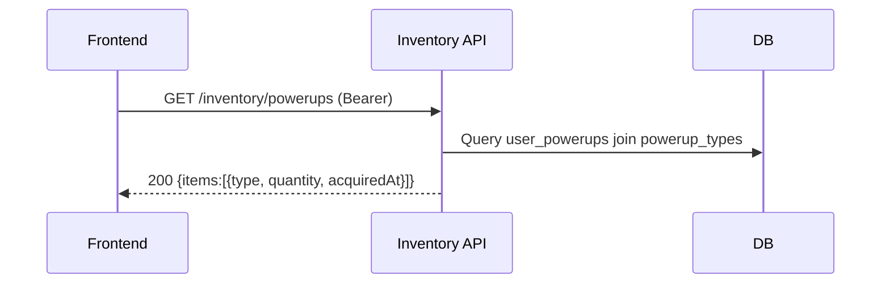
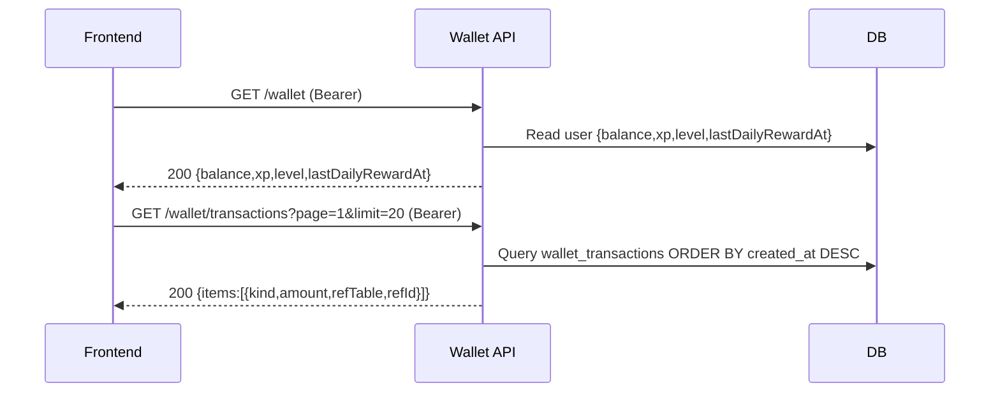
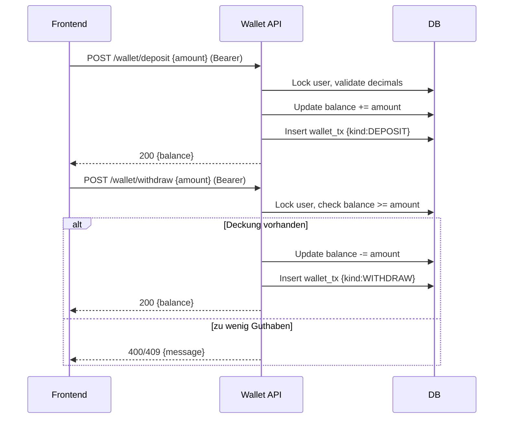

## Revision History
| Datum | Version | Beschreibung | Autor |
| --- | --- | --- | --- |
| 02.12.2025 | 1.0 | UCRS für Shop, Inventar & Guthabenverwaltung erstellt | Team BetCeption |

# BetCeption  
## Use-Case-Realization Specification: Shop, Inventar & Guthabenverwaltung  
Version 1.0  

---

## 1. Introduction
Diese UCRS dokumentiert die technische Realisierung des UC2 **Shop, Inventar & Guthabenverwaltung** in BetCeption. Sie beschreibt, wie Frontend, Backend und Datenbank beim Laden des Shops, beim Kauf von Power-Ups, beim Inventar-Abruf sowie bei Wallet-Operationen zusammenarbeiten.

### 1.1 Purpose
Sicherer und konsistenter Kauf von Power-Ups, Verwaltung der Bestände im Inventar und transparente Guthabenführung mit Transaktionshistorie.

### 1.2 Scope
- **Shop:** Power-Ups laden, Kauf mit Level- und Guthabenprüfung.  
- **Inventar:** Anzeige der vorhandenen Power-Ups eines Users.  
- **Wallet:** Saldo und Transaktionen lesen, Ein-/Auszahlungen buchen.  
- **Grenzen:** Realtime-Sync und UI-Filter sind aktuell nicht umgesetzt.

### 1.3 Definitions, Acronyms, and Abbreviations
- **WalletTx:** Eintrag in `wallet_transactions` (ADJUSTMENT/DEPOSIT/WITHDRAW/WIN/LOSS/REWARD).  
- **PowerupType:** Kaufbares Item mit Preis und Mindest-Level.  
- **Bearer:** JWT im Authorization-Header.

### 1.4 References
- ../use-cases/uc2-shop-inventar-guthabeverwaltung.md  
- db/schema.sql (Tabellen `powerup_types`, `user_powerups`, `wallet_transactions`)  
- Backend-Routen `shop`, `inventory`, `wallet`

### 1.5 Overview
Kapitel 2 beschreibt Implementierungsstand und Flow-Varianten; Kapitel 3 enthält die Sequenzdiagramme; Kapitel 4 fasst abgeleitete Anforderungen zusammen.

---

## 2. Implementierungsstand (aktueller Code)
- **Backend:**  
  - `GET /shop/powerups` liefert alle Typen (Preis, minLevel, Effekt).  
  - `POST /shop/powerups/purchase` sperrt den User (pessimistic lock), prüft Level und Balance, bucht Betrag als `wallet_transactions.kind=ADJUSTMENT` und erhöht `user_powerups` in einer DB-Transaktion.  
  - `GET /inventory/powerups` liefert Bestände des eingeloggten Users inkl. Typ-Details.  
  - `GET /wallet`, `GET /wallet/transactions`, `POST /wallet/deposit|withdraw` liefern Saldo, Historie bzw. buchen Ein-/Auszahlungen. Geld wird als Decimal gespeichert, Berechnung in Cent.  
- **Frontend:**  
  - Keine dedizierten Shop-/Inventar-/Wallet-Views. Blackjack-Screen ruft nur `Wallet.getSummary()`.  
  - Keine Transaktionsliste oder Kauf-UI.  
- **Abweichungen:**  
  - Kein Realtime-Sync, keine Client-Validierung für Level/Budget.  
  - Kein UI für Kauf oder Inventar; alle Prüfungen serverseitig.

---

## 3. Flow of Events - Design

### 3.1 Power-Up kaufen (Shop)
1. Frontend lädt die verfügbaren Power-Ups.  
2. Spieler wählt Typ und Menge.  
3. Backend sperrt den User-Datensatz, prüft Level und Balance.  
4. Bei Erfolg: Betrag wird abgebucht, `user_powerups` erhöht, Wallet-Transaktion geschrieben.  
5. Antwort enthält neuen Saldo und gekaufte Menge.  
6. Bei Fehlern: 400/403/404 mit Meldung (z. B. Level zu niedrig oder zu wenig Guthaben).

### 3.2 Inventar anzeigen
1. Authentifizierter Spieler ruft `GET /inventory/powerups` auf.  
2. Backend liest Bestände und zugehörige Typ-Infos.  
3. Frontend zeigt Items und Mengen.

### 3.3 Guthaben anzeigen / Transaktionen
1. Spieler ruft `GET /wallet` und `GET /wallet/transactions`.  
2. Backend liefert Saldo, XP/Level, `lastDailyRewardAt` sowie paginierte Historie.  
3. UI zeigt Kontostand und Historie, optional Filter/Sortierung (noch nicht implementiert).

### 3.4 Ein-/Auszahlung
1. Spieler sendet `POST /wallet/deposit|withdraw` mit Betrag (2 Nachkommastellen).  
2. Backend validiert Betrag, sperrt User, passt Saldo an und schreibt WalletTx.  
3. Antwort enthält aktualisierten Saldo.

---

## 4. Sequenzdiagramme

### 4.1 Power-Up kaufen

### 4.2 Inventar anzeigen

### 4.3 Guthaben & Transaktionen anzeigen

### 4.4 Ein-/Auszahlung

---

## 5. Derived Requirements
- Käufe, Ein-/Auszahlungen und Inventar-Updates laufen atomar in DB-Transaktionen mit pessimistic lock auf dem User.  
- Preise, Mindest-Level und Effekte kommen serverseitig aus `powerup_types`; keine Client-Trust.  
- Betragsvalidierung auf zwei Nachkommastellen; Berechnung in Cent, Speicherung als Decimal.  
- Antwortzeit für Shop/Inventar/Wallet <= 1 s im Normalfall.  
- Fehlermeldungen bei Budget-/Level-Verletzung, fehlenden Typen oder Sperrkonflikten.  
- Paginierte Transaktionsliste, sortiert nach `created_at DESC`.  
- Authentifizierung per JWT für alle schreibenden Routen und Inventar/Wallet-Reads.

---

## 2. Overall Description
- **Product Perspective:** Teil der Ökosystem-Domäne (Shop/Inventory/Wallet); nutzt MySQL/TypeORM.  
- **Product Functions:** Power-Ups anbieten, Kauf mit Level-/Guthabenprüfung, Inventar liefern, Wallet-Saldo/Transaktionen bereitstellen.  
- **User Characteristics:** Eingeloggte Spieler; kein dediziertes UI vorhanden.  
- **Constraints:** JWT-Auth für Inventar/Wallet/Kauf; Decimal-Beträge in Cent; Level-Prüfung serverseitig.  
- **Assumptions/Dependencies:** UC1 (Auth), UC8 (Powerups einsetzen), UC9 (Level), UC10 (Persistenz).  
- **Requirements Subset:** Realtime-Sync/Filter im UI nicht implementiert.

## 3. Specific Requirements
### 3.1 Functionality
- FR1: API muss `GET /shop/powerups` öffentlich bereitstellen.  
- FR2: API muss `POST /shop/powerups/purchase` Level/Guthaben prüfen, Bestand erhöhen, WalletTx schreiben.  
- FR3: API muss `GET /inventory/powerups` Bestände des Users liefern.  
- FR4: API muss `GET /wallet`, `GET /wallet/transactions`, `POST /wallet/deposit|withdraw` mit Auth bedienen.  
- FR5: Fehlercodes für Level-/Guthabenverletzung, fehlende Auth, ungültige Typen.

### 3.2 Usability
- U1: Klare Fehlermeldungen (Level zu niedrig, Guthaben fehlt).  
- U2: Response-JSON konsistent (items, balance, transactions).

### 3.3 Reliability
- R1: Atomare Transaktionen bei Kauf/Wallet-Operationen mit Sperre.  
- R2: Cent-Berechnung verhindert Rundungsfehler.

### 3.4 Performance
- P1: Antwortzeit < 1 s für Shop/Inventar/Wallet.  
- P2: Paginierte Transaktionen (limit/offset).

### 3.5 Supportability
- S1: Logging von `userId`, `typeId`, `amount`, requestId.  
- S2: Konfigurierbare Preise/Level in `powerup_types`.

### 3.6 Design Constraints
- DC1: JWT/HTTPS, Decimal/Int; pessimistic locks.  
- DC2: Keine Realtime-Sync implementiert.

### 3.7 Online User Documentation and Help System Requirements
- H1: API-Doku für Shop/Inventory/Wallet-Endpunkte.

### 3.8 Purchased Components
- PC1: Keine.

### 3.9 Interfaces
- **User Interfaces:** Noch nicht umgesetzt (Shop-/Inventar-/Wallet-Views).  
- **Hardware Interfaces:** Keine.  
- **Software Interfaces:** REST-APIs; DB-Tabellen `powerup_types`, `user_powerups`, `wallet_transactions`.  
- **Communications Interfaces:** HTTPS, JSON, JWT.

### 3.10 Licensing Requirements
- Keine.

### 3.11 Legal, Copyright, and Other Notices
- Datenschutz: Transaktionsdaten nur für eigenen User abrufbar.

### 3.12 Applicable Standards
- HTTPS, JWT, ACID-Transaktionen.

## 4. Supporting Information
- Sequenzdiagramme Abschnitt 4.  
- Aktivitäten Abschnitt 5.

