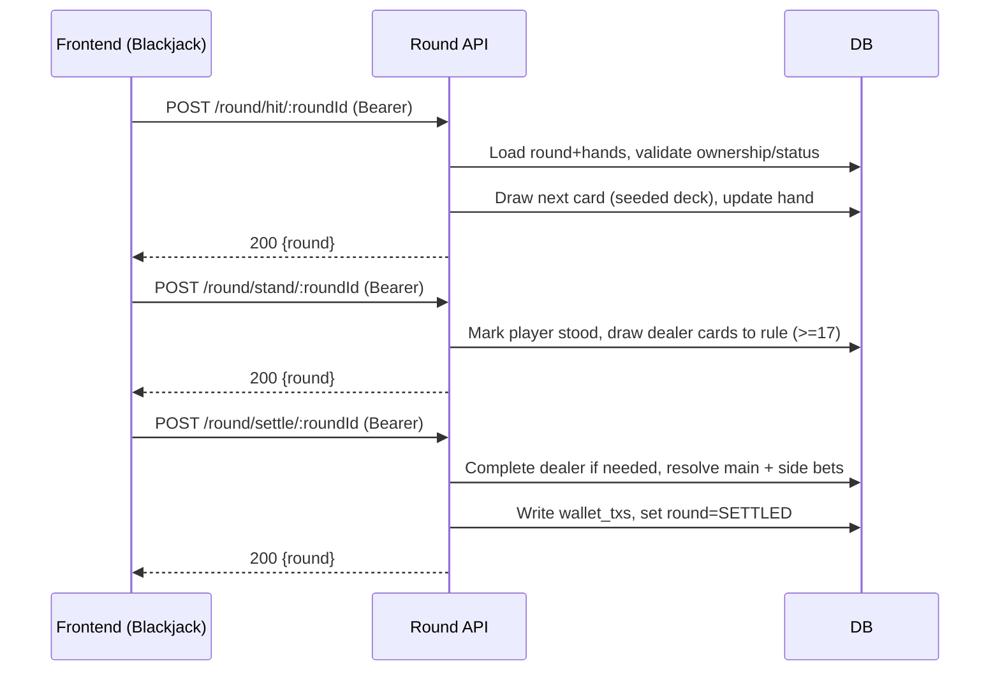

## Revision History
| Datum | Version | Beschreibung | Autor |
| --- | --- | --- | --- |
| 02.12.2025 | 1.0 | UCRS für Spielzug ausführen (Hit/Stand/Settle) erstellt | Team BetCeption |

# BetCeption  
## Use-Case-Realization Specification: Spielzug ausführen (Hit, Stand, Settle)  
Version 1.0  

---

## 1. Introduction
Diese UCRS beschreibt die technische Realisierung des Use Cases **Spielzug ausführen** (UC7) im Blackjack. Sie dokumentiert, wie Frontend, Backend und Datenbank die Züge Hit, Stand und Settle abwickeln (Double/Split sind aktuell nicht implementiert).

### 1.1 Purpose
Spielzüge regelkonform, deterministisch und transaktionssicher durchführen sowie Rundenstatus, Karten und Einsätze aktualisieren.

### 1.2 Scope
- Aktionen: **Hit**, **Stand**, **Settle** per Endpunkte `/round/hit|stand|settle/:roundId`.  
- Statusprüfung, Besitzprüfung, Kartenlogik (Dealer completes), Auflösung von Main-/Sidebets beim Settle.  
- Kein Double/Split in der aktuellen Implementierung.

### 1.3 Definitions, Acronyms, and Abbreviations
- **Hit:** Spieler zieht eine Karte.  
- **Stand:** Spieler bleibt; Dealer zieht bis Regel erfüllt.  
- **Settle:** Finale Auswertung (Dealer ggf. vervollständigen, Bets auflösen).  
- **RoundStatus:** `IN_PROGRESS`, `SETTLED`.

### 1.4 References
- ../use-cases/uc7-spielzug-ausfuehren.md  
- db/schema.sql (rounds, hands, cards, main_bets, side_bets, wallet_transactions)  
- Backend-Routen `round/hit`, `round/stand`, `round/settle`

### 1.5 Overview
Kapitel 2 fasst den Implementierungsstand, Kapitel 3 den Flow, Kapitel 4 das Sequenzdiagramm, Kapitel 5 die abgeleiteten Anforderungen zusammen.

---

## 2. Implementierungsstand (aktueller Code)
- **Backend:**  
  - `POST /round/hit/:roundId`: prüft Eigentum/Status `IN_PROGRESS`, zieht nächste Karte aus deterministischem Deck, aktualisiert Hand.  
  - `POST /round/stand/:roundId`: markiert Player-Hand als „stood“, lässt Dealer bis Regel (>=17) ziehen.  
  - `POST /round/settle/:roundId`: vervollständigt Dealer falls nötig, löst Main-/Sidebets auf, schreibt Wallet-Txs, setzt Round `SETTLED`.  
  - `GET /round/:roundId`: liefert aktuellen Stand. Double/Split fehlen.  
- **Frontend:** Buttons für Deal (UC5), Hit, Stand, Settle; kein Double/Split. Fehler werden angezeigt, Round/Balance werden nach Aktionen neu geladen.  
- **Abweichungen:** Keine Zeitlimits, keine Multi-Hand/Split, keine XP-Updates im Codepfad, kein Idempotency-Key.

---

## 3. Flow of Events - Design

### 3.1 Spielzug ausführen
1. Spieler ist eingeloggt und hat eine aktive Runde (Status `IN_PROGRESS`).  
2. Spieler wählt Hit, Stand oder Settle.  
3. Backend prüft Eigentum/Status und die Zulässigkeit der Aktion.  
4. Aktion ausführen:  
   - **Hit:** Karte ziehen, Handwert aktualisieren.  
   - **Stand:** Player steht, Dealer zieht bis Regel.  
   - **Settle:** Dealer ggf. vervollständigen, Bets auswerten, Wallet-Txs schreiben, Round auf `SETTLED`.  
5. Response 200 mit aktualisiertem Round-State.  
6. Fehlerfälle: falscher Status/Eigentum -> 400/404/409; fehlendes JWT -> 401.

---

## 4. Sequenzdiagramm

---

## 5. Derived Requirements
- Eigentums- und Statusprüfung vor jedem Zug; nur `IN_PROGRESS` akzeptieren.  
- Kartenziehung deterministisch pro Runde (Seed/Deck-Order).  
- Jede Aktion atomar (Transaktion) mit Konsistenz von Bets/Wallet.  
- Settle muss Main- und Sidebets vollständig auswerten und Wallet-Txs schreiben.  
- Fehlercodes: 401 (Auth), 404 (falsche Round), 409/400 (Status/Aktion nicht erlaubt).  
- Optionaler Ausbau: Double/Split, Zeitlimit je Zug, XP-Update nach Abschluss, Idempotency-Key.

---

## 2. Overall Description
- **Product Perspective:** Teil der Blackjack-Runtime; nutzt Round/Hand/Card/Bet-Logik.  
- **Product Functions:** Hit/Stand/Settle ausführen, Dealer-Logik, Bets auswerten.  
- **User Characteristics:** Eingeloggte Spieler mit aktiver Runde.  
- **Constraints:** Runde muss `IN_PROGRESS` sein; deterministisches Deck; Auth erforderlich.  
- **Assumptions/Dependencies:** UC5 (Runde existiert), UC6 (Bets vorhanden), UC1 (Auth).  
- **Requirements Subset:** Double/Split nicht implementiert.

## 3. Specific Requirements
### 3.1 Functionality
- FR1: System muss Eigentum und Status prüfen, bevor ein Zug ausgeführt wird.  
- FR2: Hit zieht nächste Karte aus deterministischem Deck und aktualisiert Handwert.  
- FR3: Stand markiert Spielerhand, Dealer zieht bis Regel erfüllt.  
- FR4: Settle muss Main-/Sidebets auswerten, Wallet-Txs schreiben und Runde auf `SETTLED` setzen.  
- FR5: Responses 200 mit aktuellem Round-State; Fehler 400/401/404/409 bei Verstößen.

### 3.2 Usability
- U1: Klare Fehlermeldungen bei verbotenen Aktionen/Status.  
- U2: Response-JSON vollständig für UI-Update (Karten, Status, Bets).

### 3.3 Reliability
- R1: Jede Aktion in Transaktion; kein Teilzustand bei Fehler.  
- R2: Dealer-Logik deterministisch, keine Abhängigkeit von externen Diensten.

### 3.4 Performance
- P1: Antwortzeit < 1 s pro Zug.  
- P2: Kartenziehung und Auswertung in-memory ohne zusätzliche I/O außer DB.

### 3.5 Supportability
- S1: Logging (`roundId`, `action`, `requestId`).  
- S2: Konfigurierbare Regeln (Dealer zieht bis >=17, Soft 17).

### 3.6 Design Constraints
- DC1: JWT/HTTPS, MySQL/TypeORM.  
- DC2: Keine Double/Split-Implementation; Single-Hand.

### 3.7 Online User Documentation and Help System Requirements
- H1: API-Doku für `/round/hit|stand|settle/:roundId`.

### 3.8 Purchased Components
- PC1: Keine.

### 3.9 Interfaces
- **User Interfaces:** Blackjack-UI Buttons für Hit/Stand/Settle.  
- **Hardware Interfaces:** Keine.  
- **Software Interfaces:** REST-APIs, DB-Tabellen `rounds`, `hands`, `cards`, `main_bets`, `side_bets`, `wallet_transactions`.  
- **Communications Interfaces:** HTTPS, JSON, JWT.

### 3.10 Licensing Requirements
- Keine.

### 3.11 Legal, Copyright, and Other Notices
- Datenschutzkonform: keine sensiblen Daten in Logs/Responses.

### 3.12 Applicable Standards
- HTTPS, JWT, ACID-Transaktionen.

## 4. Supporting Information
- Sequenzdiagramm Abschnitt 4.  
- Aktivitäten Abschnitt 5.

