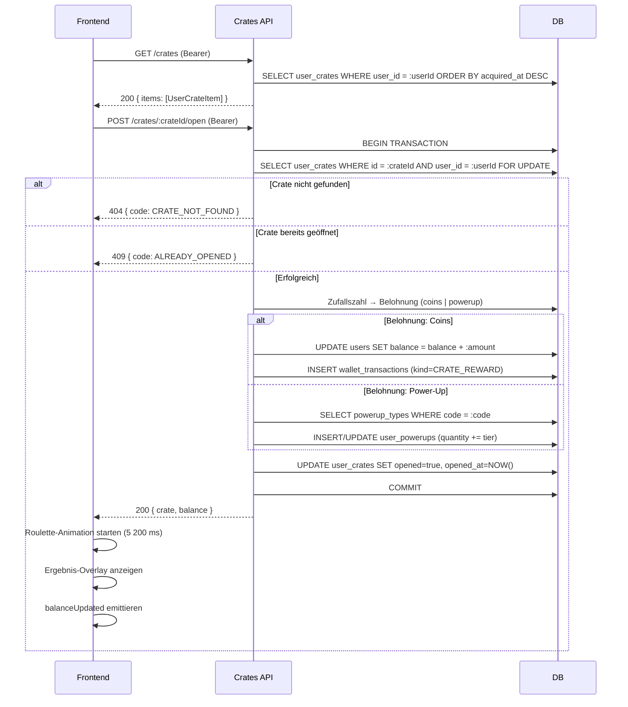
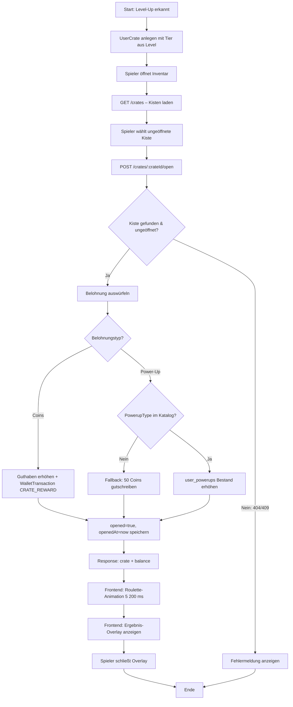

## Revision History
| Datum | Version | Beschreibung | Autor |
| --- | --- | --- | --- |
| 06.05.2026 | 1.0 | Initiale UC-Dokumentation – Crate-System | Team BetCeption |

# Use Case 11: Kisten-System (Crate-System)

## 1. Brief Description
Dieser Use Case beschreibt das Kisten-System (Crate-System) von BetCeption.
Spieler erhalten automatisch eine Kiste, wenn sie ein neues Level erreichen. Die Kisten haben drei Tier-Stufen (Common, Rare, Epic), die vom aktuellen Level des Spielers abhängen. Durch das Öffnen einer Kiste erhält der Spieler entweder Coins oder ein Power-Up als Belohnung. Das Öffnen wird durch eine CS:GO-inspirierte Roulette-Spin-Animation visualisiert.

---
## Abgleich Implementierung (Stand aktueller Code)
- **Backend:** Kisten werden beim Level-Up automatisch per `UserCrate`-Entity angelegt (Tier ergibt sich aus dem neuen Level). `GET /crates` liefert alle Kisten des eingeloggten Users. `POST /crates/:crateId/open` öffnet eine Kiste atomar (pessimistic write lock): rollt die Belohnung aus, schreibt Coins oder Power-Up ins Inventar und legt bei Coins eine `WalletTransaction` (Kind: `CRATE_REWARD`) an.
- **Frontend:** `CrateInventoryComponent` zeigt ungeöffnete und bereits geöffnete Kisten. Beim Öffnen läuft eine 5200-ms-Roulette-Strip-Animation mit 60 Slots ab (Winner bei Index 50, ±20 px Jitter). Nach der Animation wird die Belohnung als Ergebnis-Overlay eingeblendet.
- **Abweichungen:** Keine bekannten Abweichungen – System vollständig implementiert. Tier-Stufen 4 und 5 sind im Frontend als CSS-Klassen vorbereitet, im Backend aber noch nicht vergeben (max. Tier 3).

---

## 2. Akteure
- **Spieler:** Empfängt Kisten durch Level-Ups und öffnet diese im Inventar.
- **System:** Vergibt Kisten automatisch bei Level-Up, rollt die Belohnung aus und schreibt sie ins Spielerprofil.

---

## 3. Tier-Konfiguration

| Tier | Bezeichnung | Erhält man ab Level | Coin-Spanne | Power-Up-Chance |
|------|-------------|---------------------|-------------|-----------------|
| 1    | Common      | ≤ 5                 | 50 – 400    | 4 %             |
| 2    | Rare        | 6 – 10              | 200 – 1 000 | 6 %             |
| 3    | Epic        | > 10                | 500 – 3 000 | 8 %             |

Power-Up-Belohnungen: Tier-1-Kiste → 1×, Tier-2 → 2×, Tier-3 → 3× des ausgewürfelten Power-Ups.

---

## 4. Flow of Events

### 4.1 Basic Flow – Kiste erhalten
1. Spieler schließt eine Runde ab.
2. System berechnet XP und neues Level (UC9).
3. System erkennt Level-Up und erstellt einen `UserCrate`-Eintrag mit dem dem neuen Level entsprechenden Tier.
4. Frontend zeigt dem Spieler die neue Kiste im Inventar an.

### 4.2 Basic Flow – Kiste öffnen
1. Spieler öffnet das Kisten-Inventar auf der Homepage.
2. System lädt alle Kisten des Spielers (`GET /crates`).
3. Spieler wählt eine ungeöffnete Kiste aus und klickt „Öffnen".
4. Frontend wechselt in Phase `loading` und sendet `POST /crates/:crateId/open`.
5. Backend setzt pessimistic write lock auf die Kiste und den User-Eintrag.
6. Backend prüft: Gehört die Kiste dem User? Ist sie noch ungeöffnet?
7. Backend rollt die Belohnung aus (Zufallszahl gegen Tier-Konfiguration):
   - **Coins:** Wallet-Guthaben wird erhöht, `WalletTransaction` (CRATE_REWARD) wird geschrieben.
   - **Power-Up:** Zufälliges Power-Up wird ausgewählt; Bestand in `user_powerups` wird erhöht (oder neu angelegt).
8. Backend setzt `opened = true`, `openedAt = now`.
9. Frontend erhält Response mit Belohnungsdetails und startet Roulette-Animation (Phase `spinning`, 5 200 ms).
10. Nach der Animation zeigt das System das Ergebnis-Overlay (Phase `done`).
11. Spieler schließt das Overlay; Guthaben in der Navigation wird aktualisiert.

### 4.3 Alternative Flow – Kiste bereits geöffnet
- Schritt 6: Kiste hat `opened = true` → 409 `ALREADY_OPENED`.
- Frontend zeigt Fehlermeldung; Animation wird nicht gestartet.

### 4.4 Alternative Flow – Kiste nicht gefunden / kein Besitz
- Schritt 6: Kiste existiert nicht oder gehört einem anderen User → 404 `CRATE_NOT_FOUND`.

### 4.5 Alternative Flow – Power-Up-Typ nicht im Katalog
- Schritt 7: Gewürfelter Power-Up-Code hat keinen Eintrag in `powerup_types` → Fallback: 50 Coins werden gutgeschrieben.

---

## 5. Sequenzdiagramm

---

## 6. Aktivitätsdiagramm

---

## 7. Special Requirements
- Öffnen einer Kiste muss atomar sein (pessimistic write lock verhindert Doppelöffnung).
- Belohnungsauslosung erfolgt serverseitig mittels kryptografisch sicherem Zufallsgenerator (`crypto.randomInt`).
- Kein Spieler darf eine Kiste eines anderen Spielers öffnen.
- Die Roulette-Animation läuft ausschließlich clientseitig; das Ergebnis steht bereits vor Animationsstart fest.

---

## 8. Preconditions
- Spieler ist eingeloggt und besitzt mindestens eine ungeöffnete Kiste.
- Kiste wurde durch einen Level-Up erworben.

---

## 9. Postconditions
- Kiste ist als `opened = true` in der Datenbank markiert.
- Belohnung (Coins oder Power-Up) wurde dem Spieler gutgeschrieben.
- Bei Coins: `WalletTransaction` mit Kind `CRATE_REWARD` ist angelegt.
- Bei Power-Up: `user_powerups`-Bestand ist um die Tier-abhängige Menge erhöht.
- Frontend zeigt die aktualisierte Balance an.

---

## 10. Function Points

| Kategorie     | Beschreibung                                                      | Function Points |
|---------------|-------------------------------------------------------------------|-----------------|
| Eingaben      | Auswahl und Öffnen einer Kiste (crateId via Route-Param)          | 2 FP            |
| Ausgaben      | Belohnungsanzeige (Coins-Betrag / Power-Up-Name, Roulette-Strip)  | 3 FP            |
| Abfragen      | Laden der Kisten-Liste (GET /crates)                              | 1 FP            |
| Interne Logik | Tier-basierte Belohnungsauswürfelung, Fallback-Logik, Locking     | 3 FP            |
| **Gesamt**    |                                                                   | **9 FP**        |
