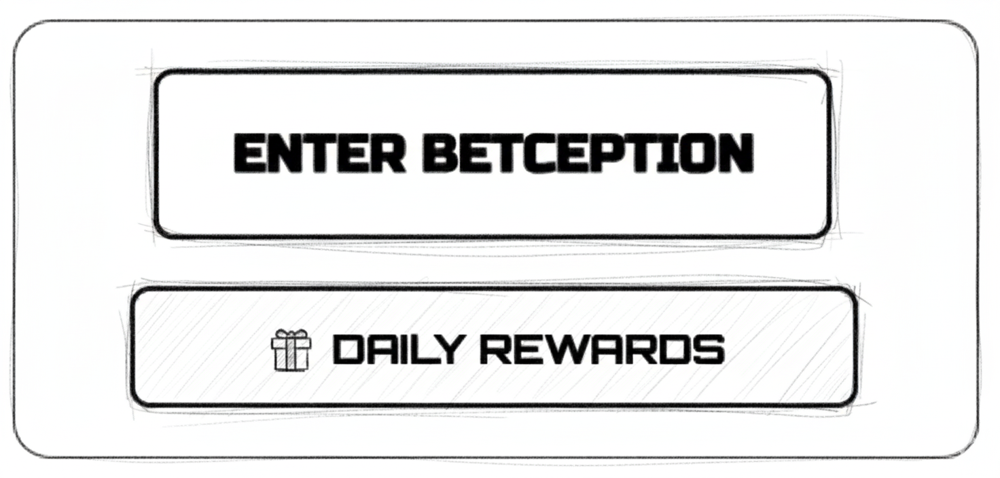

## Revision History
| Datum | Version | Beschreibung | Autor |
| --- | --- | --- | --- |
| 27.10.2025 | 0.1 | Initiale UC-Dokumentation (Neue Ordnerstruktur) | Team BetCeption|
| 01.12.2025 | 1.1 | Abgleich Implementierung (Round-Start, Seeds, Sidebets optional, keine Lobby-Weiterleitung) | Team BetCeption |

# Use Case 5: Spiel starten (Blackjack)

## 1.1 Brief Description
Dieser Use Case ermöglicht es einem **eingeloggten Spieler**, ein neues **Blackjack-Spiel** in **BetCeption** zu starten.  
Der Spieler wählt seinen Einsatz und das System initialisiert das Spiel mit Dealer, Karten und Spielstatus.  
Das Spiel kann anschließend über weitere Use Cases (z. B. UC6 - Wette platzieren, UC8 - Spielzug ausführen) fortgesetzt werden.

---
## Abgleich Implementierung (Stand aktueller Code)
- **Backend:** `POST /round/start` (auth) nimmt `{betAmount, sideBets?}` entgegen. Backend prüft, ob für den User bereits eine aktive Runde existiert, sperrt User-Balance, prüft Einsatz > 0, prüft optionale Side-Bets, zieht Gesamteinsatz ab, erstellt Runde mit Server-Seed/Hash, teilt initial 4 Karten (Player/Dealer alternierend), legt MainBet + Wallet-Tx an, setzt Status `IN_PROGRESS` und liefert den kompletten Round-State inkl. Fairness-Payload zurück.
- **Frontend:** Blackjack-Seite ruft `startRound` nur mit `betAmount` auf, zeigt Karten, Status und einen Banner bei Blackjack an. Kein UI für Side-Bets, kein Round-Guard; 401 wird als Fehlertext angezeigt. Balance wird nach Deal/Settle neu geladen.
- **Abweichungen:** Keine separaten Schritte für Einsatzreservierung oder Lobby-Weiterleitung; Start funktioniert nur, wenn keine aktive Runde existiert (`ROUND_IN_PROGRESS`-Fehler). RNG ist deterministisch über Server-Seed, Client bekommt direkt Hash + Seed im Response.


## 1.2 Wireframe Mockups

## 1.3 Mockup


---

**2. Akteure:**  
- **Spieler:** Startet ein neues Blackjack-Spiel.  
- **System:** Initialisiert das Spiel, verteilt Karten und verwaltet die Wettsituation.
---

## 3. Flow of Events

### 3.1 Basic Flow
1. Spieler ist **eingeloggt** (UC2).  
2. Spieler navigiert zur **Blackjack-Spielseite**.  
3. Das System zeigt das aktuelle Guthaben an.  
4. Spieler gibt seinen **Einsatzbetrag** ein.  
5. System prüft, ob genügend Guthaben vorhanden ist.  
6. Wenn ja:
   - Betrag wird reserviert bzw. abgezogen.
   - Neues Spielobjekt wird erstellt (Status: *running*).
   - Spieler- und Dealer-Karten werden initial verteilt.
   - Spielstatus wird gespeichert.
7. Spieloberfläche zeigt den aktuellen Zustand (Karten, Einsatz, Optionen).

---


### 4. Sequenzdiagramm
```mermaid
sequenceDiagram
  participant FE as Frontend (Blackjack)
  participant API as Round API
  participant DB as DB

  FE->>API: POST /round/start {betAmount, sideBets?} (Bearer)
  API->>DB: Check active round for user
  alt Runde aktiv
    API-->>FE: 409 {code:ROUND_IN_PROGRESS}
  else keine aktive Runde
    API->>DB: Lock user; validate bet>0
    API->>DB: Validate sideBets types/payload (max 5)
    API->>DB: Check balance >= bet + sum(sideBets)
    alt Guthaben ok
      API->>DB: Create round (serverSeed+hash, status=DEALING)
      API->>DB: Insert dealer+player hands; deal 4 cards deterministisch
      API->>DB: Insert main_bet (PLACED) + wallet_tx (BET_PLACE -bet)
      API->>DB: Insert side_bets + wallet_txs (falls vorhanden)
      API->>DB: Update round status=IN_PROGRESS
      API-->>FE: 201 {round with hands, bets, fairness}
    else zu wenig Guthaben
      API-->>FE: 400 {code:INSUFFICIENT_FUNDS}
    end
  end

  Note over FE: Weitere Aktionen siehe UC7 (hit/stand/settle)
```

### 5. Aktivitätsdiagramm (aktuell)
```mermaid
flowchart TD
  A[Start] --> B[Einsatz und Sidebets eingeben]
  B --> C{Aktive Runde vorhanden?}
  C -->|Ja| D[409 ROUND_IN_PROGRESS]
  C -->|Nein| E[POST /round/start]
  E --> F[Einsatz/Sidebets validieren]
  F --> G{Guthaben ok?}
  G -->|Nein| H[400 INSUFFICIENT_FUNDS]
  G -->|Ja| I[User sperren, Round anlegen (Seed/Hash)]
  I --> J[Haende erzeugen, 4 Karten austeilen]
  J --> K[MainBet + Wallet-Tx buchen]
  K --> L[Sidebets + Wallet-Tx buchen]
  L --> M[Status IN_PROGRESS, Antwort 201]
  D --> N[Ende]
  H --> N
  M --> N
```

---

## 6. Special Requirements
- Spiel darf nur gestartet werden, wenn **kein anderes aktives Spiel** besteht.  
- Einsatzbetrag wird **atomar reserviert** (DB-Transaktion).  
- Initiale Kartenverteilung erfolgt **zufällig** über RNG.
- Server synchronisiert Spielstatus mit Client nach jeder Aktion.

---

## 7. Preconditions
- Spieler ist **eingeloggt** (UC2).  
- Kein anderes aktives Spiel läuft.  
- Spieler hat ausreichend Guthaben.

---

## 8. Postconditions
- Neues Spielobjekt ist erstellt und gespeichert.  
- Einsatzbetrag ist vom Guthaben abgezogen.  
- Spielstatus = *running*.  
- Karten wurden verteilt.

---

## 9. Function Points
| Komponente | Beschreibung | Punkte |
|-------------|---------------|--------|
| Einsatzprüfung | Guthabenvalidierung | 2 |
| Spielinitialisierung | Karten & Status erstellen | 2 |
| Datenpersistenz | Spiel- und User-Update | 2 |
| UI-Feedback | Darstellung Spielstart & Fehler | 1 |
| **Gesamt** |  | **7 FP** |

---


