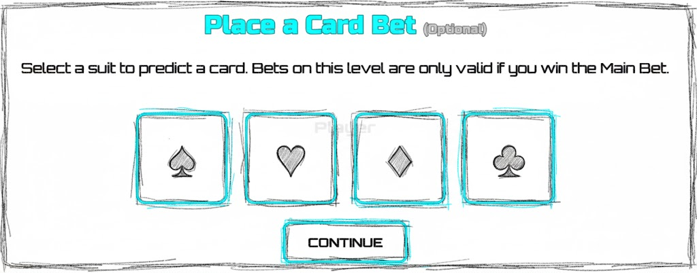
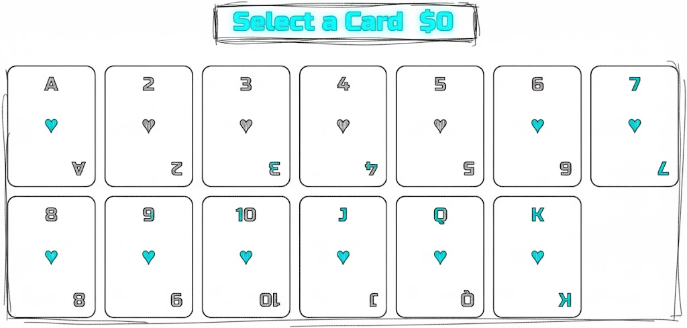
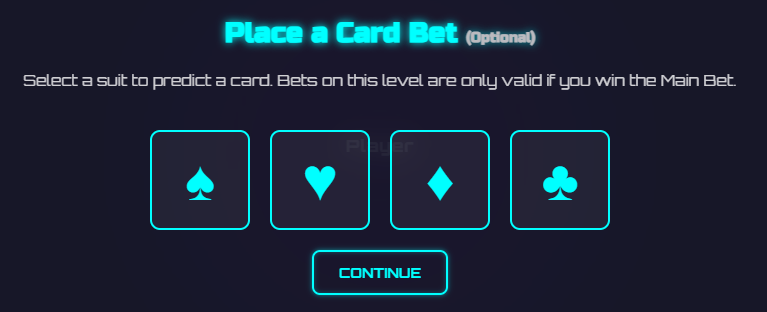
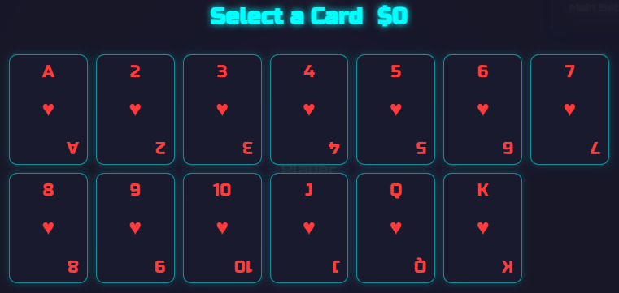
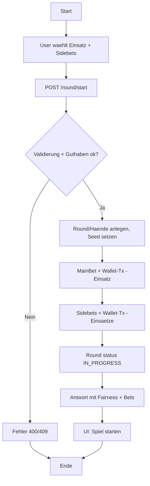

## Revision History
| Datum | Version | Beschreibung | Autor |
| --- | --- | --- | --- |
| 27.10.2025 | 0.1 | Initiale UC-Dokumentation (Neue Ordnerstruktur) | Team BetCeption|
| 01.12.2025 | 1.1 | Abgleich Implementierung (Main+Side Bets via Round-Start, keine Idempotency/Double) | Team BetCeption |

# Use Case 6: Wetten platzieren (Haupt- **und** Nebenwetten)

## 1. Brief Description
Dieser Use Case fasst die Platzierung von **Hauptwetten** (Einsatz vor Spielstart) und **Nebenwetten** (Side Bets zu Kartenereignissen) in **BetCeption** zusammen.  
Das System prüft **Guthaben**, **Einsatzlimits**, **Zeitfenster/Spielzustand** und verarbeitet die Buchungen **atomar**. Nebenwetten können – sofern erlaubt – **vor dem Deal** oder **in definierten In-Game-Fenstern** abgegeben und beim Eintreten des Ereignisses **automatisch ausgewertet** werden.

Abhängigkeiten: Start und Fortschritt eines Blackjack-Spiels (z. B. *Spiel starten*, *Spielzug ausführen*), Authentifizierung (Login).

---
## Abgleich Implementierung (Stand aktueller Code)
- **Backend:** Haupt- und Nebenwetten werden gemeinsam in `POST /round/start` abgewickelt (kein separater Platzierungs-Endpoint). Main Bet = `betAmount`; Side Bets optional über `sideBets[]` (Codes `FIRST_CARD_COLOR|SUIT|RANK`, Zielkontext Dealer/Player-First-Card). Backend prüft eine aktive Runde (verbietet zweite), validiert Einsätze > 0, Side-Bet-Payload und Guthaben, bucht Wallet-Txs (`BET_PLACE`), legt `main_bets`/`side_bets` an. Odds kommen aus `sidebet_types.baseOdds`, keine dynamische Quote.
- **Frontend:** Nur Feld für `betAmount` auf der Blackjack-Seite; keine UI für Side Bets, Odds, Limits oder Validierung vorab. Kein eigener Flow für Hauptwette ohne Spielstart.
- **Abweichungen:** Keine In-Game-Zeitfenster oder Idempotency-Key-Unterstützung. Einsatzlimits sind serverseitig (max 100000 pro Bet-Validierung), aber nicht visuell kommuniziert. Kein Pre-Deal-Caching oder Bet-Panel wie beschrieben.


## 1.2 Wireframe Mockups


## 1.3 Mockups


---

## 2. Akteure
- **Primär:** Spieler (eingeloggt)
- **Sekundär:** Angular-Client, Game-/Bet-API (Node/Express), MySQL (Transaktionen), ggf. Odds-/Reward-Services

---

## 3. Flow of Events

### 3.1 Hauptwette (Main Bet) – vor Spielstart
1. Spieler ist **eingeloggt** und befindet sich in Lobby oder Blackjack-Ansicht.  
2. Spieler wählt **Einsatz** (Chip/Amount).  
3. Client sendet **„Hauptwette platzieren“** an Server.  
4. Server validiert: **Einsatzlimits**, **Guthaben**, **kein aktives Spiel mit gesetztem Einsatz**.  
5. Bei Erfolg (in **atomarer Transaktion**):  
   - Betrag wird **reserviert/abgezogen**.  
   - **Bet-Record** wird mit Status `placed` gespeichert.  
   - **Aktueller Kontostand** wird zurückgegeben.  
6. UI bestätigt und erlaubt **„Spiel starten“**.

**Alternative Flows (Hauptwette):**  
- Nicht eingeloggt → **401**; Verweis auf Login.  
- Einsatz < min oder > max → **400** *„Einsatz liegt nicht im erlaubten Bereich.“*  
- Unzureichendes Guthaben → **400** *„Nicht genügend Guthaben.“*  
- Bereits aktive Wette/Spiel → **409** *„Aktive Wette/Spiel existiert bereits.“*  
- Doppelanfrage/Race → **idempotent success** via **Idempotency-Key**.  
- Server-/DB-Fehler → **500**, keine Buchung.

---

### 3.2 Nebenwette (Side Bet) – pre-deal oder in definierten Fenstern
1. Spieler ist **eingeloggt** und hat ein **aktives Spiel**.  
2. Spieler öffnet **Nebenwetten-Panel**.  
3. Spieler wählt **Typ** (z. B. Suit/Farbe, Rang, konkrete Karte, Muster), **Ziel** und **Einsatz**.  
4. Client fragt beim Server die **Quote (odds)** an.  
5. Spieler bestätigt die Nebenwette.  
6. Server validiert **Guthaben**, **Limits**, **Zeitfenster** (pre-deal/next-card), keine „locked“-Phase.  
7. Bei Erfolg (atomar): **Einsatz buchen**, **Side-Bet** mit `status=open` speichern, **Quote** & **potenzielle Auszahlung** zurückgeben.  
8. Beim **Ereigniszeitpunkt** (z. B. „nächste Karte aufgedeckt“) **wertet** der Server die Nebenwette aus → `status=won|lost`, ggf. **Auszahlung** gutschreiben.

**Alternative Flows (Nebenwette):**  
- Nicht eingeloggt / **kein aktives Spiel** → **401/409**.  
- **Zeitfenster geschlossen** → **409** *„Nebenwetten sind derzeit nicht erlaubt.“*  
- **Ungültige Wettkonfiguration** → **400**.  
- **Nicht genügend Guthaben / Limit verletzt** → **400**.  
- **Idempotente Doppelabgabe** → **200** mit vorherigem Resultat.  
- **Spielende vor Auswertung** → Storno oder lost gemäß Regelwerk, ggf. **Rückerstattung**.

---

## 4. Sequenzdiagramm
### 4.1 Haupt- und Nebenwetten (Round-Start)
```mermaid
sequenceDiagram
  participant FE as Frontend (Blackjack)
  participant API as Round/Bets API
  participant DB as DB

  FE->>API: POST /round/start {betAmount, sideBets[]} (Bearer)
  API->>DB: Check no active round for user
  API->>DB: Validate main bet >0; validate sideBet codes/targets/amounts
  API->>DB: Lock user; check balance >= bet + sideBets
  alt Validierung ok
    API->>DB: Create round + hands + serverSeed/hash
    API->>DB: Insert main_bet (PLACED) + wallet_tx (BET_PLACE -bet)
    API->>DB: For each sideBet: insert side_bet (PLACED) + wallet_tx (-amount)
    API->>DB: Update round status=IN_PROGRESS
    API-->>FE: 201 {round incl. mainBet, sideBets, fairness}
  else Fehler (invalid side bet / insufficient funds)
    API-->>FE: 400/409 {code, message}
  end

  Note over FE: SideBets optional; keine Idempotency-Keys, Schutz via Locks/Status
```

## 5. Aktivitätsdiagramm (aktuell)


## 6. Special Requirements (gemeinsam)
- **Einsatzlimits** konfigurierbar (`min_bet`, `max_bet`, `step`) je Wettart.  
- **Atomare Transaktionen** für Buchung & Persistenz (ACID).  
- **Idempotenz** via `Idempotency-Key` (Header oder Request-ID).  
- **Audit-Log**: `user_id`, `game_id`, `bet_id/side_bet_id`, `amount/stake`, `type/target`, `odds`, `request_id`, `timestamp`.  
- **Einheiten**: Coins als **Integer** (keine Floats).  
- **Zeitfenstersteuerung** serverseitig (pre-deal/in-game/locked).  
- **Validierung** client- und serverseitig.  
- **Fairness/Integrität**: RNG/Kartenfolge unabhängig von Wetten; Wetten beeinflussen das Spiel nicht.

---

## 7. Preconditions
- Spieler ist **authentifiziert**.  
- **Hauptwette**: kein laufendes Spiel mit bereits gesetzter Hauptwette.  
- **Nebenwette**: aktives Spiel vorhanden und **Fenster offen**.  
- **Ausreichendes Guthaben** vorhanden.

---

## 8. Postconditions
- **Hauptwette (Erfolg):** Bet `placed`, Guthaben reduziert/reserviert, UI erlaubt Spielstart.  
- **Nebenwette (Platzierung):** Side-Bet `open`, Einsatz gebucht; nach Ereignis **won/lost** + ggf. Auszahlung.  
- **Fehlschlag:** **Keine** Buchungen/Änderungen.

---


## 9. Function Points
| Bereich | Beschreibung | Punkte |
|---|---|---|
| Einsatz-/Konfig-Validierung | Limits, Schrittweiten, Typ/Ziel | 3 |
| Guthabenprüfung & Sperre | Balance >= Einsatz, FOR UPDATE/Locks | 3 |
| Persistenz & Transaktionen | Bets/Side-Bets + Wallet-Update | 4 |
| Idempotenz & Fehlerhandling | Request-Key, Doppelanfragen, Races | 2 |
| Quoten (Nebenwette) | Odds-Berechnung & Rückgabe | 4 |
| Auswertung (Nebenwette) | Event-Handler & Auszahlung | 3 |
| **Gesamt** |  | **19 FP** |

---


