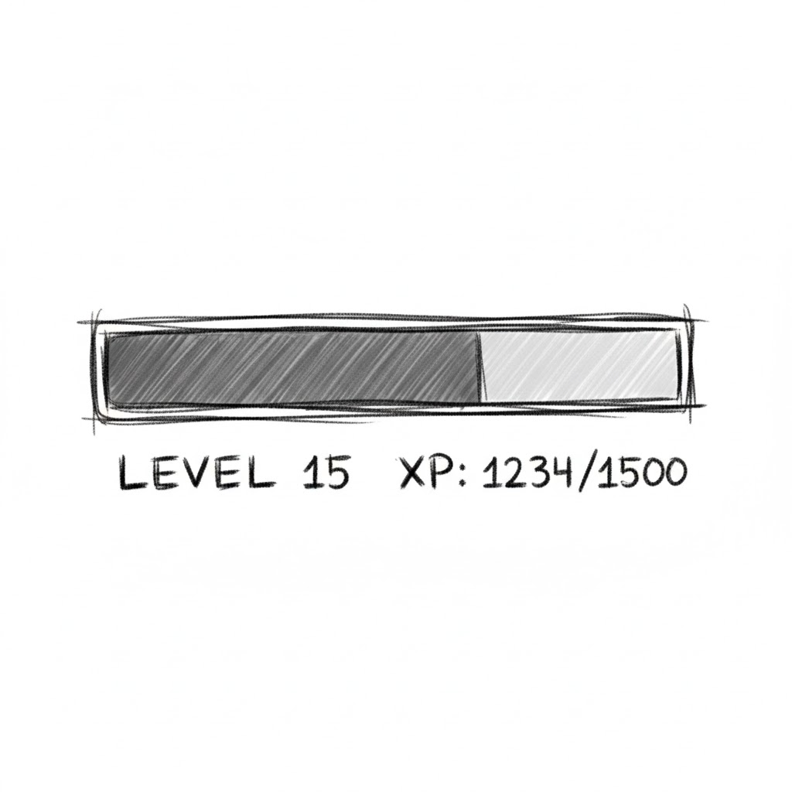

## Revision History
| Datum | Version | Beschreibung | Autor |
| --- | --- | --- | --- |
| 27.10.2025 | 0.1 | Initiale UC-Dokumentation (Neue Ordnerstruktur) | Team BetCeption|
| 01.12.2025 | 1.1 | Abgleich Implementierung (XP/Level derzeit read-only) | Team BetCeption |

# Use Case 9: XP und Level-System verwalten

## 1. Brief Description
Dieser Use Case beschreibt das Level- und Erfahrungspunktesystem (XP-System).  
Nach jedem Spiel erhält der Spieler XP abhängig von seiner Leistung, z. B. Gewinnhöhe, Wetteinsatz oder besonderen Aktionen.  
Erreicht der Spieler eine bestimmte XP-Schwelle, steigt er im Level auf und schaltet neue Power-Ups oder Features frei.

---
## Abgleich Implementierung (Stand aktueller Code)
- **Backend:** `users` besitzen Felder `xp` (int) und `level` (int), werden aber nirgends erhöht. Weder Rundenauswertung noch Rewards aktualisieren XP/Level. APIs geben Werte nur aus (`/wallet`, `/users/:id`, `/leaderboard/level`). Power-Up-Kauf prüft nur `level >= minLevel`.
- **Frontend:** Zeigt XP/Level in Wallet-Summary (nur intern genutzt) und im Leaderboard. Keine Fortschrittsanzeige, keine Level-Up-Logik.
- **Abweichungen:** XP-Berechnung, Level-Grenzen, Freischaltungen und Benachrichtigungen fehlen komplett. Sequenzdiagramm und Flow gelten aktuell nur als Zielbild.

---
## 1.2 Wireframe Mockups

## 1.3 Mockup

---


## 2. Akteure:
- **System:** Berechnet und speichert die Erfahrungspunkte (XP) nach Spielende.  
- **Datenbank:** Speichert Spielerlevel, Fortschritt und XP-Daten dauerhaft.

## 3. Flow of Events

### 3.1 Basic Flow
1. Spiel wird beendet.
2. Das System berechnet die XP auf Grundlage des Ergebnisses.
3. XP werden zum Spielerprofil hinzugefügt.
4. System prüft, ob die Levelgrenze erreicht wurde.
5. Wenn ja:
   - Level wird erhöht.
   - Neue Power-Ups oder Features werden freigeschaltet.
   - Eine Benachrichtigung wird angezeigt.
6. System speichert aktualisierte XP- und Leveldaten in der Datenbank.

---
## 4. Sequenzdiagramm (aktuell: Read-only)
```mermaid
sequenceDiagram
  participant FE as Frontend
  participant API as User/Wallet/Leaderboard
  participant DB as DB

  FE->>API: GET /wallet (Bearer)
  API->>DB: Read user {balance,xp,level,lastDailyRewardAt}
  API-->>FE: 200 {balance,xp,level}

  FE->>API: GET /leaderboard/level?limit=10
  API->>DB: Query leaderboard_level_view
  API-->>FE: 200 {items:[{rank,user,level,xp}], currentUserRank}

  Note over FE,API: XP/Level werden aktuell nicht erhöht; Werte sind read-only
```

---
## 5. AktivitAtsdiagramm (aktuell: Read-only)
```mermaid
flowchart TD
  A[Start] --> B[UI ruft GET /wallet]
  B --> C[Server liefert balance,xp,level]
  C --> D[UI zeigt Werte]
  D --> E[GET /leaderboard/level?limit=10]
  E --> F[Server liefert Rangliste + optional currentUserRank]
  F --> G[UI rendert Tabelle]
  G --> H[Ende]
  note right of G: XP/Level werden derzeit nicht erhoeht
```

---
## 6. Special Requirements
- XP-Formel muss serverseitig definiert und überprüfbar sein.
- Level-Grenzen und Belohnungen sollen konfigurierbar sein.
- Alle Änderungen werden protokolliert.

---

## 7. Preconditions
- Spieler hat ein Spiel abgeschlossen.
- Spielerprofil existiert.

---

## 8. Postconditions
- XP und Level werden aktualisiert.
- Freischaltbare Power-Ups sind aktiviert.
- Änderungen sind in der Datenbank gespeichert.

---


## 9. Function Points

| Kategorie      | Beschreibung                                           | Function Points |
|----------------|--------------------------------------------------------|-----------------|
| Eingaben       | Übermittlung des Spielergebnisses / Spielausgangs      | 1 FP            |
| Ausgaben       | Aktualisierte XP- und Levelanzeige                     | 2 FP            |
| Abfragen       | Aktuelles Level und XP-Stand aus der Datenbank         | 2 FP            |
| Interne Logik  | Berechnung für XP-Zuwachs und Levelaufstieg            | 2 FP            |
| **Gesamt**     |                                                        | **7 FP**        |

---


